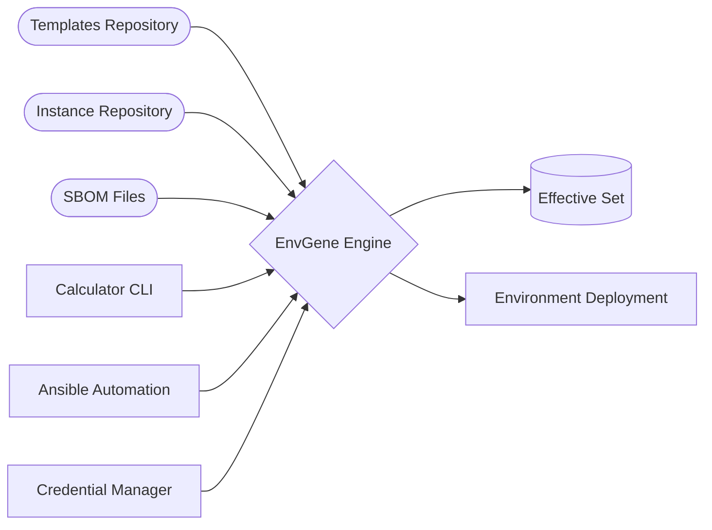

# Environment Generator (EnvGene)


[](https://github.com/netcracker/qubership-envgene/actions/workflows/deploy-docs.yml)
[](https://netcracker.github.io/qubership-envgene)
[](https://github.com/netcracker/qubership-envgene/releases)
[](https://central.sonatype.com/artifact/org.qubership/qubership_envgene_templates)
[](https://pypi.org/project/envgenehelper/)

Environment generator allows you to easily create environments from predefined templates with version control, automation, and Git-based configuration management.

<!-- toc -->

## Features

- **Template-Based Environment Creation**: Define reusable environment templates including Tenant, Cloud, Namespaces, and Parameters
- **Git-Native Version Control**: Complete history tracking of environment and parameter changes using native Git functionality
- **Automated Environment Management**: Automated environment creation, updates, and effective parameter set generation
- **Secure Credentials Management**: Built-in encryption for sensitive configuration data stored in Git repositories
- **Template Versioning**: Template evolution tracking with rollback capabilities
- **Environment Comparison**: Compare environment configurations using standard diff tools
- **SBOM Support**: Load and process SBOM files for calculating effective sets
- **Multi-Language Support**: Python and Java implementations for different use cases

## Requirements

### System Requirements
- Python 3.8+ 
- Java 11+ (for Java components)
- Maven 3.6+ (for Java components)
- Ansible 9.2+ (for automation components)
- Git

### Supported Platforms
- Linux (recommended)
- macOS
- Windows (with WSL)

## Installation

### Option 1: Python Components Only

For basic environment generation capabilities:

1. **Clone the repository**:
   ```bash
   git clone https://github.com/netcracker/qubership-envgene.git
   cd qubership-envgene
   ```

2. **Install Python dependencies**:
   ```bash
   pip install -r dependencies/tests_requirements.txt
   ```

3. **Build and install Python modules**:
   ```bash
   cd python
   chmod +x build_modules.sh
   ./build_modules.sh
   ```

This installs three Python packages:
- `envgenehelper`: Core helper functions for EnvGene
- `jschon-sort`: JSON schema tools
- `integration-loader`: Integration utilities

### Option 2: Complete Installation (Python + Java)

For full functionality including effective set generation:

1. **Follow Python installation** (steps 1-3 above)

2. **Install Java components**:
   ```bash
   cd build_effective_set_generator_java
   mvn clean install
   ```

3. **Install Ansible components**:
   ```bash
   pip install ansible==9.2.0
   ```

### Option 3: Development Setup

For contributors and advanced users:

1. **Complete installation** (Option 2)

2. **Install documentation dependencies**:
   ```bash
   pip install -r requirements_mkdocs.txt
   ```

3. **Install development dependencies**:
   ```bash
   pip install -r dependencies/tests_requirements.txt
   ```

### Verification

Verify your installation:

```bash
# Test Python module
python -c "import envgenehelper; print('EnvGene helper installed successfully')"

# Test Java components (if installed)
cd build_effective_set_generator_java
mvn test

# Test documentation build (if dev setup)
mkdocs build
```

## Usage

### Quick Start

1. **Create template repository structure**:
   ```
   templates/
   ├── env_templates/
   │   ├── namespace1.yml.j2
   │   ├── tenant1.yml.j2
   │   └── cloud1.yml.j2
   ├── parameters/
   │   ├── paramset1.yml
   │   └── paramset2.yml
   └── resource_profiles/
       ├── profile1.yml
       └── profile2.yml
   ```

2. **Create instance repository structure**:
   ```
   environments/
   ├── configuration/
   │   ├── credentials/
   │   │   └── credentials.yml
   │   ├── deployer.yml
   │   └── registry.yml
   └── cluster_name/
       ├── cloud-passport/
       │   └── cloud_name.yml
       └── env_name/
           ├── Inventory/
           │   └── inventory.yml
           └── parameters/
               └── env_specific_paramset.yml
   ```

3. **Generate effective set** (requires Java components):
   ```bash
   # Using Calculator CLI
   java -jar effective-set-generator.jar \
     --env-id "cluster/env-name" \
     --envs-path "/path/to/environments" \
     --sboms-path "/path/to/sboms" \
     --solution-sbom-path "/path/to/solution.sbom.json" \
     --registries "/path/to/registry.yml" \
     --output "/path/to/output"
   ```

### Calculator CLI

The Calculator CLI generates effective parameter sets from templates and environment configurations. See the [Calculator CLI documentation](https://netcracker.github.io/qubership-envgene/calculator-cli/) for detailed usage.

### Ansible Integration

Use Ansible playbooks for automated environment generation:

```bash
cd build_effective_set_generator/ansible
ansible-playbook playbooks/generate_effective_set.yaml -i inventory
```

## Configuration

### Registry Configuration

Configure artifact registries in `registry.yml`:

```yaml
registries:
  - id: "maven-central"
    type: "maven"
    url: "https://repo1.maven.org/maven2"
  - id: "custom-registry"
    type: "custom"
    url: "https://your-registry.com"
```

### Credentials Management

Store encrypted credentials in Git:

```yaml
# credentials.yml
database:
  username: "{{vault.db_user}}"
  password: "{{vault.db_password}}"
```

See [Configuration documentation](https://netcracker.github.io/qubership-envgene/envgene-configs/) for complete configuration options.

## API Reference / Documentation

Complete documentation is available at: https://netcracker.github.io/qubership-envgene

### Key Documentation Sections

- [Basic How-To Guide](https://netcracker.github.io/qubership-envgene/basic-how-to/)
- [Calculator CLI Reference](https://netcracker.github.io/qubership-envgene/calculator-cli/)
- [Environment Definition](https://netcracker.github.io/qubership-envgene/env_definition/)
- [Configuration Guide](https://netcracker.github.io/qubership-envgene/envgene-configs/)
- [SBOM Processing](https://netcracker.github.io/qubership-envgene/sbom/)
- [Examples and Samples](https://netcracker.github.io/qubership-envgene/samples/)

## Architecture / Diagram

### System Overview



The system processes templates, instance configurations, and SBOM files to generate effective parameter sets for environment deployment. Key components include:

- **Template Engine**: Processes Jinja2 templates with parameter substitution
- **Parameter Calculator**: Resolves parameter dependencies and inheritance
- **Credential Manager**: Handles encrypted credential storage and retrieval
- **SBOM Processor**: Extracts parameters from Software Bill of Materials files

## Testing

### Running Tests

```bash
# Python unit tests
cd python/envgene
python -m pytest tests/

# Java unit tests
cd build_effective_set_generator_java
mvn test

# Integration tests
cd build_effective_set_generator
python -m pytest scripts/test_generate_effective_set.py
```

### Test Data

Test environments and templates are available in:
- `test_data/test_environments/` - Sample environment configurations
- `test_data/test_templates/` - Sample templates for testing
- `docs/samples/` - Documentation examples

## Contributing

We welcome contributions! Please see our [Contributing Guide](CONTRIBUTING.md) for details on:

- Development setup
- Code style guidelines  
- Testing requirements
- Pull request process

### Code of Conduct

This project adheres to our [Code of Conduct](CODE-OF-CONDUCT.md). By participating, you agree to uphold this code.

## License

This project is licensed under the Apache License, Version 2.0. See the [LICENSE](LICENSE) file for details.
