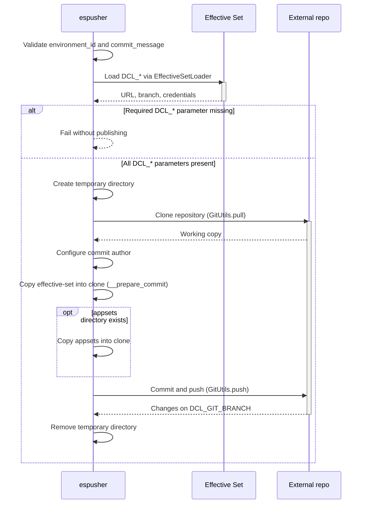

# PushEffectiveSet (espusher)

- [PushEffectiveSet (espusher)](#pusheffectiveset-espusher)
  - [Purpose](#purpose)
  - [Inputs](#inputs)
    - [Input parameters](#input-parameters)
  - [Outputs](#outputs)
  - [Sequence diagram](#sequence-diagram)
  - [Algorithm](#algorithm)
    - [Main flow](#main-flow)
    - [Alternative flows](#alternative-flows)
    - [Exception flows](#exception-flows)

## Purpose

`PushEffectiveSet` publishes a generated Effective Set to an external GitLab repository
(`PIPELINE_TYPE: GITLAB_DEPLOY`).

The command:

1. Reads external repository connection parameters (`DCL_*`) from the Effective Set.
2. Clones the external repository into a temporary directory.
3. Copies the `effective-set` directory there (and `appsets` when present).
4. Creates a commit and pushes the changes to the configured branch.

In EnvGene this matches [external export of the Effective Set](/docs/features/effective-set-generation.md#external-export).
After a successful publish, the Effective Set remains in the external repository, not in the Instance repository.

## Inputs

Besides command-context parameters, `PushEffectiveSet` reads `DCL_*` parameters from the **pipeline context**
through `EffectiveSetLoader` (by `environment_id`). Values enter the pipeline context during Effective Set
generation from `e2eParameters` in the environment `cloud.yml` (see
[external export](/docs/features/effective-set-generation.md#external-export)).

### Input parameters

| Parameter                   | Source               | Required | Description                         | Constraints / validation                  |
|-----------------------------|----------------------|----------|-------------------------------------|-------------------------------------------|
| *- command parameters -*    |                      |          |                                     |                                           |
| `params.environment_id`     | command context      | yes      | Environment identifier              | Non-empty. Checked during validation      |
| `params.commit_message`     | command context      | yes      | Commit message for external repo    | Non-empty. Checked during validation      |
| `params.rootdir`            | command context      | no       | Instance repository root directory  | Defaults to current working directory     |
| *- pipeline context -*      |                      |          |                                     |                                           |
| `DCL_GIT_URL`               | pipeline context     | yes      | External GitLab repository URL      | Non-empty. See main flow, step 5          |
| `DCL_GIT_BRANCH`            | pipeline context     | yes      | Target branch for published changes | Non-empty. See main flow, step 5          |
| `DCL_CONFIG_GITLAB_USER`    | pipeline context     | yes      | GitLab access username              | Non-empty. `secure_params` or `params`    |
| `DCL_CONFIG_GITLAB_TOKEN`   | pipeline context     | yes      | GitLab access token or password     | Non-empty. `secure_params` or `params`    |
| *- environment variables -* |                      |          |                                     |                                           |
| `GITLAB_USER_NAME`          | environment variable | no       | Git commit author name              |                                           |
| `GITLAB_USER_EMAIL`         | environment variable | no       | Git commit author email             |                                           |

For `DCL_*` parameters, the pipeline context source priority is `secure_params` first, then `params` when absent.

## Outputs

| Scenario                                       | Result                                                                    |
|------------------------------------------------|---------------------------------------------------------------------------|
| Success                                        | Effective Set (and `appsets` when present) published externally           |
| Validation error (`_validate` returns `false`) | Command does not run                                                      |
| Git error (clone, commit, push)                | Command fails (depends on `GitUtils` and `ExecutionCommand`)              |

`_execute` has no explicit return value - success or failure defines the outcome.

Target path in the external repository:

```text
/environments/<cluster-name>/<env-name>/effective-set/
```

## Sequence diagram



## Algorithm

### Main flow

1. The command checks that `params.environment_id` and `params.commit_message` are non-empty.
2. The command resolves the root directory (`params.rootdir` or the current working directory).
3. The command loads parameters from the pipeline context through `EffectiveSetLoader` by `environment_id`.
4. The command reads `DCL_GIT_URL`, `DCL_GIT_BRANCH`, `DCL_CONFIG_GITLAB_USER`, and `DCL_CONFIG_GITLAB_TOKEN`
   from the pipeline context (values originate in `e2eParameters` in `cloud.yml` and enter the pipeline context
   during Effective Set generation), plus `GITLAB_USER_NAME` and `GITLAB_USER_EMAIL` from environment variables.
5. The command checks that all `DCL_*` parameters are non-empty.
6. When every `DCL_*` parameter is set, the command creates a temporary directory.
7. The command clones the external repository (`GitUtils.pull`) with `DCL_GIT_URL`, `DCL_GIT_BRANCH`, and
   credentials `DCL_CONFIG_GITLAB_USER` / `DCL_CONFIG_GITLAB_TOKEN`.
8. The command configures the local Git author name and email.
9. The command copies the `effective-set` directory from `{rootdir}/environments/{environment_id}/effective-set/`
   to `{repopath}/environments/{environment_id}/effective-set/` (`__prepare_commit`). Before copying, it checks
   the `overwrite` flag (default `true`, not set externally - `GitUtils.push` receives only `rootdir` and
   `repopath`). When `overwrite = true`, the target directory
   `{repopath}/environments/{environment_id}/effective-set/` is removed first, then content is copied from the
   local working copy.
10. The `{rootdir}/appsets` directory exists.
11. The command copies the `appsets` directory to `{repopath}/appsets`.
12. The command creates a commit and pushes changes to the remote repository (`GitUtils.push` with branch
    `DCL_GIT_BRANCH` and message `params.commit_message`).
13. The command completes successfully. The Effective Set is published in the external repository.

### Alternative flows

#### Alternative flow 10.a - appsets directory absent

**Condition:** at main-flow step 10, the `{rootdir}/appsets` directory does not exist.

1. The command logs a warning.
2. Copying `appsets` is skipped (`effective-set` is already copied at this point).
3. The flow continues at main-flow step 12.

### Exception flows

#### Exception 1.a - command parameters not set

**Condition:** at main-flow step 1, `params.environment_id` or `params.commit_message` is empty.

1. `_validate` returns `false`.
2. `_execute` is not called.
3. The flow ends with an error.

#### Exception 5.a - DCL_* parameters not set

**Condition:** at main-flow step 5, at least one of `DCL_GIT_URL`, `DCL_GIT_BRANCH`, `DCL_CONFIG_GITLAB_USER`, or
`DCL_CONFIG_GITLAB_TOKEN` is empty.

1. The command does not proceed to publishing.
2. The flow ends with an error.

#### Exception 7.a - repository clone error

**Condition:** at main-flow step 7, `GitUtils.pull` fails.

1. The command aborts.
2. The temporary directory is removed.
3. The flow ends with an error.

#### Exception 12.a - commit or push error

**Condition:** at main-flow step 12, the Git operation fails.

1. The command aborts.
2. The temporary directory is removed.
3. The flow ends with an error.
