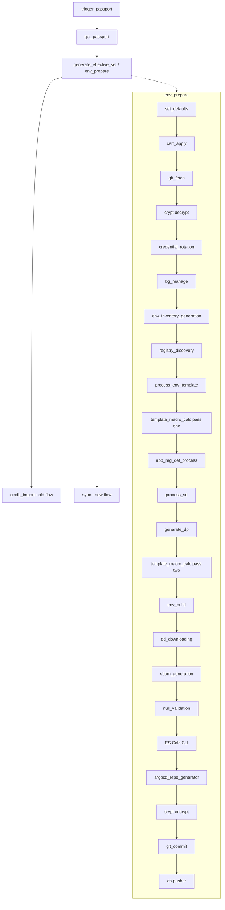

# Modern toolset instance pipeline

- [Overview](#overview)
- [Jobs](#jobs)
- [Sequence](#sequence)
- [env_prepare steps](#env_prepare-steps)
- [Old flow vs new flow](#old-flow-vs-new-flow)
- [Cross-cutting inputs](#cross-cutting-inputs)
- [Component docs](#component-docs)

## Overview

The modern toolset pipeline consolidates the previous many-job instance pipeline into a single `env_prepare` job.
The core logic lives in `qubership-envgene`, and `env-generator` provides the Netcracker extension jobs. The design
keeps the old flow working while adding support for the new deploy flow selected by `PIPELINE_TYPE == GITAB_DEPLOY`.

## Jobs

| # | Job                                  | Runs in | Trigger                                 |
|---|--------------------------------------|---------|-----------------------------------------|
| 1 | trigger_passport                     | core    | GET_PASSPORT                            |
| 2 | get_passport                         | core    | GET_PASSPORT                            |
| 3 | generate_effective_set (env_prepare) | core    | always                                  |
| 4 | cmdb_import                          | extend  | CMDB_IMPORT, old flow only              |
| 5 | sync                                 | extend  | OPERATION_TYPE not CLEAN, new flow only |

## Sequence

## env_prepare steps

| #  | Step                         | Trigger  | Change   | Doc                                                        |
|----|------------------------------|----------|----------|------------------------------------------------------------|
| 1  | set_defaults                 | always   | new      | [set-defaults.md](set-defaults.md)                         |
| 2  | cert_apply                   | always   | as-is    | [cert-apply.md](cert-apply.md)                             |
| 3  | git_fetch                    | always   | as-is    | [git-fetch.md](git-fetch.md)                               |
| 4  | crypt decrypt                | always   | as-is    | [crypt.md](crypt.md)                                       |
| 5  | credential_rotation          | optional | as-is    | [credential-rotation.md](credential-rotation.md)           |
| 6  | bg_manage                    | optional | as-is    | [bg-manage.md](bg-manage.md)                               |
| 7  | env_inventory_generation     | optional | as-is    | [env-inventory-generation.md](env-inventory-generation.md) |
| 8  | registry_discovery           | disabled | new      | [registry-discovery.md](registry-discovery.md)             |
| 9  | process_env_template         | always   | as-is    | [process-env-template.md](process-env-template.md)         |
| 10 | template_macro_calc pass one | always   | new      | [template-macro-calc.md](template-macro-calc.md)           |
| 11 | app_reg_def_process          | always   | as-is    | [app-reg-def-process.md](app-reg-def-process.md)           |
| 12 | process_sd                   | old flow | as-is    | [process-sd.md](process-sd.md)                             |
| 13 | generate_dp                  | new flow | new      | [generate-dp.md](generate-dp.md)                           |
| 14 | template_macro_calc pass two | always   | new      | [template-macro-calc.md](template-macro-calc.md)           |
| 15 | env_build                    | always   | as-is    | [env-build.md](env-build.md)                               |
| 16 | dd_downloading               | always   | new      | [dd-downloading.md](dd-downloading.md)                     |
| 17 | sbom_generation              | always   | as-is    | [sbom-generation.md](sbom-generation.md)                   |
| 18 | null_validation              | always   | as-is    | [null-validation.md](null-validation.md)                   |
| 19 | ES Calc CLI                  | always   | as-is    | [es-calc-cli.md](es-calc-cli.md)                           |
| 20 | argocd_repo_generator        | new flow | modified | [argocd-repo-generator.md](argocd-repo-generator.md)       |
| 21 | crypt encrypt                | always   | as-is    | [crypt.md](crypt.md)                                       |
| 22 | git_commit                   | always   | modified | [git-commit.md](git-commit.md)                             |
| 23 | es-pusher                    | new flow | modified | [es-pusher.md](es-pusher.md)                               |

## Old flow vs new flow

| Aspect          | Old flow              | New flow (PIPELINE_TYPE == GITAB_DEPLOY) |
|-----------------|-----------------------|------------------------------------------|
| process_sd      | called                | not called                               |
| generate_dp     | not called            | called                                   |
| cmdb_import job | called                | not called                               |
| sync job        | not called            | called                                   |
| Push target     | git_commit to EnvGene | es-pusher to the deploy target           |

## Cross-cutting inputs

- `PIPELINE_TYPE` is `GITAB_DEPLOY` or empty, and selects the new flow when set to `GITAB_DEPLOY`.
- Filters are `DEPLOY_POSTFIXES_FILTER`, `NAMESPACE_NAMES_FILTER`, `COMPONENT_NAMES_FILTER`, and `WAVE_NAMES_FILTER`.
- `SAVE_ARTIFACTS_STRATEGY` is `SAVE_ALL` or empty.
- Work is planned in phase1, phase2, and phase3.

## Component docs

- [trigger-passport.md](trigger-passport.md)
- [get-passport.md](get-passport.md)
- [set-defaults.md](set-defaults.md)
- [cert-apply.md](cert-apply.md)
- [git-fetch.md](git-fetch.md)
- [crypt.md](crypt.md)
- [credential-rotation.md](credential-rotation.md)
- [bg-manage.md](bg-manage.md)
- [env-inventory-generation.md](env-inventory-generation.md)
- [registry-discovery.md](registry-discovery.md)
- [process-env-template.md](process-env-template.md)
- [template-macro-calc.md](template-macro-calc.md)
- [app-reg-def-process.md](app-reg-def-process.md)
- [process-sd.md](process-sd.md)
- [generate-dp.md](generate-dp.md)
- [env-build.md](env-build.md)
- [dd-downloading.md](dd-downloading.md)
- [sbom-generation.md](sbom-generation.md)
- [null-validation.md](null-validation.md)
- [es-calc-cli.md](es-calc-cli.md)
- [argocd-repo-generator.md](argocd-repo-generator.md)
- [git-commit.md](git-commit.md)
- [es-pusher.md](es-pusher.md)
- [cmdb-import.md](cmdb-import.md)
- [sync.md](sync.md)
