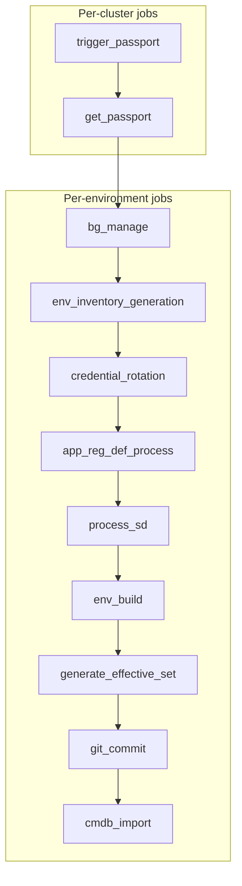

# EnvGene Pipelines

This document describes the CI/CD pipelines and jobs in these pipelines used in EnvGene. For each pipeline, the set and sequence of jobs is described. For each job, the conditions under which the job is executed and the Docker image used to run the job are specified.

Jobs are executed sequentially in the **listed order**. Depending on the condition, a job may or may not be executed. If any job in the sequence fails, the subsequent jobs in the flow are not executed.

The conditions for job execution, the sequence, and the Docker images are intended to match across GitLab and GitHub CI/CD platforms.

> [!NOTE]
> This is the sequence of the core EnvGene. EnvGene is extensible: in extensions, the sequence may be changed and new jobs may be added.

## Instance pipeline

The main pipeline of the EnvGene Instance repository, in which the main functions of EnvGene are performed, such as Environment Instance generation, Effective Set generation, and others.

This pipeline is triggered manually by the user via the GitLab/GitHub UI or by an external system via the GitLab/GitHub API.

If multiple [`ENV_NAMES`](/docs/instance-pipeline-parameters.md#env_names) are specified:

- For each distinct cluster name in `ENV_NAMES`, at most one Cloud Passport flow runs: `trigger_passport_job`, `get_passport_job` (deduplicated by cluster).
- For each environment from `ENV_NAMES`, parallel flows of the remaining jobs are started.

### [Instance pipeline] Job sequence

1. **trigger_passport**:
   - **Condition**: Runs if [`GET_PASSPORT: true`](/docs/instance-pipeline-parameters.md#get_passport)
   - **Docker image**: None. The Discovery repository is triggered from the pipeline

2. **get_passport**:
   - **Condition**: Runs if [`GET_PASSPORT: true`](/docs/instance-pipeline-parameters.md#get_passport)
   - **Docker image**: [`qubership-envgene`](https://github.com/Netcracker/qubership-envgene/pkgs/container/qubership-envgene)

3. **bg_manage**
   - **Condition**: Runs if [`BG_MANAGE: true`](/docs/instance-pipeline-parameters.md#bg_manage).
   - **Docker image**: [`qubership-envgene`](https://github.com/Netcracker/qubership-envgene/pkgs/container/qubership-envgene)

4. **env_inventory_generation**:
   - **Condition**: Runs if [`ENV_TEMPLATE_TEST: false`](/docs/envgene-repository-variables.md#env_template_test) AND any of the following holds:
     - [`ENV_INVENTORY_CONTENT`](/docs/instance-pipeline-parameters.md#env_inventory_content) is set, or
     - [`ENV_INVENTORY_INIT`](/docs/instance-pipeline-parameters.md#env_inventory_init) is `true`, or
     - [`ENV_SPECIFIC_PARAMS`](/docs/instance-pipeline-parameters.md#env_specific_params) is set (non-empty), or
     - [`ENV_TEMPLATE_NAME`](/docs/instance-pipeline-parameters.md#env_template_name) is set (non-empty)
   - **Docker image**: [`qubership-envgene`](https://github.com/Netcracker/qubership-envgene/pkgs/container/qubership-envgene)

5. **credential_rotation**:
   - **Condition**: Runs if [`CRED_ROTATION_PAYLOAD`](/docs/instance-pipeline-parameters.md#cred_rotation_payload) is provided
   - **Docker image**: [`qubership-envgene`](https://github.com/Netcracker/qubership-envgene/pkgs/container/qubership-envgene)

6. **app_reg_def_process**:
   - **What happens in this job**:
       1. Handles certificate updates from the configuration directory.
       2. Renders [Application Definitions](/docs/envgene-objects.md#application-definition) and [Registry Definitions](/docs/envgene-objects.md#registry-definition) from:
          1. Templates, as described in [User Defined by Template](/docs/features/app-reg-defs.md#user-defined-by-template)
          2. External Job, as described in [External Job](/docs/features/app-reg-defs.md#external-job) (Deprecation in features/app-reg-defs.md lines 49-50 (External Job deprecated warning))
       3. Runs [Application and Registry Definitions Transformation](/docs/features/app-reg-defs.md#application-and-registry-definitions-transformation)
   - **Condition**: Runs if [`ENV_BUILD: true`](/docs/instance-pipeline-parameters.md#env_builder)
   - **Docker image**: [`qubership-envgene`](https://github.com/Netcracker/qubership-envgene/pkgs/container/qubership-envgene)

7. **process_sd**:
   - **Condition**: Runs if ( [`SD_SOURCE_TYPE: json`](/docs/instance-pipeline-parameters.md#sd_source_type) AND [`SD_DATA`](/docs/instance-pipeline-parameters.md#sd_data) is provided ) OR ( [`SD_SOURCE_TYPE: artifact`](/docs/instance-pipeline-parameters.md#sd_source_type) AND [`SD_VERSION`](/docs/instance-pipeline-parameters.md#sd_version) is provided )
   - **Docker image**: [`qubership-envgene`](https://github.com/Netcracker/qubership-envgene/pkgs/container/qubership-envgene)

8. **env_build**:
   - **What happens in this job**:
       1. Handles certificate updates from the configuration directory.
       2. Updates the Environment Template version if [`ENV_TEMPLATE_VERSION`](/docs/instance-pipeline-parameters.md#env_template_version) is provided.
       3. Renders the environment using Jinja2 templates (renders Namespaces, Clouds, and other environment components, but not Application and Registry Definitions).
       4. Handles template overrides
       5. Handles template Parameter Set and Resource profiles.
       6. Handles environment-specific Parameter Set and Resource profiles.
       7. Creates Credentials including shared Credentials
   - **Condition**: Runs if [`ENV_BUILD: true`](/docs/instance-pipeline-parameters.md#env_builder).
   - **Docker image**: [`qubership-envgene`](https://github.com/Netcracker/qubership-envgene/pkgs/container/qubership-envgene)

9. **generate_effective_set**:
   - **Condition**: Runs if [`GENERATE_EFFECTIVE_SET: true`](/docs/instance-pipeline-parameters.md#generate_effective_set)
   - **Docker image**: [`qubership-effective-set-generator`](https://github.com/Netcracker/qubership-envgene/pkgs/container/qubership-effective-set-generator)

10. **git_commit**:
    - **Condition**: Runs if there are jobs requiring changes to the repository AND [`ENV_TEMPLATE_TEST: false`](/docs/envgene-repository-variables.md#env_template_test)
    - **Docker image**: [`qubership-envgene`](https://github.com/Netcracker/qubership-envgene/pkgs/container/qubership-envgene)

11. **cmdb_import**:
    - **Condition**: Runs if [`CMDB_IMPORT: true`](/docs/instance-pipeline-parameters.md#cmdb_import)

    > [!NOTE]
    > The `cmdb_import` job is **not** part of core EnvGene. It is an **extension point**
