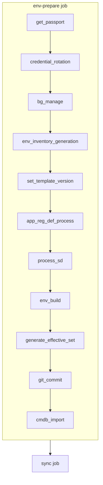

# EnvGene Pipelines

- [Instance pipeline](#instance-pipeline)
  - [env-prepare job](#env-prepare-job)
  - [sync job](#sync-job)

This document describes the EnvGene Instance pipeline: its jobs, the container image each job runs in, and
the steps that run inside each job. For each step it gives the condition under which the step runs.

The jobs and their step sequence are intended to match across the GitLab and GitHub CI/CD platforms.

> [!NOTE]
> This describes core EnvGene. EnvGene is extensible: an extension can change the step sequence or add steps.

## Instance pipeline

The main EnvGene pipeline. It generates the Environment Instance and the Effective Set, and - for deploy
operations - hands the result to the deployer. It is triggered manually from the GitLab or GitHub UI, or by
an external system through the GitLab or GitHub API.

The Instance pipeline has two jobs:

- `env-prepare` runs the EnvGene steps in the `qubership-envgene` image.
- `sync` deploys the generated Effective Set in the deployer image. It runs only for `GITLAB_DEPLOY` deploy
  operations.

If [`ENV_NAMES`](/docs/instance-pipeline-parameters.md#env_names) lists several environments, EnvGene runs one
`env-prepare` flow per environment in parallel. The Cloud Passport step runs at most once per cluster.

```mermaid
flowchart TB
    subgraph env_prepare["env-prepare job"]
        direction TB
        A[get_passport] --> B[credential_rotation]
        B --> C[bg_manage]
        C --> D[env_inventory_generation]
        D --> SV[set_template_version]
        SV --> E[app_reg_def_process]
        E --> F[process_sd]
        F --> G[env_build]
        G --> H[generate_effective_set]
        H --> I[git_commit]
        I --> J[cmdb_import]
    end
    env_prepare --> sync["sync job"]
```

### env-prepare job

- **Image**: [`qubership-envgene`](https://github.com/Netcracker/qubership-envgene/pkgs/container/qubership-envgene)
- **Condition**: every Instance pipeline run.

`env-prepare` runs the steps below in a single process, in the listed order. A step runs only when its
condition holds, otherwise it is skipped. If a step fails, the job fails and the remaining steps do not run.
The authoritative step sequence and names are defined in the pipeline orchestrator
(`scripts/pipeline/orchestrator.py`).

Before the steps run, `env-prepare` checks out the repository, installs certificates, and resolves the
pipeline parameters.

1. **get_passport** - obtains the Cloud Passport for the target cluster, triggering the
   [Discovery pipeline](/docs/discovery-pipeline-parameters.md) when the passport is not already present.
   - **Condition**: [`GET_PASSPORT: true`](/docs/instance-pipeline-parameters.md#get_passport).

2. **credential_rotation** - rotates credentials from the rotation payload.
   - **Condition**: [`CRED_ROTATION_PAYLOAD`](/docs/instance-pipeline-parameters.md#cred_rotation_payload) is
     set. It cannot be combined with `GET_PASSPORT`.

3. **bg_manage** - changes Blue-Green Deployment state and warms up the candidate namespace.
   - **Condition**: [`OPERATION_TYPE: BGD`](/docs/instance-pipeline-parameters.md#operation_type) in a
     [`GITLAB_DEPLOY`](/docs/instance-pipeline-parameters.md#pipeline_type) pipeline. The warmup runs only
     when [`BGD_OPERATION: warmup`](/docs/instance-pipeline-parameters.md#bgd_operation).

4. **env_inventory_generation** - generates the Environment Instance inventory.
   - **Condition**: any of the following is set:
     - [`ENV_INVENTORY_CONTENT`](/docs/instance-pipeline-parameters.md#env_inventory_content), or
     - [`ENV_INVENTORY_INIT: true`](/docs/instance-pipeline-parameters.md#env_inventory_init), or
     - [`ENV_SPECIFIC_PARAMS`](/docs/instance-pipeline-parameters.md#env_specific_params), or
     - [`ENV_TEMPLATE_NAME`](/docs/instance-pipeline-parameters.md#env_template_name).

     The last three are deprecated.

5. **set_template_version** - applies
   [`ENV_TEMPLATE_VERSION`](/docs/instance-pipeline-parameters.md#env_template_version) to the Environment
   according to
   [`ENV_TEMPLATE_VERSION_UPDATE_MODE`](/docs/instance-pipeline-parameters.md#env_template_version_update_mode):
   in `PERSISTENT` mode it updates `env_definition.yml`, in `TEMPORARY` mode it applies the version to the
   current run only. See [Template Version Update](/docs/use-cases/template-version-update.md).
   - **Condition**: [`ENV_TEMPLATE_VERSION`](/docs/instance-pipeline-parameters.md#env_template_version) is
     provided.

6. **app_reg_def_process** - renders [Application Definitions](/docs/envgene-objects.md#application-definition)
   and [Registry Definitions](/docs/envgene-objects.md#registry-definition).
   - **Condition**: [`ENV_BUILDER: true`](/docs/instance-pipeline-parameters.md#env_builder).

   This step:

   1. Renders the definitions from [templates](/docs/features/app-reg-defs.md#templates) or an
      [external job (deprecated)](/docs/features/app-reg-defs.md#external-job-deprecated).
   2. Runs [template transformation](/docs/features/app-reg-defs.md#template-transformation).

7. **process_sd** - builds the deployment plan from the Solution Descriptor.
   - **Condition**: a standalone (non-`GITLAB_DEPLOY`) pipeline runs an
     [`OPERATION_TYPE: DEPLOY`](/docs/instance-pipeline-parameters.md#operation_type) operation and a Solution
     Descriptor is provided through [`SD_DATA`](/docs/instance-pipeline-parameters.md#sd_data) or
     [`SD_VERSION`](/docs/instance-pipeline-parameters.md#sd_version). A `GITLAB_DEPLOY` pipeline builds the
     deployment plan directly.

8. **env_build** - renders the Environment Instance from Jinja2 templates.
   - **Condition**: [`ENV_BUILDER: true`](/docs/instance-pipeline-parameters.md#env_builder), or a
     `GITLAB_DEPLOY` deploy or clean operation.

   This step:

   1. Renders Namespaces, Clouds, and other environment components, but not Application and Registry
      Definitions.
   2. Applies template overrides.
   3. Applies template and environment-specific ParameterSets and Resource Profiles.
   4. Creates Credentials, including shared Credentials.

9. **generate_effective_set** - generates the Effective Set with the
   [`qubership-effective-set-generator`](https://github.com/Netcracker/qubership-envgene/pkgs/container/qubership-effective-set-generator)
   CLI, invoked inside the `env-prepare` job.
   - **Condition**: [`GENERATE_EFFECTIVE_SET: true`](/docs/instance-pipeline-parameters.md#generate_effective_set),
     or a `GITLAB_DEPLOY` deploy, clean, or BGD warmup operation.

   This step:

   1. Generates the Effective Set.
   2. Invokes the [External Credentials provisioning CLI](/docs/features/external-creds-provisioning-cli.md) to
      materialize each external Credential in its target Secret Store. It is skipped when the Environment
      Instance contains no external Credentials. See
      [Credential provisioning](/docs/features/external-creds.md#credential-provisioning) for the CI/CD
      variable contract and failure semantics.

10. **git_commit** - commits the generated files to the Instance repository.
    - **Condition**: always runs. It commits only when a step produced changes to the repository.

11. **cmdb_import** - imports data into a CMDB.
    - **Condition**: [`CMDB_IMPORT: true`](/docs/instance-pipeline-parameters.md#cmdb_import). It does not run
      in a `GITLAB_DEPLOY` pipeline.

    > [!NOTE]
    > The `cmdb_import` step is not part of core EnvGene. It is an extension point.

### sync job

- **Image**: the deployer image.
- **Condition**: [`PIPELINE_TYPE: GITLAB_DEPLOY`](/docs/instance-pipeline-parameters.md#pipeline_type) with a
  deploy operation. It does not run for [`OPERATION_TYPE: CLEAN`](/docs/instance-pipeline-parameters.md#operation_type).

`sync` reads the Effective Set produced by `env-prepare` and runs the deployer to apply it to the target
namespaces.
