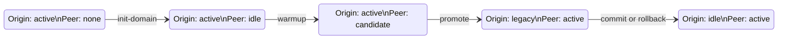
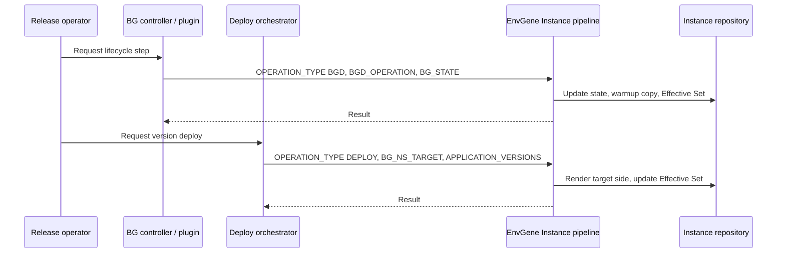

# Blue-Green Deployment

- [Blue-Green Deployment](#blue-green-deployment)
  - [Description](#description)
  - [Why EnvGene supports Blue-Green](#why-envgene-supports-blue-green)
  - [What a BG environment looks like](#what-a-bg-environment-looks-like)
  - [Two kinds of work on a BG environment](#two-kinds-of-work-on-a-bg-environment)
  - [Deploy to one side](#deploy-to-one-side)
  - [Lifecycle in plain terms](#lifecycle-in-plain-terms)
  - [What state files tell you](#what-state-files-tell-you)
  - [Warmup and why it matters](#warmup-and-why-it-matters)
  - [Who triggers what](#who-triggers-what)
  - [Where to read next](#where-to-read-next)

## Description

Blue-Green Deployment (BGD) is a release pattern that keeps two copies of the same application
stack side by side. One copy serves live traffic. The other copy is prepared, tested, and switched
over when the release is ready. Downtime stays low because the switch is a promotion between two
already-running sides, not a rebuild of the only copy.

In EnvGene, BGD is modeled around a **BG Domain**: a named group of three namespaces - **origin**,
**peer**, and **controller**. The origin and peer namespaces hold the two application sides. The
controller namespace hosts the coordination service that drives promotion and rollback with the
deploy platform.

EnvGene does not run the live cluster or route traffic. It maintains the **Environment Instance**
in Git: namespace definitions, inventory, version pins, lifecycle state markers, and the
**Effective Set** that deployers consume. External systems (a BG controller, a deploy orchestrator)
call the EnvGene Instance pipeline when they need configuration updated for the next step of a
release.

BGD in EnvGene requires the **No-CMDB v2** deployment architecture
([`noCmdbVersion: v2`](/docs/deployment-architecture.md#no-cmdb-v2) in the Environment Inventory,
[`PIPELINE_TYPE: GITLAB_DEPLOY`](/docs/instance-pipeline-parameters.md#pipeline_type) on pipeline
runs).

To set up a BG environment, start with
[Configure Blue-Green Deployment](/docs/how-to/blue-green-deployment-configure.md). To run a
deploy into one side, see
[Blue-Green Deployment deploy operations](/docs/how-to/blue-green-deployment-deploy-operations.md).

## Why EnvGene supports Blue-Green

A BG release is not a single action. It is a sequence of preparatory steps where configuration
must stay consistent across two sides that share one logical application but may diverge in
template version, parameters, and deployed application versions.

EnvGene addresses that by keeping both sides in one Environment Instance and recording which side
is active, which is idle, and which is a candidate for promotion. That record lives in small
**state marker files** in the environment folder (for example, `.origin-active`, `.peer-idle`).
Deploy and lifecycle tools read the same Git state EnvGene writes.

Without this model, operators would manually duplicate namespace trees, track versions by
convention, and risk promoting a side whose inventory no longer matches its folder content.
EnvGene ties together template rendering per side (`bgNsArtifacts`), namespace content, inventory,
state, and Effective Set generation so the two sides stay comparable through the release cycle.

## What a BG environment looks like

At a conceptual level, a BG-enabled environment adds structure on top of a normal EnvGene
environment:

```text
Environment
├── BG Domain object          (names origin, peer, controller)
├── Composite Structure       (groups baseline and satellite namespaces)
├── Namespaces/
│   ├── …-origin/             (one application side)
│   ├── …-peer/               (the other application side)
│   ├── …-bg-controller/      (coordination service)
│   └── …/                    (other namespaces, unchanged by BGD)
├── State marker files        (.origin-*, .peer-* in the environment root)
└── Inventory                 (template pins, including per-side artifacts)
```

The [BG Domain](/docs/envgene-objects.md#bg-domain) object is the anchor. It declares which
namespace is origin, which is peer, and which is controller, plus the controller URL and
credentials reference. EnvGene validates during generation that every namespace named in the BG
Domain exists in the environment.

Origin and peer often share one **deploy postfix** in the Solution Descriptor (for example,
`bss` maps to both `bss-origin` and `bss-peer` folders). EnvGene resolves the physical side
through [`BG_NS_TARGET`](/docs/instance-pipeline-parameters.md#bg_ns_target) on deploy runs.

Each side can render from its own template artifact version via
[`envTemplate.bgNsArtifacts`](/docs/envgene-configs.md) in the Environment Inventory. That allows
the candidate side to run a newer template while the active side stays on the previous pin until
promotion.

A full working example lives under
[`/docs/samples/blue-green-deployment/`](/docs/samples/blue-green-deployment/).

## Two kinds of work on a BG environment

Operators and automation interact with a BG environment through two distinct pipeline modes. The
distinction matters because they change different things.

| Kind | Pipeline mode | What changes |
| --- | --- | --- |
| **Deploy** | [`OPERATION_TYPE: DEPLOY`](/docs/instance-pipeline-parameters.md#operation_type) | Application versions on a chosen side (origin or peer), or on non-BG namespaces |
| **Lifecycle** | [`OPERATION_TYPE: BGD`](/docs/instance-pipeline-parameters.md#operation_type) + [`BGD_OPERATION`](/docs/instance-pipeline-parameters.md#bgd_operation) | BG state markers, and during warmup also namespace content copied from active to candidate |

**Deploy** answers: "Put this Solution Descriptor into the origin side, the peer side, the
controller, or a standalone namespace." It renders fresh configuration from template artifacts and
updates the Effective Set for the targeted namespaces.

**Lifecycle** answers: "Advance the release stage - initialize the domain, warm up the candidate,
promote, commit, or roll back." It updates state markers and, for warmup, prepares the candidate
side as a copy of the active side before a new version is deployed there.

Neither mode replaces the other. A typical forward release uses lifecycle steps to prepare and
promote, and deploy steps to place application versions on the candidate side before promotion.

## Deploy to one side

On deploy, EnvGene updates only the namespaces from your Solution Descriptor. Other namespace
folders in the environment stay as they are.

When origin and peer share one deploy postfix, set
[`BG_NS_TARGET`](/docs/instance-pipeline-parameters.md#bg_ns_target) to `origin` or `peer` for
the side you deploy to.

## Lifecycle in plain terms

BG lifecycle moves the origin and peer namespaces through a small set of **roles** relative to
traffic: **active** (serving), **idle** (standby), **candidate** (prepared for switch), and
**legacy** (demoted after a successful promote).

The forward path, in everyday language:

1. **Init domain** - `OPERATION_TYPE=BGD`, `BGD_OPERATION=init-domain`. Register the BG Domain in
   Git. Active side is origin; peer starts idle.
2. **Warmup** - `OPERATION_TYPE=BGD`, `BGD_OPERATION=warmup`. Copy active-side configuration into
   the idle side so it becomes a **candidate** starting point.
3. **Deploy to candidate** - This is not a BGD lifecycle operation. It uses
   `OPERATION_TYPE=DEPLOY` and targets the candidate side.
4. **Promote** - `OPERATION_TYPE=BGD`, `BGD_OPERATION=promote`. Flip roles: candidate becomes
   **active**, former active becomes **legacy**.
5. **Commit** - `OPERATION_TYPE=BGD`, `BGD_OPERATION=commit`. Retire the legacy side back to
   **idle**, leaving the new active side in place.
6. **Rollback** - `OPERATION_TYPE=BGD`, `BGD_OPERATION=rollback`. Return the lifecycle to the same
   observable repository state as commit: the legacy side becomes **idle**, and the active side
   stays active.

In other words, for BG lifecycle operations EnvGene always uses `OPERATION_TYPE=BGD`. The specific
operation is selected through `BGD_OPERATION`, whose supported values are `warmup`, `commit`,
`promote`, `rollback`, and `init-domain`.

EnvGene also supports a **reverse** path (promotion in the opposite direction). The same
lifecycle operation names apply; which side is active is determined from the current state
markers, not from fixed origin/peer labels.



The same lifecycle can be read as a small state-change table:

| `BGD_OPERATION` | State pair before | State pair after | Meaning |
| --- | --- | --- | --- |
| `init-domain` | `(ACTIVE, NONE)` | `(ACTIVE, IDLE)` | Initialize the BG pair |
| `warmup` | `(ACTIVE, IDLE)` | `(ACTIVE, CANDIDATE)` | Prepare the idle side for the next deploy |
| `promote` | `(ACTIVE, CANDIDATE)` | `(LEGACY, ACTIVE)` | Switch the active side |
| `commit` | `(LEGACY, ACTIVE)` | `(IDLE, ACTIVE)` | Finish the cycle and retire the legacy side |
| `rollback` | `(LEGACY, ACTIVE)` | `(IDLE, ACTIVE)` | Return to the same repository state as commit |

State files are the Git markers for these pairs. In the reverse cycle, EnvGene uses the same
operation names and resolves the active and idle sides from the current marker files.

Parameter names and allowed values are in
[Instance pipeline parameters](/docs/instance-pipeline-parameters.md).

## What state files tell you

State marker files are empty files in the environment root named `.<role>-<state>` (for example,
`.peer-candidate`). They are the ground truth in Git for which lifecycle role each side currently
holds.

| Example file | Meaning |
| --- | --- |
| `.origin-active` | Origin namespace is serving traffic |
| `.peer-idle` | Peer namespace is standby, not in the release path |
| `.peer-candidate` | Peer namespace is prepared for promotion |
| `.origin-legacy` | Origin was demoted after peer promotion |

When a BGD lifecycle run completes, EnvGene updates the marker files from the
[`BG_STATE`](/docs/instance-pipeline-parameters.md#bg_state) pipeline parameter. The caller
passes the target state for origin and peer; EnvGene writes the matching `.origin-<state>` and
`.peer-<state>` files and removes the previous markers. Only those two state values are used -
other fields in `BG_STATE` do not affect the markers.

You can inspect the marker files directly in the Instance repository to see where a release
stands without opening cluster consoles.

Schema and naming rules:
[BG State Files](/docs/envgene-objects.md#bg-state-files).

## Warmup and why it matters

Warmup is the lifecycle step that makes the candidate side a **replica of the active side** in
Git: namespace folder content (including applications), and the candidate's template artifact pin
in inventory. Only the namespace **name** stays that of the candidate side.

That matters because a candidate should start from what production actually runs, not from an
empty or stale template render. After warmup, deploy puts the **delta** (new application
versions) on top of a known baseline. Warmup retry from a failed state updates markers only; it
does not repeat the copy until the state allows it again.

Warmup also feeds deploy planning: EnvGene builds a deploy-plan delta for the candidate from the
active side's plan so Effective Set generation covers the warmed namespace consistently.

## Who triggers what

EnvGene sits in a chain of tools. None of the orchestration products below are part of EnvGene
Core, but they explain why the Instance pipeline receives BG-related parameters.



The BG controller (often exposed through a BG plugin API) drives lifecycle operations. The deploy
orchestrator drives application version deploys and selects origin or peer through
`BG_NS_TARGET` when both share one deploy postfix.

EnvGene's role is to apply those requests faithfully to Git and regenerate deploy artifacts. Traffic
switching and health checks happen outside EnvGene.

## Where to read next

Use this page for **understanding**. Follow the links below for **doing**, **lookup**, or
**deeper design**.

| If you want to… | Read |
| --- | --- |
| Set up templates, inventory, and a first BG environment | [Configure Blue-Green Deployment](/docs/how-to/blue-green-deployment-configure.md) |
| Deploy application versions to origin, peer, controller, or other namespaces | [Blue-Green Deployment deploy operations](/docs/how-to/blue-green-deployment-deploy-operations.md) |
| Look up BG Domain, state files, and object fields | [EnvGene objects - BG Domain](/docs/envgene-objects.md#bg-domain) |
| Look up pipeline parameters (`BGD_OPERATION`, `BG_STATE`, `BG_NS_TARGET`) | [Instance pipeline parameters](/docs/instance-pipeline-parameters.md) |
| See folder naming and per-side template artifacts | [Environment Instance generation](/docs/features/environment-instance-generation.md) |
| See BG parameters in the Effective Set | [Effective Set calculator - `bg_domain` example](/docs/features/calculator-cli.md#version-20topology-context-bg_domain-example) |
| Copy a complete template and instance layout | [BGD samples](/docs/samples/blue-green-deployment/) |
| Study pipeline step behavior (implementers) | [BGD sub-flows](/docs/analysis/modern-toolset/bgd-sub-flows.md), [`change_bg_state`](/docs/technical-design/instance-pipeline/change-bg-state.md), [`warmup`](/docs/technical-design/instance-pipeline/warmup.md) |
