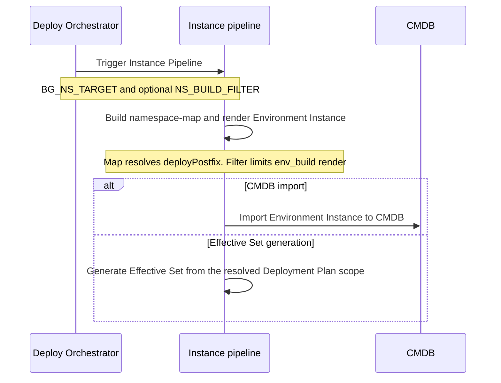
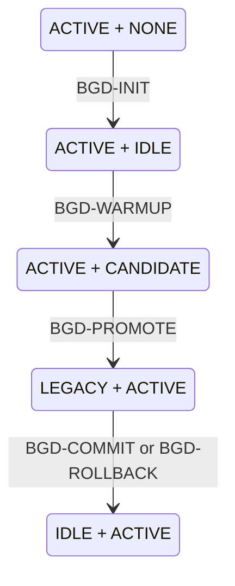

# Blue-Green Deployment

- [Blue-Green Deployment](#blue-green-deployment)
  - [Description](#description)
  - [Conceptual model](#conceptual-model)
  - [Operation-driven control](#operation-driven-control)
  - [Responsibility boundaries](#responsibility-boundaries)
  - [Operation flows](#operation-flows)
  - [Deploy-side namespace targeting](#deploy-side-namespace-targeting)
  - [`bg_manage` step](#bg_manage-step)
  - [BG Domain lifecycle](#bg-domain-lifecycle)
  - [Operation semantics](#operation-semantics)
    - [BGD-INIT](#bgd-init)
    - [BGD-WARMUP](#bgd-warmup)
    - [BGD-PROMOTE](#bgd-promote)
    - [BGD-COMMIT](#bgd-commit)
    - [BGD-ROLLBACK](#bgd-rollback)
  - [State storage](#state-storage)
    - [State transition validation](#state-transition-validation)
  - [Warmup behaviour](#warmup-behaviour)
  - [CMDB import](#cmdb-import)
  - [BG-related parameters in Effective Set](#bg-related-parameters-in-effective-set)
  - [BG-related macros](#bg-related-macros)
  - [Related documentation](#related-documentation)

## Description

Blue-Green Deployment (BGD) is a deployment strategy that reduces downtime by running two instances
of an application side by side. In EnvGene, a [BG Domain](/docs/envgene-objects.md#bg-domain) groups
the two application namespaces - origin and peer - and the controller namespace.

For BGD, EnvGene:

- generates the BG Domain object from a
  [BG Domain Template](/docs/envgene-objects.md#bg-domain-template) during Environment Instance
  generation and validates that every referenced namespace exists in the Environment
- resolves a shared Solution Descriptor `deployPostfix` to the origin or peer Namespace `name`
  through [`BG_NS_TARGET`](/docs/instance-pipeline-parameters.md#bg_ns_target) and the
  [Namespace map](/docs/features/namespace-map.md)
- regenerates selected namespaces by name, BG Domain role alias, or derivation from `BG_NS_TARGET`
  ([Namespace Render Filter](/docs/features/namespace-render-filtering.md))
- creates and updates [BG state files](#state-storage) for lifecycle operations
- copies namespace contents during [warmup](#warmup-behaviour)
- adds BG Domain parameters to the
  [Effective Set](#bg-related-parameters-in-effective-set)
- [imports](#cmdb-import) the BG Domain object into CMDB

To prepare an Environment, see
[Migrate to Blue-Green Deployment](/docs/how-to/blue-green-deployment-migration.md).
For deploy parameters, see
[Blue-Green Deployment deploy operations](/docs/how-to/blue-green-deployment-deploy-operations.md).

## Conceptual model

Origin and peer are fixed positions in a BG Domain. They do not decide which side serves traffic.

State files decide the purpose of each side at a point in time (for example origin `ACTIVE`, peer
`IDLE`). After a full cycle the states swap. EnvGene resolves active, idle, candidate, or legacy
from state files, not from the origin or peer role. That supports both forward and reverse cycles.

## Operation-driven control

Lifecycle control uses
[`OPERATION_TYPE`](/docs/instance-pipeline-parameters.md#operation_type).

EnvGene reads the current origin and peer states from the state files, derives the next states from
`OPERATION_TYPE`, and writes the new state files. The caller does not pass the next origin or peer
states.

Application deploy into a BG Domain side is not a lifecycle operation. It uses a deploy-side
selector such as [`BG_NS_TARGET`](/docs/instance-pipeline-parameters.md#bg_ns_target) and optional
[`NS_BUILD_FILTER`](/docs/instance-pipeline-parameters.md#ns_build_filter), not a BGD
`OPERATION_TYPE` value. See [Deploy-side namespace targeting](#deploy-side-namespace-targeting) and
[Blue-Green Deployment deploy operations](/docs/how-to/blue-green-deployment-deploy-operations.md).

## Responsibility boundaries

| Actor                       | Responsibility                                                           |
|-----------------------------|--------------------------------------------------------------------------|
| BG Operator / BG Controller | Decide whether a lifecycle operation is allowed before the pipeline runs |
| BG Plugin                   | Start the Instance pipeline with `ENV_NAMES` and `OPERATION_TYPE`        |
| EnvGene                     | Read BG Domain and state files, run repository actions, write next state |
| External deployment system  | Deploy apps, check candidate readiness, switch traffic, clean up legacy  |

> [!NOTE]
> The BG Plugin, BG Operator, deployment system, and CMDB are not part of EnvGene Core.

## Operation flows

## Deploy-side namespace targeting

Application deploy into a BG Domain side is not a lifecycle operation. Deploy-side targeting uses
[`BG_NS_TARGET`](/docs/instance-pipeline-parameters.md#bg_ns_target) (`origin` or `peer`).

Two independent effects:

1. **Namespace map** - when origin and peer share a Solution Descriptor `deployPostfix`,
   `compute_namespace_map` requires `BG_NS_TARGET` and writes the matching Namespace `name` into
   [`namespace-map.yml`](/docs/envgene-objects.md#namespace-map). The Deployment Plan Generator
   consumes that map. See [Namespace map](/docs/features/namespace-map.md).
2. **Render filter** - when `NS_BUILD_FILTER` is empty, `BG_NS_TARGET` applies the effect of
   `@origin` or `@peer` so `env_build` does not rewrite the other BG side. See
   [Namespace Render Filter](/docs/features/namespace-render-filtering.md).

`BG_NS_TARGET` does not mean `ACTIVE`, `IDLE`, or `CANDIDATE`. State files are not inputs to these
two effects.

## `bg_manage` step

The Instance pipeline step that applies a BGD
[`OPERATION_TYPE`](/docs/instance-pipeline-parameters.md#operation_type).

- Resolves origin, peer, and controller names from the
  [BG Domain](/docs/envgene-objects.md#bg-domain).
- Applies [Operation-driven control](#operation-driven-control) and
  [State transition validation](#state-transition-validation).
- For `BGD-WARMUP`, runs [Warmup behaviour](#warmup-behaviour).

When the step runs and how it orders relative to other steps is described in
[EnvGene pipelines](/docs/envgene-pipelines.md).

Related pipeline parameters:

- [`ENV_NAMES`](/docs/instance-pipeline-parameters.md#env_names)
- [`OPERATION_TYPE`](/docs/instance-pipeline-parameters.md#operation_type)
- [`BG_NS_TARGET`](/docs/instance-pipeline-parameters.md#bg_ns_target)
- [`NS_BUILD_FILTER`](/docs/instance-pipeline-parameters.md#ns_build_filter)
- [`ENV_TEMPLATE_VERSION`](/docs/instance-pipeline-parameters.md#env_template_version)
- [`GH_ADDITIONAL_PARAMS`](/docs/instance-pipeline-parameters.md#gh_additional_params)

## BG Domain lifecycle

Forward transitions as `(origin, peer)`. Every state except `(ACTIVE, NONE)` also has a mirrored
form with origin and peer swapped.

After `LEGACY + ACTIVE` → `IDLE + ACTIVE`, the former candidate stays active and the former active
side becomes idle.

## Operation semantics

State transitions for each value are in
[State transition validation](#state-transition-validation). The notes below add only what the table
does not carry.

### BGD-INIT

Creates the initial pair when one side is `ACTIVE` and the other has no state file.

### BGD-WARMUP

Also synchronises namespace content and template artefacts - see
[Warmup behaviour](#warmup-behaviour).

### BGD-PROMOTE

Updates state files only. The external system switches traffic.

### BGD-COMMIT

Updates state files only. The external system stops or cleans up the legacy workload.

### BGD-ROLLBACK

Same state-file outcome as `BGD-COMMIT`. The difference (successful cycle versus revert) is outside
EnvGene.

## State storage

BG state files are empty markers in the Environment root. The name encodes role and state:

`.<role>-<state>`

Valid states: `active`, `idle`, `candidate`, `legacy`.

Examples:

- `.origin-active` / `.peer-idle` - stable pair
- `.peer-candidate` - peer prepared for promotion
- `.origin-legacy` - origin demoted after promote

Each role has at most one state file. On change, EnvGene removes the old marker and creates the new
one. Path and naming:
[BG State Files](/docs/envgene-objects.md#bg-state-files).

### State transition validation

The `bg_manage` step accepts a BGD
[`OPERATION_TYPE`](/docs/instance-pipeline-parameters.md#operation_type) only when all of the
following hold. On the first violated check, the step fails with an error describing the violation
and leaves state files unchanged.

- **BG Domain present.** The Environment Instance contains a BG Domain object. Namespace names for
  origin, peer, and controller come from that object.
- **Single state file per role.** At most one `.origin-<state>` and one `.peer-<state>` file exists
  in the environment root.
- **Known current state.** The `.origin-<state>` and `.peer-<state>` files form a state pair listed
  in the transition table. When no state files exist, the step treats the current state as
  `(ACTIVE, NONE)`.
- **Allowed transition.** The next state for the current pair and `OPERATION_TYPE` appears in the
  transition table below.

The table lists the allowed transitions as `(origin, peer)` state pairs. `NONE` means no state file
exists for that namespace - the initial state before `BGD-INIT`.

| Operation                     | Current state         | Next state            |
|-------------------------------|-----------------------|-----------------------|
| `BGD-INIT`                    | `(ACTIVE, NONE)`      | `(ACTIVE, IDLE)`      |
| `BGD-WARMUP`                  | `(ACTIVE, IDLE)`      | `(ACTIVE, CANDIDATE)` |
| `BGD-PROMOTE`                 | `(ACTIVE, CANDIDATE)` | `(LEGACY, ACTIVE)`    |
| `BGD-COMMIT` / `BGD-ROLLBACK` | `(LEGACY, ACTIVE)`    | `(IDLE, ACTIVE)`      |

Every current state except `(ACTIVE, NONE)` also allows the mirrored transitions, with the origin
and peer states swapped. The mirrored transitions cover the reverse flow: reverse warmup, reverse
promote, and reverse commit.

## Warmup behaviour

Warmup is the only lifecycle operation that synchronises namespace content in the Instance
Repository.

EnvGene replaces the candidate folder contents with the active folder contents, including nested
[Application](/docs/envgene-objects.md#application) objects, and keeps the candidate `name`. The two
namespaces then differ only by name. The copy runs for `(ACTIVE, IDLE)` → `(ACTIVE, CANDIDATE)` and
its mirror.

EnvGene also synchronises `envTemplate.bgNsArtifacts`:

- preparing peer: `origin` → `peer`
- preparing origin: `peer` → `origin`

The candidate then uses the same template artefact version as the active side.

## CMDB import

When [`CMDB_IMPORT: true`](/docs/instance-pipeline-parameters.md#cmdb_import), the Instance pipeline
imports the [BG Domain](/docs/envgene-objects.md#bg-domain) into the CMDB with other entities such as
Cloud and Namespace.

## BG-related parameters in Effective Set

When the Environment has a BG Domain, EnvGene adds its structure to the Effective Set Topology
Context `parameters.yaml` and resolved controller credentials to `credentials.yaml`. EnvGene
replaces the credentials reference with the value and removes the `credentials` attribute.
Credentials must be `usernamePassword`.

See the
[`bg_domain` Topology Context example](/docs/features/calculator-cli.md#version-20topology-context-bg_domain-example).

## BG-related macros

Macros that read the BG Domain when it exists:

- [`ORIGIN_NAMESPACE`](/docs/template-macros.md#origin_namespace)
- [`PEER_NAMESPACE`](/docs/template-macros.md#peer_namespace)
- [`CONTROLLER_NAMESPACE`](/docs/template-macros.md#controller_namespace)
- [`BG_CONTROLLER_URL`](/docs/template-macros.md#bg_controller_url)
- [`BG_CONTROLLER_LOGIN`](/docs/template-macros.md#bg_controller_login)
- [`BG_CONTROLLER_PASSWORD`](/docs/template-macros.md#bg_controller_password)
- [`BASELINE_ORIGIN`](/docs/template-macros.md#baseline_origin)
- [`BASELINE_PEER`](/docs/template-macros.md#baseline_peer)
- [`BASELINE_CONTROLLER`](/docs/template-macros.md#baseline_controller)
- [`PUBLIC_IDENTITY_PROVIDER_URL`](/docs/template-macros.md#public_identity_provider_url)
- [`PRIVATE_IDENTITY_PROVIDER_URL`](/docs/template-macros.md#private_identity_provider_url)

## Related documentation

- [Migrate to Blue-Green Deployment](/docs/how-to/blue-green-deployment-migration.md)
- [Blue-Green Deployment deploy operations](/docs/how-to/blue-green-deployment-deploy-operations.md)
- [Blue-Green Deployment Use Cases](/docs/use-cases/blue-green-deployment.md)
- [Namespace map](/docs/features/namespace-map.md)
- [Namespace Render Filter](/docs/features/namespace-render-filtering.md)
- [BG Domain object](/docs/envgene-objects.md#bg-domain)
- [BG Domain Template](/docs/envgene-objects.md#bg-domain-template)
- [BG State Files](/docs/envgene-objects.md#bg-state-files)
- [Namespace map object](/docs/envgene-objects.md#namespace-map)
- [BGD samples](/docs/samples/blue-green-deployment/)
