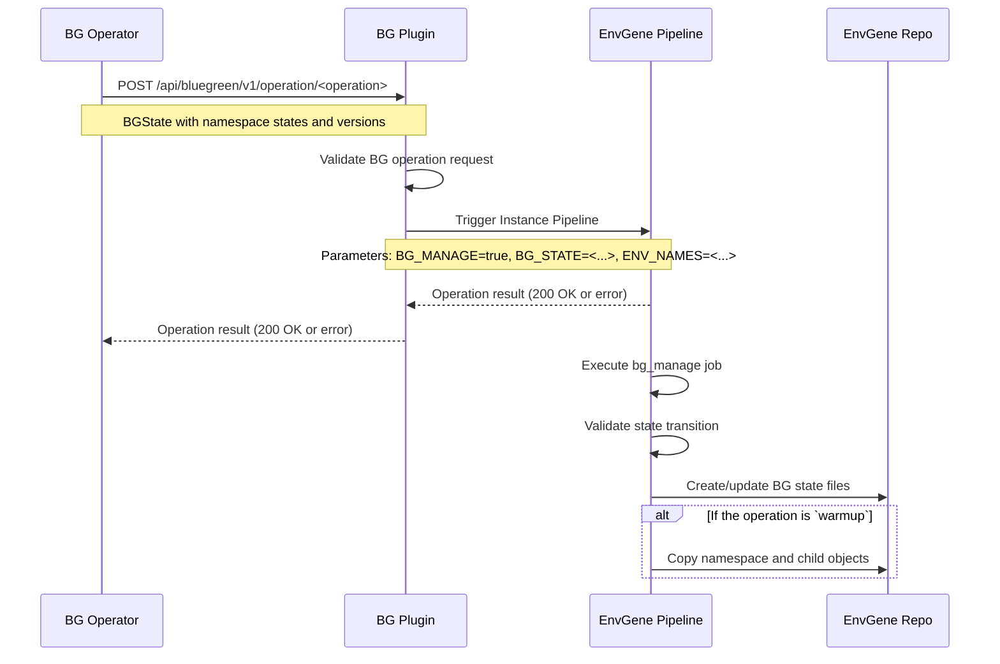
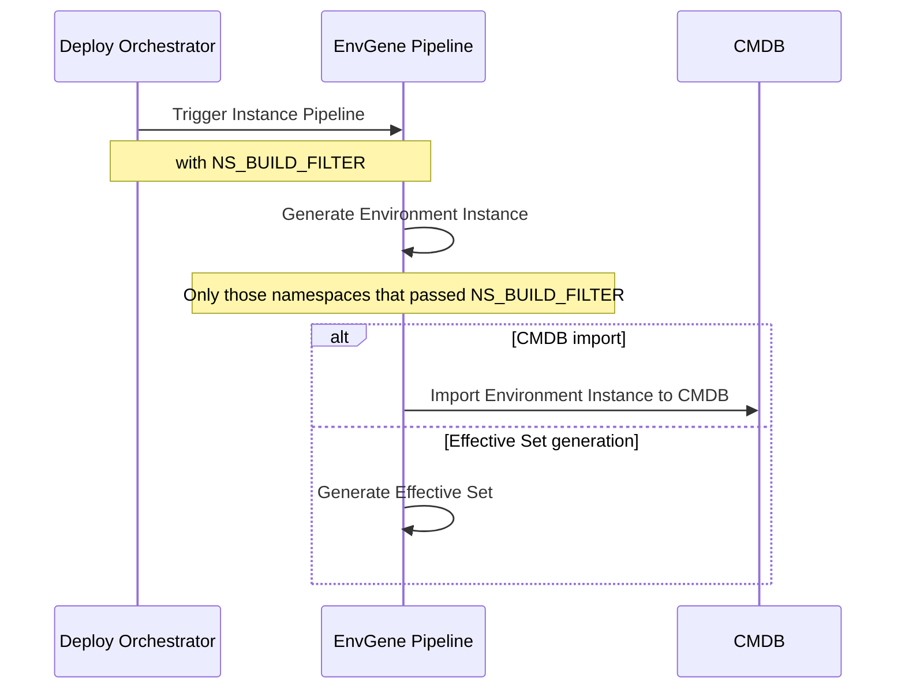

# Blue-Green Deployment

- [Blue-Green Deployment](#blue-green-deployment)
  - [Description](#description)
  - [Operation flows](#operation-flows)
  - [BG-related EnvGene objects](#bg-related-envgene-objects)
  - [`bg_manage` job](#bg_manage-job)
  - [BG-related Instance pipeline parameters](#bg-related-instance-pipeline-parameters)
  - [BG state files](#bg-state-files)
    - [State transition validation](#state-transition-validation)
  - [Warmup operation](#warmup-operation)
  - [CMDB import](#cmdb-import)
  - [BG-related parameters in Effective Set](#bg-related-parameters-in-effective-set)
  - [BG-related macros](#bg-related-macros)
  - [Related documentation](#related-documentation)

## Description

Blue-Green Deployment (BGD) is a deployment strategy that reduces downtime by running two instances
of an application side by side. In EnvGene, a [BG Domain](/docs/envgene-objects.md#bg-domain) groups
the two application namespaces - origin and peer - and the controller namespace.

For BGD, EnvGene:

- generates the BG Domain object from a
  [BG Domain Template](/docs/envgene-objects.md#bg-domain-template) during Environment Instance
  generation and validates that every namespace the object references exists in the Environment
  (otherwise generation fails)
- regenerates selected namespaces only, by name or BG Domain role alias, using the
  [Namespace Render Filter](/docs/features/namespace-render-filtering.md)
- creates, updates, and validates [BG state files](#bg-state-files) on BG Plugin calls
- copies namespace contents between origin and peer during the [warmup operation](#warmup-operation)
- adds BG Domain parameters to the
  [Effective Set](#bg-related-parameters-in-effective-set)
- [imports](#cmdb-import) the BG Domain object into CMDB

To prepare an Environment for BGD, see
[Configure Blue-Green Deployment](/docs/how-to/blue-green-deployment-configure.md). To select
parameters for a deploy operation, see
[Blue-Green Deployment deploy operations](/docs/how-to/blue-green-deployment-deploy-operations.md).

## Operation flows

The BG Operator initiates lifecycle operations through the BG Plugin, which triggers the Instance
pipeline with `BG_MANAGE` and `BG_STATE`.



The deploy orchestrator triggers the Instance pipeline with `NS_BUILD_FILTER` for selective
namespace processing.



> [!NOTE]
> BG Operator, BG Plugin, Deploy Orchestrator, and CMDB are not components of EnvGene. They are
> external systems that interact with EnvGene during BGD operations.

## BG-related EnvGene objects

- [BG Domain](/docs/envgene-objects.md#bg-domain): defines the domain structure - origin, peer, and
  controller namespaces
- [BG Domain Template](/docs/envgene-objects.md#bg-domain-template): generates the BG Domain object
  during Environment Instance generation
- [BG State Files](/docs/envgene-objects.md#bg-state-files): track the states of the origin and peer
  namespaces

## `bg_manage` job

The job is part of the Instance pipeline. It:

- validates namespace names in `BG_STATE` against the [BG Domain](/docs/envgene-objects.md#bg-domain)
  object in the Environment Instance
- validates the requested state change against the BG state files (see
  [State transition validation](#state-transition-validation))
- creates and updates [BG state files](/docs/envgene-objects.md#bg-state-files)
- during warmup, copies the [Namespace](/docs/envgene-objects.md#namespace) and the
  [Applications](/docs/envgene-objects.md#application) under it

The criteria for running the job and its order relative to other jobs are described in
[EnvGene pipelines](/docs/envgene-pipelines.md).

## BG-related Instance pipeline parameters

- [`ENV_NAMES`](/docs/instance-pipeline-parameters.md#env_names)
- `BG_MANAGE`
- `BG_STATE`
- [`GH_ADDITIONAL_PARAMS`](/docs/instance-pipeline-parameters.md#gh_additional_params)

The parameter set differs between the GitLab and GitHub pipelines.

**GitLab CI example:**

```yaml
variables:
  ENV_NAMES: "sdp-dev/env-1"
  BG_MANAGE: "true"
  BG_STATE: "{\"controllerNamespace\":\"bss-controller\",\"originNamespace\":{\"name\":\"bss-origin\",\"state\":\"active\",\"version\":\"v2.1.0\"},\"peerNamespace\":{\"name\":\"bss-peer\",\"state\":\"candidate\",\"version\":\"v2.2.0\"},\"updateTime\":\"2024-01-15T10:30:00Z\"}"
```

**GitHub Actions example:**

```yaml
ENV_NAMES: "sdp-dev/env-1"
GH_ADDITIONAL_PARAMS: "BG_MANAGE=true,BG_STATE={\"controllerNamespace\":\"bss-controller\",\"originNamespace\":{\"name\":\"bss-origin\",\"state\":\"active\",\"version\":\"v2.1.0\"},\"peerNamespace\":{\"name\":\"bss-peer\",\"state\":\"candidate\",\"version\":\"v2.2.0\"},\"updateTime\":\"2024-01-15T10:30:00Z\"}"
```

The BG Plugin is expected to merge the pipeline parameters from `INSTANCE_PIPELINE_PARAMETERS` - a
deployment parameter of the solution, consumed by the BG Plugin outside EnvGene - into the trigger
call. For example, when `INSTANCE_PIPELINE_PARAMETERS` holds
`ENV_NAMES: sdp-dev/env-1`, `CMDB_IMPORT: "true"`, and `DEPLOYMENT_TICKET_ID: "FAKE-000"`, the plugin
triggers the pipeline with:

```yaml
variables:
  ENV_NAMES: "sdp-dev/env-1"
  BG_MANAGE: "true"
  BG_STATE: "{\"controllerNamespace\":\"bss-controller\",\"originNamespace\":{\"name\":\"bss-origin\",\"state\":\"active\",\"version\":\"v2.1.0\"},\"peerNamespace\":{\"name\":\"bss-peer\",\"state\":\"candidate\",\"version\":\"v2.2.0\"},\"updateTime\":\"2024-01-15T10:30:00Z\"}"
  CMDB_IMPORT: "true"
  DEPLOYMENT_TICKET_ID: "FAKE-000"
```

## BG state files

BG state files track which lifecycle state each of the origin and peer namespaces of a BG Domain is
in. BG state files are empty marker files created and updated by the `bg_manage` job. When a state
changes, the job removes the old state file and creates a new one with the updated state.

The file location and naming pattern (`.<role>-<state>` in the environment root) are defined in
[BG State Files](/docs/envgene-objects.md#bg-state-files).

**Examples**:

- `.origin-active` - the origin namespace is serving traffic
- `.peer-candidate` - the peer namespace is prepared for promotion
- `.origin-legacy` - the origin namespace was demoted after promotion
- `.peer-idle` - the peer namespace is not in use
- `.peer-failedw` - the peer namespace warmup operation failed
- `.origin-failedc` - the origin namespace commit or promote operation failed

### State transition validation

The `bg_manage` job accepts a requested state change only when all of the following hold. On the
first violated check, the job fails with an error describing the violation.

- **Namespace names.** `BG_STATE.originNamespace.name` and `BG_STATE.peerNamespace.name` equal the
  matching names in the BG Domain object, and `BG_STATE.controllerNamespace` equals
  `bg_domain.controllerNamespace.name`.
- **Single state file per role.** At most one `.origin-<state>` and one `.peer-<state>` file exists
  in the environment root.
- **Known current state.** The `.origin-<state>` and `.peer-<state>` files form a state pair listed
  in the transition table. When no state files exist, the job treats the current state as
  `(ACTIVE, NONE)`.
- **Allowed transition.** The state pair requested in `BG_STATE` is an allowed next state for the
  current pair.

The table lists the allowed transitions as `(origin, peer)` state pairs. `NONE` means no state file
exists for that namespace - the initial state before the Init domain operation.

| Current state         | Next state            | Operation                  |
|-----------------------|-----------------------|----------------------------|
| `(ACTIVE, NONE)`      | `(ACTIVE, IDLE)`      | Init domain                |
| `(ACTIVE, IDLE)`      | `(ACTIVE, CANDIDATE)` | Warmup                     |
| `(ACTIVE, IDLE)`      | `(ACTIVE, FAILEDW)`   | Warmup failure             |
| `(ACTIVE, IDLE)`      | `(ACTIVE, IDLE)`      | -                          |
| `(ACTIVE, CANDIDATE)` | `(LEGACY, ACTIVE)`    | Promote                    |
| `(ACTIVE, CANDIDATE)` | `(ACTIVE, FAILEDC)`   | Promote failure            |
| `(ACTIVE, CANDIDATE)` | `(ACTIVE, IDLE)`      | -                          |
| `(LEGACY, ACTIVE)`    | `(IDLE, ACTIVE)`      | Commit or rollback         |
| `(LEGACY, ACTIVE)`    | `(FAILEDC, ACTIVE)`   | Commit or rollback failure |
| `(ACTIVE, FAILEDW)`   | `(ACTIVE, CANDIDATE)` | Warmup retry               |
| `(ACTIVE, FAILEDW)`   | `(ACTIVE, FAILEDW)`   | Warmup failure             |
| `(ACTIVE, FAILEDC)`   | `(IDLE, ACTIVE)`      | -                          |
| `(ACTIVE, FAILEDC)`   | `(ACTIVE, FAILEDC)`   | -                          |

Every current state except `(ACTIVE, NONE)` also allows the mirrored transitions, with the origin
and peer states swapped. The mirrored transitions cover the reverse flow: reverse warmup, reverse
promote, and reverse commit.

## Warmup operation

Unlike other BG operations, `warmup` (forward flow) and `reverse warmup` (reverse flow) copy
namespace contents.

The `bg_manage` job syncs the namespace folders in the repository: it replaces the content of the
candidate namespace folder with the content from the active namespace folder, including all nested
`Application` objects and their files, but keeps the `name` attribute of the candidate namespace. As
a result, the active and candidate namespace folders become identical except for the `name`
attribute.

The copy runs only for the transition `(ACTIVE, IDLE)` to `(ACTIVE, CANDIDATE)` and its mirror. A
warmup retried from the `FAILEDW` state updates state files only.

During warmup the `bg_manage` job also updates the Environment Inventory (`env_definition.yml`):

- Forward flow (warmup): copies `envTemplate.bgNsArtifacts.origin` to `envTemplate.bgNsArtifacts.peer`
- Reverse flow (reverse warmup): copies `envTemplate.bgNsArtifacts.peer` to
  `envTemplate.bgNsArtifacts.origin`

The candidate namespace then uses the same template artifact version as the active namespace when it
becomes active.

## CMDB import

The CMDB import creates the [BG Domain](/docs/envgene-objects.md#bg-domain) in the CMDB, among other
entities such as Cloud or Namespace. The import runs when the Instance pipeline is started with
[`CMDB_IMPORT: true`](/docs/instance-pipeline-parameters.md#cmdb_import).

> [!NOTE]
> Integration with a CMDB system is not part of EnvGene Core.

## BG-related parameters in Effective Set

When a BG Domain object is part of an Environment Instance, EnvGene adds BG-specific parameters to
the Effective Set Topology Context: the domain structure goes to `parameters.yaml`, and the resolved
controller credentials go to `credentials.yaml`. EnvGene replaces the credentials reference with the
actual credentials value and removes the `credentials` attribute. The credentials must be of type
`usernamePassword`.

See the
[Effective Set](/docs/features/calculator-cli.md#version-20topology-context-bg_domain-example)
documentation for the `bg_domain` context example.

## BG-related macros

Calculator command-line tool macros that read the BG Domain object when one exists in the
Environment:

- [`ORIGIN_NAMESPACE`](/docs/template-macros.md#origin_namespace)
- [`PEER_NAMESPACE`](/docs/template-macros.md#peer_namespace)
- [`CONTROLLER_NAMESPACE`](/docs/template-macros.md#controller_namespace)
- [`BG_CONTROLLER_URL`](/docs/template-macros.md#bg_controller_url)
- [`BG_CONTROLLER_LOGIN`](/docs/template-macros.md#bg_controller_login)
- [`BG_CONTROLLER_PASSWORD`](/docs/template-macros.md#bg_controller_password)
- [`BASELINE_ORIGIN`](/docs/template-macros.md#baseline_origin)
- [`BASELINE_PEER`](/docs/template-macros.md#baseline_peer)
- [`BASELINE_CONTROLLER`](/docs/template-macros.md#baseline_controller)
- [`PUBLIC_IDENTITY_PROVIDER_URL`](/docs/template-macros.md#public_identity_provider_url)
- [`PRIVATE_IDENTITY_PROVIDER_URL`](/docs/template-macros.md#private_identity_provider_url)

## Related documentation

- [Configure Blue-Green Deployment](/docs/how-to/blue-green-deployment-configure.md)
- [Blue-Green Deployment deploy operations](/docs/how-to/blue-green-deployment-deploy-operations.md)
- [Blue-Green Deployment Use Cases](/docs/use-cases/blue-green-deployment.md)
- [Namespace Render Filter](/docs/features/namespace-render-filtering.md)
- [BG Domain object](/docs/envgene-objects.md#bg-domain)
- [BGD samples](/docs/samples/blue-green-deployment/)
