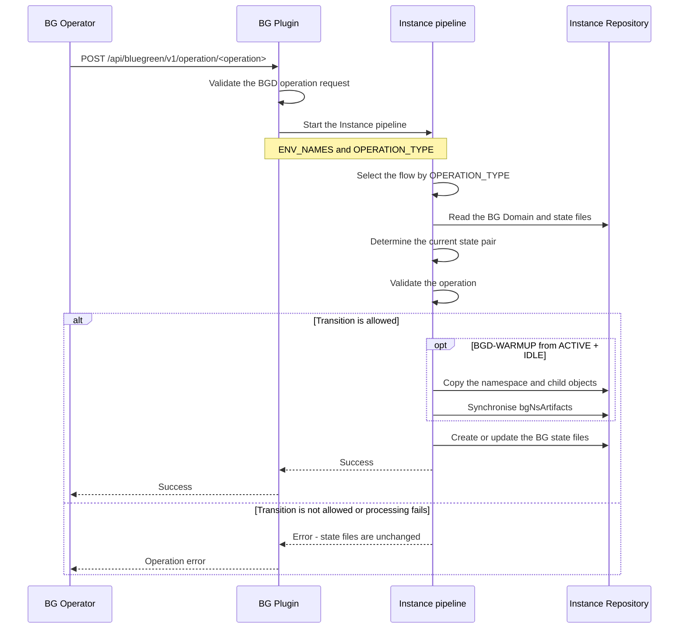
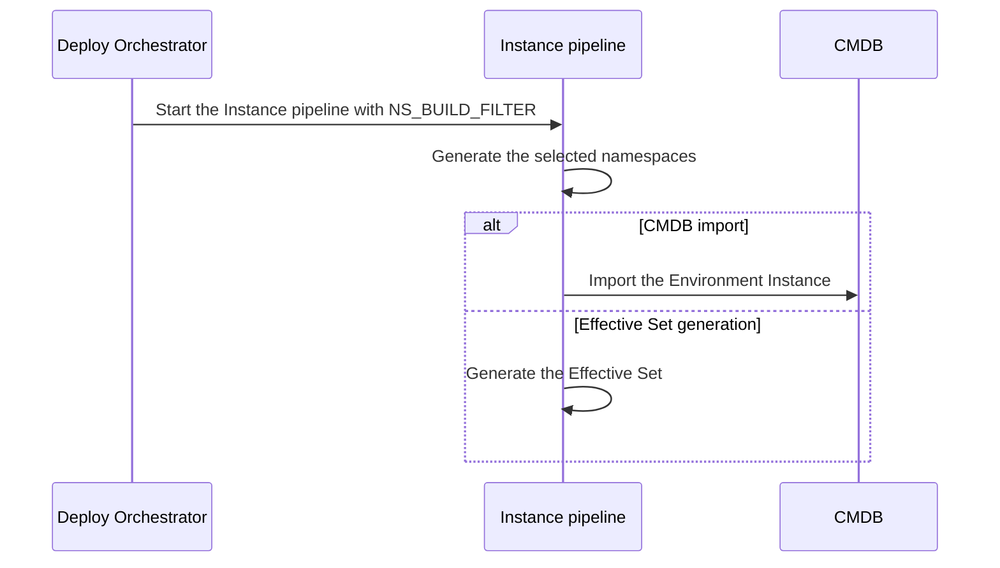
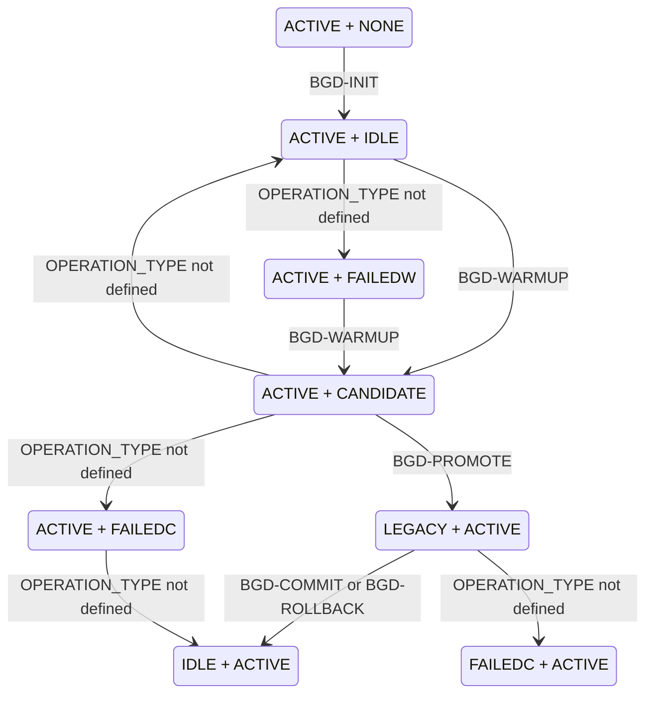

# Blue-Green Deployment

- [Blue-Green Deployment](#blue-green-deployment)
  - [Description](#description)
  - [Conceptual model](#conceptual-model)
  - [Operation-driven control](#operation-driven-control)
  - [Operation flows](#operation-flows)
  - [Responsibility boundaries](#responsibility-boundaries)
  - [BG Domain lifecycle](#bg-domain-lifecycle)
  - [Operation semantics](#operation-semantics)
    - [BGD-INIT](#bgd-init)
    - [BGD-WARMUP](#bgd-warmup)
    - [BGD-PROMOTE](#bgd-promote)
    - [BGD-COMMIT](#bgd-commit)
    - [BGD-ROLLBACK](#bgd-rollback)
  - [State storage](#state-storage)
  - [Transition validation](#transition-validation)
  - [Warmup behaviour](#warmup-behaviour)
  - [BG-related EnvGene objects](#bg-related-envgene-objects)
  - [CMDB import](#cmdb-import)
  - [BG-related parameters in Effective Set](#bg-related-parameters-in-effective-set)
  - [BG-related macros](#bg-related-macros)
  - [Related documentation](#related-documentation)

## Description

Blue-Green Deployment (BGD) is a deployment strategy that reduces downtime by running two instances
of an application side by side. In EnvGene, a [BG Domain](/docs/envgene-objects.md#bg-domain) groups
the two application namespaces - origin and peer - and the controller namespace.

For BGD, EnvGene:

- generates the BG Domain object from a
  [BG Domain Template](/docs/envgene-objects.md#bg-domain-template) during Environment Instance
  generation and validates that every namespace the object references exists in the Environment
  (otherwise generation fails)
- regenerates selected namespaces only, by name or BG Domain role alias, using the
  [Namespace Render Filter](/docs/features/namespace-render-filtering.md)
- creates, updates, and validates [BG state files](#state-storage) for BGD operations
- copies namespace contents between origin and peer during [warmup](#warmup-behaviour)
- adds BG Domain parameters to the
  [Effective Set](#bg-related-parameters-in-effective-set)
- [imports](#cmdb-import) the BG Domain object into CMDB

To prepare an Environment for BGD, see
[Migrate to Blue-Green Deployment](/docs/how-to/blue-green-deployment-migration.md). To select
parameters for a deploy operation, see
[Blue-Green Deployment deploy operations](/docs/how-to/blue-green-deployment-deploy-operations.md).

## Conceptual model

The origin and peer roles define the fixed positions of namespaces in a BG Domain. These roles do
not determine which side serves traffic.

The state determines the purpose of a namespace at a particular point in time. For example, origin
can be `ACTIVE` while peer is `IDLE`. Their states are swapped after a complete BGD cycle.

This separation allows the same model to support both forward and reverse cycles. EnvGene
identifies the active, idle, candidate, or legacy namespace from the state files rather than from
the origin or peer role.

## Operation-driven control

The BG Plugin passes the intended action in the
[`OPERATION_TYPE`](/docs/instance-pipeline-parameters.md#operation_type) parameter. EnvGene does not
accept a pre-calculated target state from the calling system. EnvGene also does not accept or store
application version or update timestamp for BGD operations.

BGD supports the following operations:

- `BGD-INIT`
- `BGD-WARMUP`
- `BGD-PROMOTE`
- `BGD-ROLLBACK`
- `BGD-COMMIT`

EnvGene uses two inputs when processing a BGD operation:

- the operation received in `OPERATION_TYPE`
- the current state pair read from the state files

EnvGene uses these inputs to validate the transition and calculate the next state. This contract
prevents the calling system from passing an arbitrary state pair that bypasses the BGD model.

## Operation flows

The BG Operator initiates a lifecycle operation through the BG Plugin. The BG Plugin starts the
Instance pipeline and passes the Environment and operation code. The request does not contain the
target namespace states: EnvGene determines them from `OPERATION_TYPE` and the current BG state
files.

The Deploy Orchestrator can continue to start selective namespace processing by using
`NS_BUILD_FILTER`. Selective namespace processing is independent of BGD operations.

## Responsibility boundaries

The BG Plugin initiates a BGD operation and starts the Instance pipeline. The pipeline passes the
operation to EnvGene and returns the result to the calling system.

EnvGene maintains consistent state in the Instance Repository. It:

- finds the BG Domain and its associated namespaces
- determines the current state of both sides
- validates whether the operation is allowed
- performs the repository processing required for the operation
- updates the state files after successful processing

The external deployment system performs actions on the running application. It:

- deploys the new version
- validates candidate readiness
- switches user traffic
- stops or cleans up the legacy workload

> [!NOTE]
> The BG Plugin, BG Operator, deployment system, and CMDB are not part of EnvGene Core.

## BG Domain lifecycle

The following state machine shows forward transitions as `(origin, peer)` pairs. Every state except
`(ACTIVE, NONE)` also supports mirrored transitions in which the origin and peer states are
swapped.

The transition matrix also includes transitions that do not change the state. They are omitted from
the diagram to keep it readable. After the transition from `LEGACY + ACTIVE` to `IDLE + ACTIVE`,
the former candidate remains active and the formerly active side becomes idle.

## Operation semantics

### BGD-INIT

`BGD-INIT` creates the initial stable pair. The operation applies when one side is already `ACTIVE`
and the other side has no state file.

The resulting state pair is `ACTIVE + IDLE`.

### BGD-WARMUP

`BGD-WARMUP` prepares the idle namespace as the candidate. The operation is allowed for the
`ACTIVE + IDLE` pair.

EnvGene copies the contents of the active namespace to the idle namespace, preserves the name of the
target namespace, synchronises the associated template artefacts, and sets the pair to
`ACTIVE + CANDIDATE`.

The operation is also allowed for the `ACTIVE + FAILEDW` pair as a warmup retry. A retry from
`FAILEDW` updates state files only and does not copy namespace contents again.

### BGD-PROMOTE

`BGD-PROMOTE` records the switch to the candidate. The operation is allowed for the
`ACTIVE + CANDIDATE` pair.

EnvGene changes the formerly active side to `LEGACY` and the candidate to `ACTIVE`. The resulting
state pair is `LEGACY + ACTIVE`.

The external deployment system switches user traffic.

### BGD-COMMIT

`BGD-COMMIT` completes a successful cycle. The operation is allowed for the `LEGACY + ACTIVE` pair.

EnvGene changes the legacy namespace to `IDLE`. The new side remains `ACTIVE`. The resulting state
pair is `IDLE + ACTIVE`.

The external deployment system stops or cleans up the legacy workload.

### BGD-ROLLBACK

`BGD-ROLLBACK` applies to the `LEGACY + ACTIVE` pair. The existing transition matrix lists commit
and rollback for the same transition: `LEGACY + ACTIVE` to `IDLE + ACTIVE`.

The rollback semantics of this transition and its ordering relative to the external traffic switch
must be confirmed before implementation.

## State storage

BG state files are empty marker files stored in the Environment root directory. Each file name
contains the namespace role and its state:

`.<role>-<state>`

For example, `.origin-active` and `.peer-idle` represent the `ACTIVE + IDLE` pair.

**Examples:**

- `.origin-active` - the origin namespace is serving traffic
- `.peer-candidate` - the peer namespace is prepared for promotion
- `.origin-legacy` - the origin namespace was demoted after promotion
- `.peer-idle` - the peer namespace is not in use
- `.peer-failedw` - the peer namespace warmup operation failed
- `.origin-failedc` - the origin namespace commit or promote operation failed

Each role has no more than one state file. When a state changes, EnvGene removes the old marker file
and creates a new one.

The file location and naming pattern are defined in
[BG State Files](/docs/envgene-objects.md#bg-state-files).

State files are EnvGene's source of the current BGD state. `OPERATION_TYPE` describes the requested
action but does not replace the stored state.

## Transition validation

EnvGene validates the semantic rules before modifying the state files. If a rule is violated, the
operation fails and the state files remain unchanged.

- **BG Domain structure.** The BG Domain contains existing origin, peer, and controller namespaces.
- **Single state per role.** No more than one state file exists for each of origin and peer.
- **Complete state.** State files exist for both sides for every operation except `BGD-INIT`.
- **Known state pair.** The state combination is part of the BGD model.
- **Allowed operation.** The current state pair allows the operation specified by `OPERATION_TYPE`.
- **Unambiguous semantic role.** EnvGene can identify exactly one active, idle, candidate, or
  legacy namespace required by the operation.

For example, `BGD-PROMOTE` cannot be applied to the `ACTIVE + IDLE` pair. `BGD-WARMUP` must prepare
the candidate first.

Combinations such as `ACTIVE + ACTIVE` and `IDLE + IDLE`, or multiple state files for one role, are
ambiguous.

The table lists the allowed forward transitions as `(origin, peer)` state pairs. `NONE` means that
no state file exists for the namespace. This is the initial state before BG Domain initialisation.

An empty `OPERATION_TYPE` cell means that the transition exists in the state machine, but the
operation code for the new contract has not yet been defined.

| OPERATION_TYPE                | Current state         | Next state            |
|-------------------------------|-----------------------|-----------------------|
| `BGD-INIT`                    | `(ACTIVE, NONE)`      | `(ACTIVE, IDLE)`      |
| `BGD-WARMUP`                  | `(ACTIVE, IDLE)`      | `(ACTIVE, CANDIDATE)` |
|                               | `(ACTIVE, IDLE)`      | `(ACTIVE, FAILEDW)`   |
|                               | `(ACTIVE, IDLE)`      | `(ACTIVE, IDLE)`      |
| `BGD-PROMOTE`                 | `(ACTIVE, CANDIDATE)` | `(LEGACY, ACTIVE)`    |
|                               | `(ACTIVE, CANDIDATE)` | `(ACTIVE, FAILEDC)`   |
|                               | `(ACTIVE, CANDIDATE)` | `(ACTIVE, IDLE)`      |
| `BGD-COMMIT` / `BGD-ROLLBACK` | `(LEGACY, ACTIVE)`    | `(IDLE, ACTIVE)`      |
|                               | `(LEGACY, ACTIVE)`    | `(FAILEDC, ACTIVE)`   |
| `BGD-WARMUP`                  | `(ACTIVE, FAILEDW)`   | `(ACTIVE, CANDIDATE)` |
|                               | `(ACTIVE, FAILEDW)`   | `(ACTIVE, FAILEDW)`   |
|                               | `(ACTIVE, FAILEDC)`   | `(IDLE, ACTIVE)`      |
|                               | `(ACTIVE, FAILEDC)`   | `(ACTIVE, FAILEDC)`   |

Every transition except `(ACTIVE, NONE)` to `(ACTIVE, IDLE)` is also allowed in mirrored form, with
the origin and peer states swapped. The mirrored transitions support reverse warmup, reverse
promote, and reverse commit.

## Warmup behaviour

Warmup is the only BGD operation that synchronises namespace contents in the Instance Repository.

EnvGene replaces the contents of the candidate namespace with those of the active namespace,
including nested [Application](/docs/envgene-objects.md#application) objects and their files. It
preserves the `name` attribute of the candidate namespace. As a result, the two namespaces differ
only in the namespace name.

The copy runs only for the transition `(ACTIVE, IDLE)` to `(ACTIVE, CANDIDATE)` and its mirror. A
warmup retried from the `FAILEDW` state updates state files only.

EnvGene also synchronises `envTemplate.bgNsArtifacts` in the Environment Inventory:

- when preparing peer, it copies `envTemplate.bgNsArtifacts.origin` to
  `envTemplate.bgNsArtifacts.peer`
- when preparing origin, it copies `envTemplate.bgNsArtifacts.peer` to
  `envTemplate.bgNsArtifacts.origin`

The candidate uses the same template artefact version as the active namespace.

## BG-related EnvGene objects

- [BG Domain](/docs/envgene-objects.md#bg-domain): defines the domain structure - origin, peer, and
  controller namespaces
- [BG Domain Template](/docs/envgene-objects.md#bg-domain-template): generates the BG Domain object
  during Environment Instance generation
- [BG State Files](/docs/envgene-objects.md#bg-state-files): track the states of the origin and peer
  namespaces

## CMDB import

The CMDB import creates the [BG Domain](/docs/envgene-objects.md#bg-domain) in the CMDB, among other
entities such as Cloud or Namespace. The import runs when the Instance pipeline is started with
[`CMDB_IMPORT: true`](/docs/instance-pipeline-parameters.md#cmdb_import).

> [!NOTE]
> Integration with a CMDB system is not part of EnvGene Core.

## BG-related parameters in Effective Set

When a BG Domain object is part of an Environment Instance, EnvGene adds BG-specific parameters to
the Effective Set Topology Context: the domain structure goes to `parameters.yaml`, and the resolved
controller credentials go to `credentials.yaml`. EnvGene replaces the credentials reference with the
actual credentials value and removes the `credentials` attribute. The credentials must be of type
`usernamePassword`.

See the
[Effective Set](/docs/features/calculator-cli.md#version-20topology-context-bg_domain-example)
documentation for the `bg_domain` context example.

## BG-related macros

Calculator command-line tool macros that read the BG Domain object when one exists in the
Environment:

- [`ORIGIN_NAMESPACE`](/docs/template-macros.md#origin_namespace)
- [`PEER_NAMESPACE`](/docs/template-macros.md#peer_namespace)
- [`CONTROLLER_NAMESPACE`](/docs/template-macros.md#controller_namespace)
- [`BG_CONTROLLER_URL`](/docs/template-macros.md#bg_controller_url)
- [`BG_CONTROLLER_LOGIN`](/docs/template-macros.md#bg_controller_login)
- [`BG_CONTROLLER_PASSWORD`](/docs/template-macros.md#bg_controller_password)
- [`BASELINE_ORIGIN`](/docs/template-macros.md#baseline_origin)
- [`BASELINE_PEER`](/docs/template-macros.md#baseline_peer)
- [`BASELINE_CONTROLLER`](/docs/template-macros.md#baseline_controller)
- [`PUBLIC_IDENTITY_PROVIDER_URL`](/docs/template-macros.md#public_identity_provider_url)
- [`PRIVATE_IDENTITY_PROVIDER_URL`](/docs/template-macros.md#private_identity_provider_url)

## Related documentation

- [Migrate to Blue-Green Deployment](/docs/how-to/blue-green-deployment-migration.md)
- [Blue-Green Deployment deploy operations](/docs/how-to/blue-green-deployment-deploy-operations.md)
- [Blue-Green Deployment Use Cases](/docs/use-cases/blue-green-deployment.md)
- [Namespace Render Filter](/docs/features/namespace-render-filtering.md)
- [BG Domain object](/docs/envgene-objects.md#bg-domain)
- [BGD samples](/docs/samples/blue-green-deployment/)
