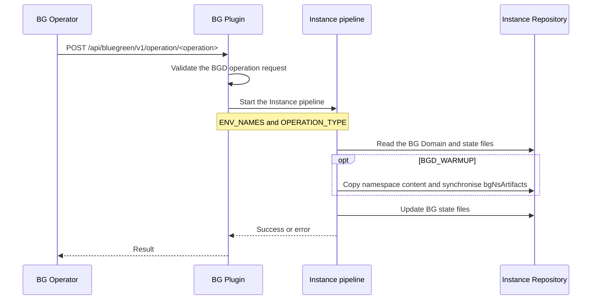
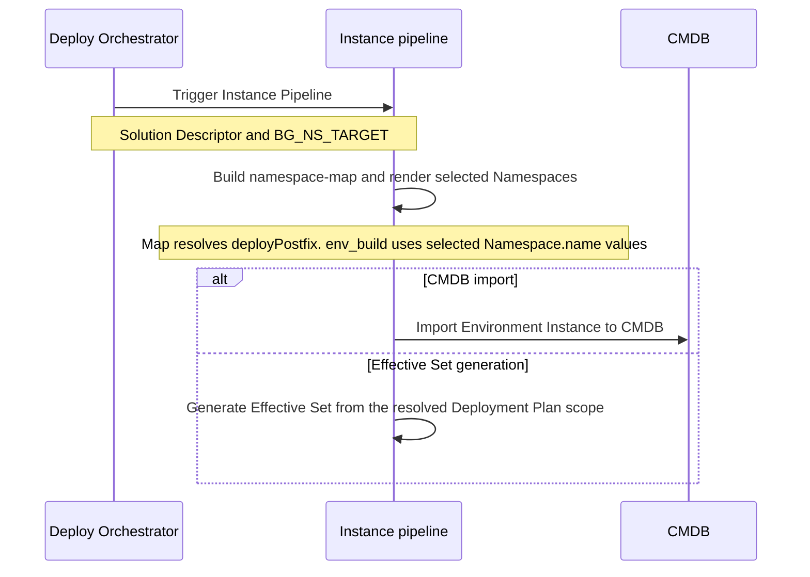
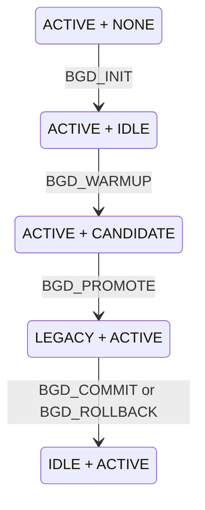

# Blue-Green Deployment

- [Blue-Green Deployment](#blue-green-deployment)
  - [Description](#description)
  - [Conceptual model](#conceptual-model)
  - [Operation-driven control](#operation-driven-control)
  - [Responsibility boundaries](#responsibility-boundaries)
  - [Operation flows](#operation-flows)
  - [Deploy-side namespace targeting](#deploy-side-namespace-targeting)
  - [`bg_manage` step](#bg_manage-step)
  - [BG Domain lifecycle](#bg-domain-lifecycle)
  - [Warmup behaviour](#warmup-behaviour)
  - [CMDB import](#cmdb-import)
  - [BG-related parameters in Effective Set](#bg-related-parameters-in-effective-set)
  - [BG-related macros](#bg-related-macros)
  - [Related documentation](#related-documentation)

## Description

Blue-Green Deployment (BGD) is a deployment strategy that reduces downtime by running two instances
of an application side by side. In EnvGene, a [BG Domain](/docs/envgene-objects.md#bg-domain) groups
the two application namespaces - origin and peer - and the controller namespace.

For BGD, EnvGene:

- generates the BG Domain object from a
  [BG Domain Template](/docs/envgene-objects.md#bg-domain-template) during Environment Instance
  generation and validates that every referenced namespace exists in the Environment
- resolves a shared Solution Descriptor `deployPostfix` to the origin or peer Namespace `name`
  through [`BG_NS_TARGET`](/docs/instance-pipeline-parameters.md#bg_ns_target) and the
  [Namespace map](/docs/tech/namespace-map.md)
- re-renders only the Namespaces selected from the Solution Descriptor via the Namespace map
  ([Namespace render filtering](/docs/features/namespace-render-filtering.md))
- creates and updates [BG state files](#bg-domain-lifecycle) for lifecycle operations
- copies namespace contents during [warmup](#warmup-behaviour)
- adds BG Domain parameters to the
  [Effective Set](#bg-related-parameters-in-effective-set)
- [imports](#cmdb-import) the BG Domain object into CMDB

To prepare an Environment, see
[Migrate to Blue-Green Deployment](/docs/how-to/blue-green-deployment-migration.md).
For deploy parameters, see
[Blue-Green Deployment deploy operations](/docs/how-to/blue-green-deployment-deploy-operations.md).

## Conceptual model

Origin and peer are fixed positions in a BG Domain. They do not decide which side serves traffic.

State files decide the purpose of each side at a point in time (for example origin `ACTIVE`, peer
`IDLE`). After a full cycle the states swap. EnvGene resolves active, idle, candidate, or legacy
from state files. That supports both forward and reverse cycles.

## Operation-driven control

Lifecycle control uses
[`OPERATION_TYPE`](/docs/instance-pipeline-parameters.md#operation_type).

EnvGene reads the current origin and peer states from the state files, derives the next states from
`OPERATION_TYPE`, and writes the new state files.

Application deploy into a BG Domain side is not a lifecycle operation. It uses a Solution Descriptor
for the applications to deploy and
[`BG_NS_TARGET`](/docs/instance-pipeline-parameters.md#bg_ns_target) when origin and peer share a
`deployPostfix`, not a BGD `OPERATION_TYPE` value. See
[Deploy-side namespace targeting](#deploy-side-namespace-targeting) and
[Blue-Green Deployment deploy operations](/docs/how-to/blue-green-deployment-deploy-operations.md).

## Responsibility boundaries

| Actor                       | Responsibility                                                           |
|-----------------------------|--------------------------------------------------------------------------|
| BG Operator / BG Controller | Decide whether a lifecycle operation is allowed before the pipeline runs |
| BG Plugin                   | Start the Instance pipeline with `ENV_NAMES` and `OPERATION_TYPE`        |
| EnvGene                     | Read BG Domain and state files, run repository actions, write next state |
| External deployment system  | Deploy apps, check candidate readiness, switch traffic, clean up legacy  |

> [!NOTE]
> The BG Plugin, BG Operator, deployment system, and CMDB are not part of EnvGene Core.

## Operation flows



## Deploy-side namespace targeting

Application deploy into a BG Domain side is not a lifecycle operation. Deploy-side targeting uses
[`BG_NS_TARGET`](/docs/instance-pipeline-parameters.md#bg_ns_target) (`origin` or `peer`).

Two effects, with one shared `BG_NS_TARGET` input to Namespace map:

1. **Namespace map** - when origin and peer share a Solution Descriptor `deployPostfix`,
   `compute_namespace_map` requires `BG_NS_TARGET` and writes the matching Namespace `name` into
   [`namespace-map.yml`](/docs/envgene-objects.md#namespace-map).
2. **Render filtering** - `env_build` re-renders only the Namespace `name` values selected from the
   SD through that map. See
   [Namespace render filtering](/docs/features/namespace-render-filtering.md).



## `bg_manage` step

The Instance pipeline step that applies a BGD
[`OPERATION_TYPE`](/docs/instance-pipeline-parameters.md#operation_type).

- Resolves origin, peer, and controller names from the
  [BG Domain](/docs/envgene-objects.md#bg-domain).
- Applies [Operation-driven control](#operation-driven-control) and the
  [lifecycle transition table](#bg-domain-lifecycle).
- For every BGD `OPERATION_TYPE`, updates BG state files.
- For `BGD_WARMUP`, also runs [Warmup behaviour](#warmup-behaviour).

When the step runs and how it orders relative to other steps is described in
[EnvGene pipelines](/docs/envgene-pipelines.md).

Related pipeline parameters:

- [`ENV_NAMES`](/docs/instance-pipeline-parameters.md#env_names)
- [`OPERATION_TYPE`](/docs/instance-pipeline-parameters.md#operation_type)
- [`BG_NS_TARGET`](/docs/instance-pipeline-parameters.md#bg_ns_target)
- [`ENV_TEMPLATE_VERSION`](/docs/instance-pipeline-parameters.md#env_template_version)
- [`GH_ADDITIONAL_PARAMS`](/docs/instance-pipeline-parameters.md#gh_additional_params)

## BG Domain lifecycle

Each side carries a runtime state: `ACTIVE`, `IDLE`, `CANDIDATE`, or `LEGACY`. The diagram shows
state pairs as `(origin, peer)`. The table below lists the same pairs with the corresponding state
files before and after each `OPERATION_TYPE`.



After `LEGACY + ACTIVE` → `IDLE + ACTIVE`, the former candidate stays active and the former active
side becomes idle. The next `BGD_WARMUP` uses the mirrored rows in the table.

**State files** are empty markers in `/environments/<cluster>/<env>/`. The file body has no
content. Each role has at most one marker named `.<role>-<state>` (for example `.origin-active`,
`.peer-idle`). On change, EnvGene removes the old marker and creates the new one. Who is origin
and who is peer comes from `bg_domain.yml`. See
[BG State Files](/docs/envgene-objects.md#bg-state-files).

When no state files exist, the current pair is `(ACTIVE, NONE)` - the state before `BGD_INIT`.
`BGD_INIT` is not mirrored.

| Operation                     | Cycle    | State files before                    | `(origin, peer)` before | `(origin, peer)` after | State files after                     | EnvGene actions              |
|-------------------------------|----------|---------------------------------------|-------------------------|------------------------|---------------------------------------|------------------------------|
| `BGD_INIT`                    | forward  | (none)                                | `(ACTIVE, NONE)`        | `(ACTIVE, IDLE)`       | `.origin-active`, `.peer-idle`        | State files only             |
| `BGD_WARMUP`                  | forward  | `.origin-active`, `.peer-idle`        | `(ACTIVE, IDLE)`        | `(ACTIVE, CANDIDATE)`  | `.origin-active`, `.peer-candidate`   | State files + warmup actions |
| `BGD_PROMOTE`                 | forward  | `.origin-active`, `.peer-candidate`   | `(ACTIVE, CANDIDATE)`   | `(LEGACY, ACTIVE)`     | `.origin-legacy`, `.peer-active`      | State files only             |
| `BGD_COMMIT` / `BGD_ROLLBACK` | forward  | `.origin-legacy`, `.peer-active`      | `(LEGACY, ACTIVE)`      | `(IDLE, ACTIVE)`       | `.origin-idle`, `.peer-active`        | State files only             |
| `BGD_WARMUP`                  | mirrored | `.origin-idle`, `.peer-active`        | `(IDLE, ACTIVE)`        | `(CANDIDATE, ACTIVE)`  | `.origin-candidate`, `.peer-active`   | State files + warmup actions |
| `BGD_PROMOTE`                 | mirrored | `.origin-candidate`, `.peer-active`   | `(CANDIDATE, ACTIVE)`   | `(ACTIVE, LEGACY)`     | `.origin-active`, `.peer-legacy`      | State files only             |
| `BGD_COMMIT` / `BGD_ROLLBACK` | mirrored | `.origin-active`, `.peer-legacy`       | `(ACTIVE, LEGACY)`      | `(ACTIVE, IDLE)`       | `.origin-active`, `.peer-idle`        | State files only             |

The **State files before** column is the required input. EnvGene looks up the row for
`OPERATION_TYPE` and the current markers. If no row matches, the step fails and leaves state files
unchanged.

`BGD_ROLLBACK` produces the same state files as `BGD_COMMIT`. The difference between a successful
cycle and a revert is outside EnvGene.

## Warmup behaviour

`BGD_WARMUP` is the only lifecycle operation that changes the Instance Repository beyond state
files. See the [lifecycle transition table](#bg-domain-lifecycle) for required state files before
and after.

EnvGene:

1. Copies the active namespace folder to the idle side that becomes candidate, including nested
   [Application](/docs/envgene-objects.md#application) objects, and keeps the candidate Namespace
   `name`.
2. Sets `envTemplate.bgNsArtifacts.<candidate> := envTemplate.bgNsArtifacts.<active>` in
   `Inventory/env_definition.yml` (preparing peer: `peer := origin`; preparing origin:
   `origin := peer`).
3. Updates state files as in the table.

`envTemplate.artifact` does not change. It renders the controller, plugin, and non-BG namespaces.

**Example** - forward `BGD_WARMUP`, mid-rollout (required state files before:
`.origin-active`, `.peer-idle`):

```yaml
# Before
envTemplate:
  artifact: "my-env-templates:2.0.0"
  bgNsArtifacts:
    origin: "my-env-templates:2.1.0"
    peer: "my-env-templates:2.0.0"

# After - state files: .origin-active, .peer-candidate
envTemplate:
  artifact: "my-env-templates:2.0.0"
  bgNsArtifacts:
    origin: "my-env-templates:2.1.0"
    peer: "my-env-templates:2.1.0"
```

Peer namespace folder content matches origin, except the peer Namespace `name`. For the mirrored row,
origin is the candidate and the same rules apply with origin and peer swapped.

## CMDB import

When [`CMDB_IMPORT: true`](/docs/instance-pipeline-parameters.md#cmdb_import), the Instance pipeline
imports the [BG Domain](/docs/envgene-objects.md#bg-domain) into the CMDB with other entities such as
Cloud and Namespace.

## BG-related parameters in Effective Set

When the Environment has a BG Domain, EnvGene adds its structure to the Effective Set Topology
Context `parameters.yaml` and resolved controller credentials to `credentials.yaml`. EnvGene
replaces the credentials reference with the value and removes the `credentials` attribute.
Credentials must be `usernamePassword`.

See the
[`bg_domain` Topology Context example](/docs/features/calculator-cli.md#version-20topology-context-bg_domain-example).

## BG-related macros

Macros that read the BG Domain when it exists:

- [`ORIGIN_NAMESPACE`](/docs/template-macros.md#origin_namespace)
- [`PEER_NAMESPACE`](/docs/template-macros.md#peer_namespace)
- [`CONTROLLER_NAMESPACE`](/docs/template-macros.md#controller_namespace)
- [`BG_CONTROLLER_URL`](/docs/template-macros.md#bg_controller_url)
- [`BG_CONTROLLER_LOGIN`](/docs/template-macros.md#bg_controller_login)
- [`BG_CONTROLLER_PASSWORD`](/docs/template-macros.md#bg_controller_password)
- [`BASELINE_ORIGIN`](/docs/template-macros.md#baseline_origin)
- [`BASELINE_PEER`](/docs/template-macros.md#baseline_peer)
- [`BASELINE_CONTROLLER`](/docs/template-macros.md#baseline_controller)
- [`PUBLIC_IDENTITY_PROVIDER_URL`](/docs/template-macros.md#public_identity_provider_url)
- [`PRIVATE_IDENTITY_PROVIDER_URL`](/docs/template-macros.md#private_identity_provider_url)

## Related documentation

- [Migrate to Blue-Green Deployment](/docs/how-to/blue-green-deployment-migration.md)
- [Blue-Green Deployment deploy operations](/docs/how-to/blue-green-deployment-deploy-operations.md)
- [Blue-Green Deployment Use Cases](/docs/use-cases/blue-green-deployment.md)
- [Namespace map](/docs/tech/namespace-map.md)
- [Namespace render filtering](/docs/features/namespace-render-filtering.md)
- [BG Domain object](/docs/envgene-objects.md#bg-domain)
- [BG Domain Template](/docs/envgene-objects.md#bg-domain-template)
- [BG Domain from Composite Structure](/docs/features/bg-domain-from-composite-structure.md)
- [BG State Files](/docs/envgene-objects.md#bg-state-files)
- [Namespace map object](/docs/envgene-objects.md#namespace-map)
- [BGD samples](/docs/samples/blue-green-deployment/)
