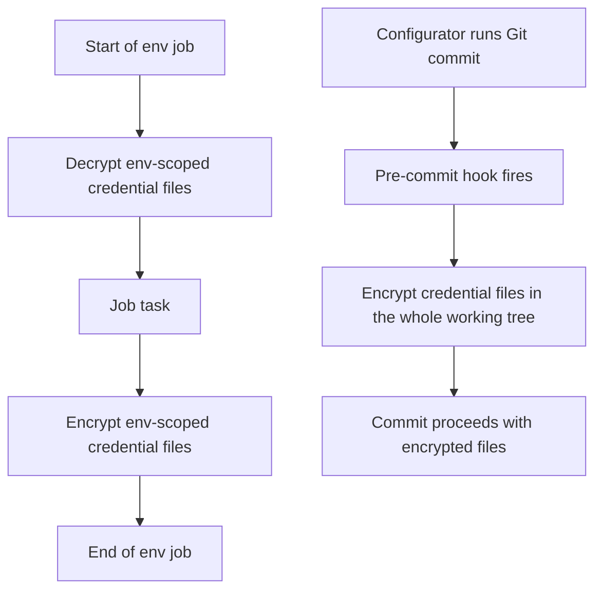

# Credential encryption

- [Credential encryption](#credential-encryption)
  - [Overview](#overview)
  - [Scope of encryption](#scope-of-encryption)
    - [Credential categories under encryption scope](#credential-categories-under-encryption-scope)
    - [File selector](#file-selector)
  - [Actors](#actors)
  - [Backends](#backends)
    - [SOPS](#sops)
    - [Fernet](#fernet)
  - [Configuration](#configuration)
  - [Encryption rules](#encryption-rules)
    - [Environment Instance level](#environment-instance-level)
    - [Effective-set level](#effective-set-level)
    - [Skip cases](#skip-cases)
  - [Decryption rules](#decryption-rules)
  - [Single-category validation](#single-category-validation)
  - [Job execution order](#job-execution-order)
  - [Algorithm](#algorithm)
    - [Encrypt algorithm](#encrypt-algorithm)
    - [Decrypt algorithm](#decrypt-algorithm)
  - [Safeguards](#safeguards)
  - [Cross-links](#cross-links)

## Overview

EnvGene encrypts credential files at rest so sensitive material never enters Git in plaintext. Both the EnvGene
runtime and the pre-commit hook honour the same contract.

Encryption applies only to credential values that EnvGene stores directly in a credential file. Where EnvGene
stores a reference to a credential in an external secret store, the reference itself is not
sensitive material and remains plaintext. See [external credentials](/docs/features/external-creds.md) for the
reference shapes.

## Scope of encryption

The user-facing categories below define what is in scope. The file selector implements them.

### Credential categories under encryption scope

- **System Credentials** in [System credentials](/docs/features/external-creds.md#envgene-system-credentials).
- **Shared Credentials** in [Shared credentials](/docs/envgene-configs.md#shared-credentials).
- **Environment Instance credentials** - the credentials file inside an
  [Environment Instance](/docs/envgene-objects.md#environment-instance-objects)'s `Credentials/` folder.
- **Cloud Passport credentials** - the credentials file paired with a Cloud Passport in
  [Cloud Passport processing](/docs/features/cloud-passport-processing.md).
- **App-deployer credentials** - the credentials file paired with an app deployer.
- **Effective-set output credential files** - `credentials.yaml` and `collision-credentials.yaml` under an
  environment's `effective-set/` tree.

### File selector

The selector combines a filename pattern with a directory suffix, restricted to files whose path contains a
`configuration` or `environments` segment.

- Filename pattern: the basename without extension matches the regular expression
  `^credentials$|^creds$|-(credentials|creds)($|-)`.
- Directory suffix: any `.yml` or `.yaml` file under a `Credentials/` or `credentials/` folder qualifies
  regardless of filename.
- Path-segment restriction: the file's path contains a `configuration` or `environments` segment somewhere in
  it, not necessarily as a repo-root prefix.

The categories above are the source of truth for what falls in scope.

## Actors

EnvGene encrypts credential files in two places: as part of pipeline job execution, and via a pre-commit
hook at Git commit time.

- **EnvGene runtime.** Encrypts as part of pipeline job execution (environment inventory generation,
  environment build, cloud passport processing, effective-set generation). The scope is the environment being
  built. This isolates parallel matrix builds, so broken credentials in a sibling environment do not affect
  the current one.
- **Pre-commit hook.** Runs on Git commit against the working tree. The scope is the whole repository. The
  hook makes encryption a Git-level guarantee, so credential files never enter Git history in plaintext,
  regardless of whether the configurator ran the EnvGene pipeline locally.

Both actors apply the same file selector, the same encryption rules per level, the same backend selection,
and the same safeguards.

## Backends

### SOPS

SOPS uses asymmetric age-based encryption. The emit format preserves the file content, replaces each
value with an `ENC[...]` token, and appends a top-level `sops:` metadata block with key material and an
integrity hash. The unencrypted-keys regular expression is `^type$`, so the `type` field stays plaintext.

Before, an environment instance `credentials.yml`:

```yaml
db-cred:
  type: usernamePassword
  data:
    username: pgadmin
    password: db-password-placeholder
```

After (SOPS):

```yaml
db-cred:
    type: usernamePassword
    data:
        username: ENC[AES256_GCM,data:...,type:str]
        password: ENC[AES256_GCM,data:...,type:str]
sops:
    kms: []
    age:
        - recipient: age1...
          enc: |
            -----BEGIN AGE ENCRYPTED FILE-----
            ...
            -----END AGE ENCRYPTED FILE-----
    lastmodified: "..."
    mac: ENC[...]
    version: 3.8.1
```

### Fernet

Fernet is the AES-128-CBC with HMAC-SHA256 construction provided by the Python `cryptography` library.
See the [Fernet spec](https://github.com/fernet/spec) for the primitives. The same
`SECRET_KEY` encrypts and decrypts. The on-disk marker `[encrypted:AES256_Fernet]` is a fixed literal,
not an algorithm identifier. The emit format preserves the file structure and prefixes each encrypted
value with the marker followed by the base64 token. The unencrypted-keys regular expression is `^type$`. Values that are
the empty string are left unencrypted.

Using the same environment instance `credentials.yml` as the SOPS example above, after (Fernet):

```yaml
db-cred:
  type: usernamePassword
  data:
    username: '[encrypted:AES256_Fernet]gAAAAA...'
    password: '[encrypted:AES256_Fernet]gAAAAA...'
```

## Configuration

Two keys in `/configuration/config.yml` control encryption:

- `crypt: true | false` enables or disables encryption. When `false`, no encrypt runs. Decrypt is a
  no-op, and any existing encrypted file triggers the safeguard in [Safeguards](#safeguards).
- `crypt_backend: SOPS | Fernet` selects the backend used to encrypt files. Decryption detects the
  backend from file content.

Both keys are optional. `crypt` defaults to `true` and `crypt_backend` defaults to `Fernet`.

Each backend requires its own CI/CD variables:

- SOPS uses `PUBLIC_AGE_KEYS` for encrypt and `ENVGENE_AGE_PRIVATE_KEY` for decrypt.
- Fernet uses `SECRET_KEY` for both encrypt and decrypt.

## Encryption rules

Rules split into two levels by file path. Files under an `effective-set/` path in the tree use the
effective-set per-value rule. All other credential files matched by the selector use the environment instance
per-entry rule. This path-based discriminator is the single source of truth for level selection.

### Environment Instance level

Applies to all credential files matched by the selector except effective-set outputs.

Each entry follows one of two shapes defined by the
[Credential object](/docs/envgene-objects.md#credential). The classification between literal and reference is
by the `type` field.

A local entry has a non-`external` type and carries `data`:

```yaml
<credId>:
  type: usernamePassword | secret
  data:
    <field>: <value>
```

An external entry has `type: external`:

```yaml
<credId>:
  type: external
  # see the Credential object for the external-entry fields
```

Per-entry classification:

- An entry with `type: external` is a reference. The rule skips the whole entry.
- An entry with any other `type` value is a literal. The rule encrypts the values under `data`. The `type`
  field, the map key (`credId`), and any other non-data fields stay plaintext.

The rule applies to each entry independently.

### Effective-set level

Applies to effective-set output files matched by the selector: `credentials.yaml` and
`collision-credentials.yaml`.

The file structure is a flat key-value map. A value takes one of three shapes:

- A scalar literal string (secret material).
- ESO reference - see [Parameter with ESO reference](/docs/features/external-creds.md#parameter-with-eso-reference).
- VALS reference - see [Parameter with VALS reference](/docs/features/external-creds.md#parameter-with-vals-reference).

Per-value classification:

- A value that is a dict with a `secretStoreId` key is a reference. The rule skips it. The `secretStoreId`
  key alone is sufficient to identify an ESO reference because the ESO shape always carries it as its
  distinguishing member.
- A value that is a string starting with `ref+` is a reference. The rule skips it.
- Any other value is a literal. The rule encrypts it.

The per-value rule is required at the effective-set level because per-context credential streams merge
into a single file that may hold literals and references side by side.

### Skip cases

- A file whose top-level content is an empty document is skipped as a no-op. An empty document covers a
  0-byte file, whitespace-only content, and any top-level YAML that yields an empty or null document
  (for example `{}`, `null`, `~`, or `---`).
- A file whose content matches neither the environment instance entry map nor the effective-set flat
  key-value shape fails with a schema violation error.

## Decryption rules

Decryption detects the backend from file-content markers, not from configuration:

- A top-level `sops:` key means the file is SOPS-encrypted. Decrypt via SOPS.
- Any leaf value starting with `[encrypted:AES256_Fernet]` means the file is Fernet-encrypted. Decrypt
  via Fernet.
- Neither marker means the file is plaintext or references-only. Decrypt is a no-op.

Encryption is config-driven and decryption is content-driven. This asymmetry lets a repository switch
`crypt_backend` between SOPS and Fernet without a bulk re-encrypt: existing files decrypt on read by
their own marker, while new writes go through the newly selected backend.

## Single-category validation

An Environment Instance credential file is single-category by contract: either all entries have a
non-`external` type (literals) or all entries have `type: external` (references). A pre-encryption
validator enforces this and fails the environment instance generation if a mixed file is detected.

Single-category applies only to environment instance credential files. Effective-set output files may
hold literals and references side by side per the effective-set rule above.

## Job execution order

EnvGene runtime wraps each environment job with one decrypt-at-start step and one encrypt-at-end step. The
task work of the job runs between the two. The pre-commit hook runs a single encrypt pass on the working
tree.



The middle node is deliberately abstract. The specific task varies by job type (see the EnvGene runtime
bullet in [Actors](#actors)). The wrapping guarantee holds regardless: files are decrypted before the task
starts and encrypted after it finishes.

The pre-commit hook has no decrypt step. It runs a single encrypt pass and then lets the commit proceed.

## Algorithm

Each step names the section that governs it and does not restate the rule content.

### Encrypt algorithm

1. Read the `crypt` setting from `/configuration/config.yml`.
2. If `crypt` is `false`: list candidate files by the selector (see [Scope of encryption](#scope-of-encryption)),
   check each for an encryption marker, fail the run if any is encrypted, and return without encrypting
   anything.
3. Read `crypt_backend` to select the backend for this run (see [Backends](#backends)).
4. List candidate files by the selector (see [Scope of encryption](#scope-of-encryption)). EnvGene runtime
   narrows to the environment being built. The pre-commit hook uses the whole working tree.
5. For each candidate file:
   1. If the file is an empty document, skip it (see [Skip cases](#skip-cases)).
   2. If the file is already encrypted, warn and skip (see [Safeguards](#safeguards)).
   3. Choose the classification level per the path-based discriminator defined in the
      [Encryption rules](#encryption-rules) preamble. The single-category invariant is enforced upstream
      (see [Single-category validation](#single-category-validation)).
   4. Encrypt the selected values with the chosen backend (see [Backends](#backends)).

### Decrypt algorithm

1. Read the `crypt` setting from `/configuration/config.yml`.
2. If `crypt` is `false`: list candidate files by the selector (see [Scope of encryption](#scope-of-encryption)),
   check each for an encryption marker, fail the run if any is encrypted, and return without decrypting
   anything.
3. List candidate files by the selector (see [Scope of encryption](#scope-of-encryption)).
4. For each candidate file, detect the backend and decrypt or no-op per [Decryption rules](#decryption-rules).

## Safeguards

- `crypt: false` combined with an already-encrypted credential file fails. This applies to both the
  EnvGene runtime and the pre-commit hook. The failure prevents a silent leak if the configurator
  disables encryption without first decrypting existing files.
- An encrypt call on an already-encrypted file warns and is a no-op.
- A decrypt call on a plaintext file or a references-only file warns and is a no-op.
- An empty file is silently skipped in both encrypt and decrypt.

## Cross-links

- [config.yml keys](/docs/envgene-configs.md#configyml)
- [Shared credentials locations](/docs/envgene-configs.md#shared-credentials)
- [CI/CD variables reference](/docs/envgene-repository-variables.md)
- [Credential object](/docs/envgene-objects.md#credential)
- [Environment Instance Objects](/docs/envgene-objects.md#environment-instance-objects)
- [External credentials](/docs/features/external-creds.md)
- [Cloud Passport processing](/docs/features/cloud-passport-processing.md)
- [Credential encryption how-to](/docs/how-to/credential-encryption.md)
- [Pre-commit hook test cases](/docs/test-cases/credential-encryption-pre-hook.md)
