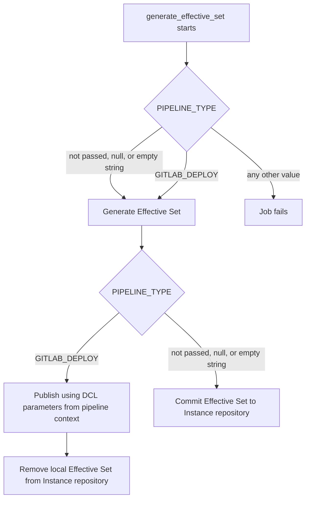

# Effective Set Generation

- [Effective Set Generation](#effective-set-generation)
  - [Overview](#overview)
  - [Location](#location)
  - [Inputs](#inputs)
  - [Solution Descriptor Role](#solution-descriptor-role)
  - [Pipeline Stage](#pipeline-stage)
  - [Generation Modes](#generation-modes)
    - [Full Generation](#full-generation)
    - [Partial Generation](#partial-generation)
      - [Forward merge](#forward-merge)
      - [Reverse merge](#reverse-merge)
      - [Limitation](#limitation)
    - [No-SD Mode](#no-sd-mode)
  - [Configuration](#configuration)
  - [External export](#external-export)
    - [Processing order](#processing-order)
    - [External repository location](#external-repository-location)
  - [See also](#see-also)

## Overview

The Effective Set (ES) is the resolved parameter set for an environment - the output consumed by deployment tooling such as ArgoCD. It is produced by merging inputs from the Solution Descriptor, the environment instance objects, Application SBOMs, and registry configuration according to strict priority rules.

## Location

The generated ES is stored alongside its environment:

```text
/environments/<cluster-name>/<env-name>/effective-set/
├── topology/
├── pipeline/
├── deployment/
├── runtime/
└── cleanup/
```

`topology/` and `pipeline/` hold solution-level data. `deployment/`, `runtime/`, and `cleanup/` contain per-namespace (and per-application for `deployment` and `runtime`) data.

> [!NOTE]
> The `generate_effective_set` job writes this tree during generation. Depending on `PIPELINE_TYPE`, the published
> result is committed under the path above in the Instance repository, or exported to an external repository at
> `/environments/<cluster-name>/<env-name>/effective-set/`. See [External export](#external-export).

The detailed file-level layout and contents are documented in [Calculator CLI](/docs/features/calculator-cli.md#version-20-effective-set-structure).

## Inputs

- **Full Solution Descriptor** — the definitive list of applications and their target namespaces. Required for `deployment`, `runtime`, and `cleanup` contexts; absent in [No-SD Mode](#no-sd-mode). See [SD processing](/docs/features/sd-processing.md).
- **Environment instance data** — `namespace.yml`, `cloud.yml`, credentials, and other environment objects under the environment's directory.
- **Application SBOMs** — produced externally, cached in the Instance Repository. See [SBOM](/docs/features/sbom.md).
- **Registry configuration** — `/configuration/registry.yml`.
- **Pipeline-time overrides** — optional custom parameters and effective-set configuration passed via pipeline variables.

## Solution Descriptor Role

The Solution Descriptor (SD) is the source of structure for Effective Set generation: it determines which applications and in which namespaces (via `deployPostfix`) are included.

Parameters at the namespace, application, and service levels are computed only for applications listed in the SD. Objects present in the Environment Instance that are not referenced by the SD are ignored and do not appear in the Effective Set.

Behavior in mismatched cases:

- **Namespace in Environment Instance but not referenced by any SD application** — the namespace is not included in the Effective Set. Generation continues for the remaining applications.
- **Application in Environment Instance but absent from the SD** — the application is not included. Generation continues for the remaining applications.
- **SD application's `deployPostfix` refers to a namespace that does not exist in the Environment Instance** — generation terminates with an error.
- **SD application is not present in the Environment Instance** — generation succeeds, but no user-defined parameters are produced for that application.

## Pipeline Stage

ES generation is the `generate_effective_set` stage of the Instance Repository pipeline. It runs after [SD processing](/docs/features/sd-processing.md) and after the required Application SBOMs are available in the cache.

See [How to generate an Effective Set](/docs/how-to/generate-effective-set.md) for operational guidance.

## Generation Modes

The generation path is chosen automatically based on the outcome of SD processing in the current pipeline run. The user does not select the mode directly.

### Full Generation

The entire ES is rebuilt from the current Full SD and environment instance data. All five contexts (`topology`, `pipeline`, `deployment`, `runtime`, `cleanup`) are produced. Applied when:

- `SD_REPO_MERGE_MODE=replace`, or
- The pipeline runs without an incoming SD and a Full SD already exists in the repository, or
- An incoming SD is supplied with a merge mode but no Full SD exists yet — the incoming SD becomes the Full SD, there is nothing to merge against.

Application and Registry Definitions for every application in the Full SD must be available.

### Partial Generation

All five contexts (`topology`, `pipeline`, `deployment`, `runtime`, `cleanup`) remain present in the persistent ES, exactly as in full generation. The difference is in *how* they are produced: the calculator is invoked with the Delta SD instead of the Full SD, and its output is recursively merged into the persistent ES — only slices affected by the SD change are recomputed. Applications unchanged in the current run keep their existing slices and their SBOMs are not requested.

Applied when SD processing produces a Delta SD — that is, `SD_REPO_MERGE_MODE` is `basic-merge`, `extended-merge`, or `basic-exclusion-merge`, and a Full SD already exists.

Application and Registry Definitions for every application in the Delta SD must be available.

This mode is available only when `effective_set_generation_strategy=partial` or not set in [`config.yml`](/docs/envgene-configs.md#configyml).

#### Forward merge

Applies to `SD_REPO_MERGE_MODE` values `basic-merge` and `extended-merge`. The Delta SD lists the applications being added or updated.

- The calculator is invoked with the Delta SD as input. It produces output across all five contexts, scoped to the Delta SD.
- The output is merged into the persistent ES recursively: per-application slices under `deployment/` and `runtime/` are replaced for the applications in the Delta SD; `topology/`, `pipeline/`, and per-namespace `cleanup/` are replaced in full; `mapping.yml` entries are upserted (added or updated, without removing entries for namespaces outside the Delta SD).
- Applications not in the Delta SD keep their existing slices; their SBOMs are not requested.

#### Reverse merge

Applies to `SD_REPO_MERGE_MODE` value `basic-exclusion-merge`. The Delta SD lists the applications being removed.

- The calculator is not invoked. SBOMs for the removed applications are not requested.
- Per-application slices of the removed applications are deleted from `deployment/` and `runtime/`.
- If removing an application leaves a namespace with no applications in the Full SD, that namespace is also removed from `deployment/`, `runtime/`, and `cleanup/`, and its entry is dropped from all three `mapping.yml` files.

#### Limitation

Under partial generation, the `generate_effective_set` stage follows the Delta SD scope: `topology/`, `pipeline/`, and `cleanup/` are refreshed from the merged calculator output, but **`deployment/` and `runtime/` are recomputed only for applications in the Delta SD**. For every other application, the stage **does not rewrite** that application's slices under `effective-set/deployment/` and `effective-set/runtime/`. Environment-instance changes for those applications are **not** folded into the Effective Set on this run. To recalculate **all** applications, trigger [full generation](#full-generation).

### No-SD Mode

Applied when the pipeline runs without an incoming SD and no Full SD exists in the repository. Only `topology` and `pipeline` contexts are produced; `deployment`, `runtime`, and `cleanup` require application data from a Solution Descriptor and cannot be generated without one. SBOMs are not required and are not requested.

See [Generate Without a Solution Descriptor](/docs/how-to/generate-effective-set.md#generate-without-a-solution-descriptor) in the how-to guide.

## Configuration

Key pipeline parameters that affect ES generation:

- `SD_DATA` / `SD_VERSION` — the incoming SD.
- `SD_REPO_MERGE_MODE` — how the incoming SD is merged with the existing one; determines whether partial or full generation applies.
- `EFFECTIVE_SET_CONFIG` — effective-set version selection and related options.
- `CUSTOM_PARAMS` — optional overrides injected into `deployment`, `runtime`, and `cleanup` contexts.
- `PIPELINE_TYPE` — selects where the Effective Set is published after generation. See
  [`PIPELINE_TYPE`](/docs/instance-pipeline-parameters.md#pipeline_type) and
  [External export](#external-export).

See [Instance pipeline parameters](/docs/instance-pipeline-parameters.md) for the full list.

## External export

External export publishes the generated Effective Set to a separate GitLab repository. The export path is controlled by
the pipeline variable `PIPELINE_TYPE`.

### Processing order

When [`GENERATE_EFFECTIVE_SET`](/docs/instance-pipeline-parameters.md#generate_effective_set) is `true`, the
`generate_effective_set` job validates `PIPELINE_TYPE`:

1. **`GITLAB_DEPLOY`** - export to external repository. Connection parameters are read from the pipeline context:
   `DCL_GIT_URL`, `DCL_GIT_BRANCH`, `DCL_CONFIG_GITLAB_USER`, `DCL_CONFIG_GITLAB_TOKEN`.
2. **Not passed** - commit to the Instance repository under [Location](#location).
3. **`null`** - same as not passed.
4. **Empty string** - same as not passed.
5. **Any other value** (`PIPELINE_TYPE != GITLAB_DEPLOY`) - the job fails before generation starts.



### External repository location

```text
/environments/<cluster-name>/<env-name>/effective-set/
```

See [Effective Set external export use cases](/docs/use-cases/effective-set-external-export.md) for worked examples.

## See also

- [Calculator CLI](/docs/features/calculator-cli.md) - the underlying tool and the detailed ES file-structure reference.
- [How to generate an Effective Set](/docs/how-to/generate-effective-set.md) - operational guide.
- [Tutorial: Understanding the Effective Set](/docs/tutorials/effective-set.md) - walkthrough of ES contents and
  parameter flow.
- [SD processing](/docs/features/sd-processing.md) - how the Solution Descriptor is merged and stored.
- [SBOM](/docs/features/sbom.md) - how Application SBOMs are produced and cached.
