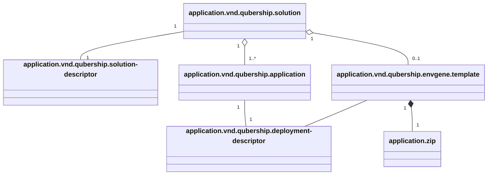
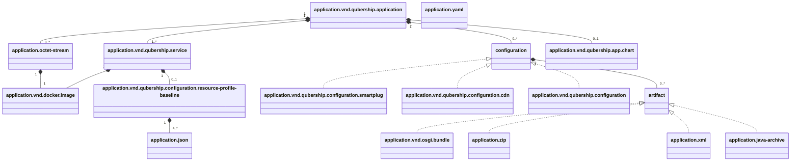

# SBOM Generation

- [SBOM Generation](#sbom-generation)
  - [Problem Statement](#problem-statement)
  - [Proposed Approach](#proposed-approach)
    - [Link to the "red" EnvGene](#link-to-the-red-envgene)
    - [Assumptions](#assumptions)
    - [Requirements](#requirements)
      - [SBOM Generation Library](#sbom-generation-library)
      - [EnvGene](#envgene)
    - [Use Cases](#use-cases)
    - [Object model](#object-model)
      - [Solution](#solution)
      - [Application](#application)
    - [SBOM Generation Library Input Attributes](#sbom-generation-library-input-attributes)
    - [SBOM Generation Rules](#sbom-generation-rules)
      - [Application SBOM Components Inclusion Criteria and Naming Convention](#application-sbom-components-inclusion-criteria-and-naming-convention)
      - [`artifact` Type Mapping](#artifact-type-mapping)
      - [Parameter Sources](#parameter-sources)
      - [Handling Missing Attributes in DD](#handling-missing-attributes-in-dd)
      - [Handling DD After Delivery](#handling-dd-after-delivery)
        - [`full_image_name`](#full_image_name)
        - [`docker_registry`](#docker_registry)
      - [SBOM Components](#sbom-components)
        - [Application SBOM Metadata](#application-sbom-metadata)
        - [`application/vnd.qubership.service` Component](#applicationvndqubershipservice-component)
        - [`application/octet-stream` Component](#applicationoctet-stream-component)
        - [`application/vnd.qubership.configuration.smartplug` Component](#applicationvndqubershipconfigurationsmartplug-component)
        - [`application/vnd.qubership.configuration.cdn` Component](#applicationvndqubershipconfigurationcdn-component)
        - [`application/vnd.qubership.configuration` Component](#applicationvndqubershipconfiguration-component)
        - [`application/vnd.qubership.app.chart` Component](#applicationvndqubershipappchart-component)
        - [Environment Template SBOM Metadata](#environment-template-sbom-metadata)
        - [`application/vnd.qubership.envgene.template.zip` Component](#applicationvndqubershipenvgenetemplatezip-component)

## Problem Statement

The Calculator CLI's reliance on external sources for the Effective Set creates a direct dependency, impacting portability and robustness.
Performance is crucial for Effective Set calculations to avoid delaying deployments.

## Proposed Approach

It is proposed to generate a CycloneDX SBOM based on NC-specific contracts, Solution Descriptor, and Deployment Descriptor.
To achieve this, SBOM Generator library will be developed that can be invoked in various usage scenarios of the EnvGene.

Additionally, the generated SBOMs can be delivered to the site to replace Application Definition in cases where the site does not have a CMDB.

To meet the NFR concerning the time required to calculate the Effective Set, it is proposed to generate the Solution and Application SBOM in advance, rather than during the calculation of the Effective Set.
The SBOM should be generated at the point when the necessary information becomes available—specifically, when the Solution Descriptor is ingested into the engine, during the generation of the environment inventory.
This approach ensures that manual modifications to the SD in the repository are not allowed; any changes must be made by initiating a pipeline.

The Environment Template SBOM will be generated during the Environment Instance creation phase.


### Link to the "red" EnvGene

This feature uses [SBOM](/docs/features/sbom.md) functionality

### Assumptions

1. An application name is globally unique
2. An application name and version combination is globally unique
3. On-site registry must align with off-site registry's structure, in terms of artifact groups
4. Artifacts must not change their groupId during on-site delivery
5. SBOM Generation Library is not support `SNAPSHOT` versions of Deployment Descriptor and Solution Descriptor artifacts
6. An artifact with specific GAV coordinates cannot be simultaneously located in multiple repositories (staging, snapshot, release) of a registry
7. The library does not support communication with registries requiring authentication

### Requirements

#### SBOM Generation Library

1. SBOM generation library must accept [SBOM Generation Library Input attributes](#sbom-generation-library-input-attributes) as input
2. The library must return:
   1. SBOM objects
   2. Registry Definition objects
   3. Solution Descriptor object
3. SBOM returned by the library must be valid and comply with the [CycloneDX 1.6 schema](http://cyclonedx.org/schema/bom-1.6.schema.json)
4. Application SBOM generated by the library must be valid and comply with the [Application SBOM JSON schema](/schemas/application.sbom.schema.json)
5. Environment Template SBOM returned by the library must be valid and comply with the [Environment Template SBOM JSON schema](/schemas/env-template.sbom.schema.json)
6. Registry Definition returned by the library must be valid and comply with the [Registry Definition JSON schema](/schemas/regdef.schema.json)
7. The library must use `app:ver` Resolving Library to resolve `app:ver` notation to Application and Registry Definitions objects IF following attributes is provided:
    1. `cmdb-url`
    2. `cmdb-username`
    3. `cmdb-token`
8. The library must use local Application and Registry Definitions IF following attributes is provided:
    1. `local-app-defs-path`
    2. `local-reg-defs-path`
9. The library should be developed using Python
10. A detailed specification of the library, outlining its functions, methods of invocation, and expected results, must be provided by the library developer. Specification must be stored in Git
11. Nexus and Artifactory must be supported as registries
12. SBOM generation for one environment by the library should take no more than 20 seconds:
    1. 250 application in SD
    2. Application ZIP size ~1MB.
    3. Application JSON size: ~50kB
13. The library must validate Deployment Descriptor and throw a human-readable error if either contains a `SNAPSHOT` version
14. The library should search for the artifact in the repositories, and the search should stop after the artifact is found. The search order is as follows:
    1. Snapshot
    2. Staging
    3. Release
    4. Snapshot group
15. The library must not check for the presence of an artifact in a registry repository if that repository is not configured (if the attribute is not set or the value is equal to `""`)
16. The library must error with a clear message (e.g., "Authenticated registries are not supported") when attempting to download from authenticated registries
17. The library must generate Application SBOM component according to the principles described in [Application SBOM Components Inclusion Criteria and Naming Convention](#application-sbom-components-inclusion-criteria-and-naming-convention)
18. The Application SBOMs must be sorted and validated according to the JSON schema
19. The Application SBOM JSON schema must be located in the path `/module/schemas/application.sbom.schema.json`

#### EnvGene

1. EnvGene should execute the library with parameters described in [SBOM Generation Library Input attributes](#sbom-generation-library-input-attributes) section
2. EnvGene must use the deployer specified in the `inventory.deployer` attribute of Environment Inventory during the generation process
3. EnvGene should execute the library for Application SBOMs generation during the Effective Set generation phase if Full SD is present. This execution must occur only in "blue extend" of EnvGene
4. EnvGene should NOT execute the library for Application SBOMs generation during the Effective Set generation phase if Full SD is NOT present and does not fail
5. EnvGene should execute the library for Application SBOMs generation during the SD processing phase. This execution must occur only in "blue extend" of EnvGene
6. EnvGene must generate SBOMs only for Full SD. Generation for Delta SD must not occur
7. EnvGene must NOT execute the library for Environment Template SBOM generation
8. EnvGene should execute the library in Local AppDefs mode (with attributes: `local-app-defs-path`, `local-reg-defs-path`) or CMDB Discovery Mode (with attributes: `cmdb-url`, `cmdb-username`, `cmdb-token`) according to [SD Processing](/docs/use-cases/sd-processing.md) use case
9. For each SBOM object returned by SBOM Generation Library EnvGene must:
   1. Generate SBOM JSON file based on SBOM object
   2. Persist the Application SBOMs by creating or replacing
      `/sboms/<application-name>/<application-name>-<application-version>.sbom.json`
10. For each Registry Definition object returned by SBOM Generation Library EnvGene must:
    1. Generate a registry configuration object based on [Registry Definitions](/docs/examples/registry-definition-v2.yml)
    2. Persist the configuration by:
       1. Creating or updating the [`/configuration/registry.yml`](/schemas/registry.schema.json)
       2. Maintaining the file as a valid YAML document containing registry objects
       3. Completely replacing any existing configuration for matching `registry_id` values
11. EnvGene must display SBOM generation library error messages in logs

### Use Cases

1. SBOM Generation
2. [SD Processing](/docs/use-cases/sd-processing.md)

### Object model

#### Solution



#### Application



### SBOM Generation Library Input Attributes

| Attribute                      | Type   | Mandatory | Description                                                                                                                                       | Example                                                     |
|--------------------------------|--------|-----------|---------------------------------------------------------------------------------------------------------------------------------------------------|-------------------------------------------------------------|
| `solution-descriptor-app-ver`  | string | no        | SD in `app:ver` notation. Mutually exclusive with `solution-descriptor-content`  and `envgene-env-template-app-ver`                               | `my-env-templates:1.0.0`                                    |
| `solution-descriptor-content`  | object | no        | Content of SD 2.1. Mutually exclusive with `solution-descriptor-app-ver`  and `envgene-env-template-app-ver`                                      | -                                                           |
| `envgene-env-template-app-ver` | string | no        | DD of Environment Template in `app:ver` notation. Mutually exclusive with `solution-descriptor-app-ver`  and `solution-descriptor-content`        | `sd.my-app_deployment-configuration_my-env-templates:1.0.0` |
| `cmdb-url`                     | string | yes       | URL of the CMDB from which the appDef and regDef will be retrieved. Mutually exclusive with `local-app-defs-path`  and `local-reg-defs-path`      | `https://cloud-deployer.example.com`                        |
| `cmdb-username`                | string | yes       | Username of the CMDB from which the appDef and regDef will be retrieved. Mutually exclusive with `local-app-defs-path`  and `local-reg-defs-path` | `cmdb-user`                                                 |
| `cmdb-token`                   | string | yes       | Token of the CMDB from which the appDef and regDef will be retrieved. Mutually exclusive with `local-app-defs-path`  and `local-reg-defs-path`    | `<cmdb-token>`                                              |
| `local-app-defs-path`          | string | yes       | Path to the directory containing Application Definition files. Mutually exclusive with `cmdb-url`  and `cmdb-username` and `cmdb-token`           | `/environments/applicationDefinitions`                      |
| `local-reg-defs-path`          | string | yes       | Path to the directory containing Registry Definition files. Mutually exclusive with `cmdb-url`  and `cmdb-username` and `cmdb-token`              | `/environments/registryDefinitions`                         |

### SBOM Generation Rules

#### Application SBOM Components Inclusion Criteria and Naming Convention

The Application SBOM component list is derived solely from the DD. Each entry in `DD.services[]`,
`DD.smartplug[]`, and `DD.configurations[]` becomes exactly one Application SBOM component. The application
chart directory tree is not traversed, and no component is created from a chart sub-chart.

The component name is the DD name of its entry: `service_name` for a service, and `name` for a smartplug or a
configuration.

> [!IMPORTANT]
>
> Each component is mapped to one of the following types, selected by the entry kind and its `image_type`, as
> described in the per-type sections below:
>
> 1. `application/vnd.qubership.service`
> 2. `application/vnd.qubership.configuration.smartplug`
> 3. `application/vnd.qubership.configuration.cdn`
> 4. `application/vnd.qubership.configuration`
> 5. `application/octet-stream`

#### `artifact` Type Mapping

In DD JSON, elements of the `smartplug`, and `configurations` lists contain an `artifacts` attribute. Every item in `artifacts` must be transformed into a child component of the corresponding component in the SBOM.  
The `mime-type` of the child component is determined by the artifact’s `type` attribute in the DD, according to the following mapping:

| Artifact’s `type` in DD | `mime-type` in SBOM           |
|-------------------------|-------------------------------|
| `pom`                   | `application/xml`             |
| `zip`                   | `application/zip`             |
| `spar`                  | `application/vnd.osgi.bundle` |
| `jar`                   | `application/java-archive`    |

For artifact types not listed above, the SBOM `mime-type` is set identically to the type value in the DD (e.g., a DD artifact with type="foo" becomes mime-type="foo" in the SBOM).

#### Parameter Sources

The following parameter sources are used during generation:

`input` - input attributes described in the  [SBOM Generation Library Input attributes](#sbom-generation-library-input-attributes) section  
`appDef` - the applicationDefinition object of the corresponding application (in NC terms). It is retrieved from cloud-cmdb using the app:ver Resolving library  
`regDef` - the registryDefinition object of the corresponding application (in NC terms). It is retrieved from cloud-cmdb using the app:ver Resolving library  
`SD` - the Solution Descriptor object, obtained from the input attribute `solution-descriptor-content` or downloaded from the registry using the attribute `solution-descriptor-app-ver`  
`DD` - Application JSON part downloaded from the registry using the attribute `solution-descriptor-app-ver`. It is a JSON file.
`ZIP` - Application ZIP part downloaded (and unzipped) from the registry using the attribute `solution-descriptor-app-ver`. It represents a file structure.

#### Handling Missing Attributes in DD

> [!IMPORTANT]
>
> When a required attribute is missing in the DD
>
> Mandatory Attributes:
> If a default exists: The default value is applied
> If no default exists: Throws readable error
>
> Optional Attributes:
> If a default exists: The default value is applied
> If no default exists: The attribute remains unset

#### Handling DD After Delivery

After the delivery, the DD (Deployment Descriptor) is modified. Specifically, the following `service` attributes are removed:

- The attributes `git_url`, `git_branch`, `git_revision`, and `full_image_name` are removed.
- The value of the `docker_registry` attribute is changed to `artifactory`.

The parameters `git_url`, `git_branch`, and `git_revision` are not needed for deployment. If they are missing, the SBOM generator just sets them to an empty string (`""`) by default.

However, for deployment, the parameters `full_image_name` and `docker_registry` must have real values. If they are missing in the DD, the SBOM generator calculates them automatically:

##### `full_image_name`

If `full_image_name` is not present in the DD, the SBOM generator constructs it using this pattern:

```text
`<regDef.DockerConfig.X>/<DD.services[].docker_repository_name>/<DD.services[].image_name>:<DD.services[].docker_tag>`
```

Here, `regDef.DockerConfig.X` is determined from the Registry Definition, which is found using the Application Definition. The assumption is that the DD and all Docker images described in it are located in the same target repository (snapshot, staging, or release).

For example, if the DD is in the release Maven repository, the generator uses the release Docker repository group.

The mapping from Maven to Docker repositories in the Registry Definition is as follows:

```text
mavenConfig.targetSnapshot -> dockerConfig.snapshotUri
mavenConfig.targetStaging  -> dockerConfig.stagingUri
mavenConfig.targetRelease  -> dockerConfig.releaseUri
mavenConfig.snapshotGroup  -> dockerConfig.groupUri
mavenConfig.releaseGroup   -> dockerConfig.groupUri
```

##### `docker_registry`

If `DD.services[].full_image_name` is not set in the DD, then the `docker_registry` value in the SBOM is generated by the SBOM generator as:

```text
`regDef.DockerConfig.X`
```

The value of `regDef.DockerConfig.X` is determined in the same way as described above for [`full_image_name`](#full_image_name).

#### SBOM Components

##### Application SBOM Metadata

Added to Application SBOM only.

| SBOM attribute                                | Generation rule                                                                                                                                                                              | Mandatory | Default                                           |
|-----------------------------------------------|----------------------------------------------------------------------------------------------------------------------------------------------------------------------------------------------|-----------|---------------------------------------------------|
| `timestamp`                                   | The date and time (timestamp) when the BOM was created                                                                                                                                       | yes       | None                                              |
| `component.bom-ref`                           | Must be unique within the BOM. Value SHOULD not start with the BOM-Link intro 'urn:cdx:' to avoid conflicts with BOM-Links                                                                   | yes       | None                                              |
| `component.type`                              | always `application`                                                                                                                                                                         | yes       | `application`                                     |
| `component.mime-type`                         | always `application/vnd.qubership.application`                                                                                                                                               | yes       | `application/vnd.qubership.application`           |
| `component.name`                              | `SD.application[].version.split(':')[0]`                                                                                                                                                     | yes       | None                                              |
| `component.version`                           | `SD.application[].version.split(':')[1]`                                                                                                                                                     | yes       | None                                              |
| `component.components[0].bom-ref`             | Must be unique within the BOM. Value SHOULD not start with the BOM-Link intro 'urn:cdx:' to avoid conflicts with BOM-Links                                                                   | yes       | None                                              |
| `component.components[0].type`                | always `data`                                                                                                                                                                                | yes       | `data`                                            |
| `component.components[0].mime-type`           | always `application/vnd.qubership.deployment-descriptor`                                                                                                                                     | yes       | `application/vnd.qubership.deployment-descriptor` |
| `component.components[0].name`                | `appDef.artifactId`                                                                                                                                                                          | yes       | None                                              |
| `component.components[0].group`               | `appDef.groupId`                                                                                                                                                                             | yes       | None                                              |
| `component.components[0].version`             | `SD.application[].version.split(':')[1]`                                                                                                                                                     | yes       | None                                              |
| `component.components[0].purl`                | `pkg:maven/<appDef.groupId>/<appDef.artifactId>@<SD.application[].version.split(':')[1]>?registry_id=<regDef.registry_name>`. Must be valid [purl](https://github.com/package-url/purl-spec) | yes       | None                                              |
| `component.components[0].properties[0].name`  | always `eso_support`. Declares whether the application can be deployed via [External Secrets Operator (ESO)](https://external-secrets.io/)                                                   | no        | `eso_support`                                     |
| `component.components[0].properties[0].value` | always `false`                                                                                                                                                                               | no        | `false`                                           |

##### `application/vnd.qubership.service` Component

Added to Application SBOM only.

Will be added for each element in `DD.services` where `image_type` is `service`.

| SBOM attribute                                         | Generation rule                                                                                                                                                                                                                                                                                                                                                                                                                                                                                          | Mandatory | Default                                                               |
|--------------------------------------------------------|----------------------------------------------------------------------------------------------------------------------------------------------------------------------------------------------------------------------------------------------------------------------------------------------------------------------------------------------------------------------------------------------------------------------------------------------------------------------------------------------------------|-----------|-----------------------------------------------------------------------|
| `bom-ref`                                              | Must be unique within the BOM. Value SHOULD not start with the BOM-Link intro 'urn:cdx:' to avoid conflicts with BOM-Links                                                                                                                                                                                                                                                                                                                                                                               | yes       | None                                                                  |
| `type`                                                 | always `application`                                                                                                                                                                                                                                                                                                                                                                                                                                                                                     | yes       | `application`                                                         |
| `mime-type`                                            | always `application/vnd.qubership.service`                                                                                                                                                                                                                                                                                                                                                                                                                                                               | yes       | `application/vnd.qubership.service`                                   |
| `name`                                                 | `DD.services[].service_name`                                                                                                                                                                                                                                                                                                                                                                                                                                                                             | yes       | None                                                                  |
| `version`                                              | `DD.services[].version`                                                                                                                                                                                                                                                                                                                                                                                                                                                                                  | yes       | None                                                                  |
| `properties[0].name`                                   | always `git_branch`                                                                                                                                                                                                                                                                                                                                                                                                                                                                                      | yes       | `git_branch`                                                          |
| `properties[0].value`                                  | `DD.services[].git_branch`                                                                                                                                                                                                                                                                                                                                                                                                                                                                               | yes       | `""`                                                                  |
| `properties[1].name`                                   | always `git_revision`                                                                                                                                                                                                                                                                                                                                                                                                                                                                                    | yes       | `git_revision`                                                        |
| `properties[1].value`                                  | `DD.services[].git_revision`                                                                                                                                                                                                                                                                                                                                                                                                                                                                             | yes       | `""`                                                                  |
| `properties[2].name`                                   | always `image_type`                                                                                                                                                                                                                                                                                                                                                                                                                                                                                      | yes       | `image_type`                                                          |
| `properties[2].value`                                  | `DD.services[].image_type`                                                                                                                                                                                                                                                                                                                                                                                                                                                                               | yes       | None                                                                  |
| `properties[3].name`                                   | always `qualifier`                                                                                                                                                                                                                                                                                                                                                                                                                                                                                       | yes       | `qualifier`                                                           |
| `properties[3].value`                                  | `DD.services[].qualifier`                                                                                                                                                                                                                                                                                                                                                                                                                                                                                | yes       | `""`                                                                  |
| `properties[4].name`                                   | always `promote_artifacts`                                                                                                                                                                                                                                                                                                                                                                                                                                                                               | yes       | `promote_artifacts`                                                   |
| `properties[4].value`                                  | `DD.services[].promote_artifacts`                                                                                                                                                                                                                                                                                                                                                                                                                                                                        | yes       | `""`                                                                  |
| `properties[5].name`                                   | always `deploy_param`                                                                                                                                                                                                                                                                                                                                                                                                                                                                                    | yes       | `deploy_param`                                                        |
| `properties[5].value`                                  | `DD.services[].deploy_param`                                                                                                                                                                                                                                                                                                                                                                                                                                                                             | yes       | `""`                                                                  |
| `properties[6].name`                                   | always `git_url`                                                                                                                                                                                                                                                                                                                                                                                                                                                                                         | yes       | `git_url`                                                             |
| `properties[6].value`                                  | `DD.services[].git_url`                                                                                                                                                                                                                                                                                                                                                                                                                                                                                  | yes       | `""`                                                                  |
| `properties[7].name`                                   | always `docker_registry`                                                                                                                                                                                                                                                                                                                                                                                                                                                                                 | yes       | `docker_registry`                                                     |
| `properties[7].value`                                  | `DD.services[].docker_registry`                                                                                                                                                                                                                                                                                                                                                                                                                                                                          | yes       | If not set in the DD, derived per [docker_registry](#docker_registry) |
| `properties[8].name`                                   | always `full_image_name`                                                                                                                                                                                                                                                                                                                                                                                                                                                                                 | yes       | `full_image_name`                                                     |
| `properties[8].value`                                  | `DD.services[].full_image_name`                                                                                                                                                                                                                                                                                                                                                                                                                                                                          | yes       | If not set in the DD, derived per [full_image_name](#full_image_name) |
| `components[0].bom-ref`                                | Must be unique within the BOM. Value SHOULD not start with the BOM-Link intro 'urn:cdx:' to avoid conflicts with BOM-Links                                                                                                                                                                                                                                                                                                                                                                               | yes       | None                                                                  |
| `components[0].type`                                   | always `container`                                                                                                                                                                                                                                                                                                                                                                                                                                                                                       | yes       | `container`                                                           |
| `components[0].mime-type`                              | always `application/vnd.docker.image`                                                                                                                                                                                                                                                                                                                                                                                                                                                                    | yes       | `application/vnd.docker.image`                                        |
| `components[0].name`                                   | `DD.services[].image_name`                                                                                                                                                                                                                                                                                                                                                                                                                                                                               | yes       | `""`                                                                  |
| `components[0].group`                                  | `DD.services[].docker_repository_name`                                                                                                                                                                                                                                                                                                                                                                                                                                                                   | yes       | `""`                                                                  |
| `components[0].version`                                | `DD.services[].docker_tag`                                                                                                                                                                                                                                                                                                                                                                                                                                                                               | yes       | None                                                                  |
| `components[0].hashes[0].alg`                          | always `SHA-256`                                                                                                                                                                                                                                                                                                                                                                                                                                                                                         | yes       | `SHA-256`                                                             |
| `components[0].hashes[0].content`                      | `DD.services[].docker_digest`                                                                                                                                                                                                                                                                                                                                                                                                                                                                            | yes       | `""`                                                                  |
| `components[0].purl`                                   | `pkg:docker/<DD.services[].docker_repository_name>/<DD.services[].image_name>@<DD.services[].docker_tag>?registry_id=<...>&repository_id=<...>`. `registry_id` is a name of the registry in registry.yml, `repository_id` is a pointer to the repository in the registry. See [registry.yml JSON schema](/schemas/registry.schema.json) and [Application SBOM](/schemas/application.sbom.schema.json) for details. Value of the attribute must be valid [purl](https://github.com/package-url/purl-spec) | yes       | None                                                                  |
| `components[1].bom-ref`                                | Must be unique within the BOM. Value SHOULD not start with the BOM-Link intro 'urn:cdx:' to avoid conflicts with BOM-Links                                                                                                                                                                                                                                                                                                                                                                               | yes       | None                                                                  |
| `components[1].type`                                   | always `data`                                                                                                                                                                                                                                                                                                                                                                                                                                                                                            | yes       | `data`                                                                |
| `components[1].mime-type`                              | always `application/vnd.qubership.resource-profile-baseline`                                                                                                                                                                                                                                                                                                                                                                                                                                             | yes       | `application/vnd.qubership.resource-profile-baseline`                 |
| `components[1].name`                                   | always `resource-profile-baselines`                                                                                                                                                                                                                                                                                                                                                                                                                                                                      | yes       | `resource-profile-baselines`                                          |
| `components[1].data[].type`                            | always `configuration`                                                                                                                                                                                                                                                                                                                                                                                                                                                                                   | yes       | `configuration`                                                       |
| `components[1].data[].name`                            | filename of the resource profile baseline in the folder `<unziped application ZIP>/deployment-artifacts/<service-name>/charts/<service-name>/resource-profiles/` or `<unziped application ZIP>/deployment-artifacts/<service-name>/helm-templates/<service-name>/resource-profiles/`                                                                                                                                                                                                                     | yes       | None                                                                  |
| `components[1].data[].contents.attachment.contentType` | always `application/yaml`                                                                                                                                                                                                                                                                                                                                                                                                                                                                                | yes       | `application/yaml`                                                    |
| `components[1].data[].contents.attachment.encoding`    | always `base64`                                                                                                                                                                                                                                                                                                                                                                                                                                                                                          | yes       | `base64`                                                              |
| `components[1].data[].contents.attachment.content`     | base64 encoded contents of the resource profile baseline file                                                                                                                                                                                                                                                                                                                                                                                                                                            | yes       | None                                                                  |

##### `application/octet-stream` Component

Added to Application SBOM only.

Will be added for each element in `DD.services` where `image_type` is `image`.

| SBOM attribute                    | Generation rule                                                                                                                                                                                                                                                                                                                                                                                                                                                                                          | Mandatory | Default                                                               |
|-----------------------------------|----------------------------------------------------------------------------------------------------------------------------------------------------------------------------------------------------------------------------------------------------------------------------------------------------------------------------------------------------------------------------------------------------------------------------------------------------------------------------------------------------------|-----------|-----------------------------------------------------------------------|
| `bom-ref`                         | Must be unique within the BOM. Value SHOULD not start with the BOM-Link intro 'urn:cdx:' to avoid conflicts with BOM-Links                                                                                                                                                                                                                                                                                                                                                                               | yes       | None                                                                  |
| `type`                            | always `application`                                                                                                                                                                                                                                                                                                                                                                                                                                                                                     | yes       | `application`                                                         |
| `mime-type`                       | always `application/octet-stream`                                                                                                                                                                                                                                                                                                                                                                                                                                                                        | yes       | `application/octet-stream`                                            |
| `name`                            | `DD.services[].service_name`                                                                                                                                                                                                                                                                                                                                                                                                                                                                             | yes       | None                                                                  |
| `version`                         | `DD.services[].version`                                                                                                                                                                                                                                                                                                                                                                                                                                                                                  | yes       | None                                                                  |
| `properties[0].name`              | always `git_branch`                                                                                                                                                                                                                                                                                                                                                                                                                                                                                      | yes       | `git_branch`                                                          |
| `properties[0].value`             | `DD.services[].git_branch`                                                                                                                                                                                                                                                                                                                                                                                                                                                                               | yes       | `""`                                                                  |
| `properties[1].name`              | always `git_revision`                                                                                                                                                                                                                                                                                                                                                                                                                                                                                    | yes       | `git_revision`                                                        |
| `properties[1].value`             | `DD.services[].git_revision`                                                                                                                                                                                                                                                                                                                                                                                                                                                                             | yes       | `""`                                                                  |
| `properties[2].name`              | always `image_type`                                                                                                                                                                                                                                                                                                                                                                                                                                                                                      | yes       | `image_type`                                                          |
| `properties[2].value`             | `DD.services[].image_type`                                                                                                                                                                                                                                                                                                                                                                                                                                                                               | yes       | None                                                                  |
| `properties[3].name`              | always `qualifier`                                                                                                                                                                                                                                                                                                                                                                                                                                                                                       | yes       | `qualifier`                                                           |
| `properties[3].value`             | `DD.services[].qualifier`                                                                                                                                                                                                                                                                                                                                                                                                                                                                                | yes       | `""`                                                                  |
| `properties[4].name`              | always `promote_artifacts`                                                                                                                                                                                                                                                                                                                                                                                                                                                                               | yes       | `promote_artifacts`                                                   |
| `properties[4].value`             | `DD.services[].promote_artifacts`                                                                                                                                                                                                                                                                                                                                                                                                                                                                        | yes       | `""`                                                                  |
| `properties[5].name`              | always `deploy_param`                                                                                                                                                                                                                                                                                                                                                                                                                                                                                    | yes       | `deploy_param`                                                        |
| `properties[5].value`             | `DD.services[].deploy_param`                                                                                                                                                                                                                                                                                                                                                                                                                                                                             | yes       | `""`                                                                  |
| `properties[6].name`              | always `git_url`                                                                                                                                                                                                                                                                                                                                                                                                                                                                                         | yes       | `git_url`                                                             |
| `properties[6].value`             | `DD.services[].git_url`                                                                                                                                                                                                                                                                                                                                                                                                                                                                                  | yes       | `""`                                                                  |
| `properties[7].name`              | always `docker_registry`                                                                                                                                                                                                                                                                                                                                                                                                                                                                                 | yes       | `docker_registry`                                                     |
| `properties[7].value`             | `DD.services[].docker_registry`                                                                                                                                                                                                                                                                                                                                                                                                                                                                          | yes       | If not set in the DD, derived per [docker_registry](#docker_registry) |
| `properties[8].name`              | always `full_image_name`                                                                                                                                                                                                                                                                                                                                                                                                                                                                                 | yes       | `full_image_name`                                                     |
| `properties[8].value`             | `DD.services[].full_image_name`                                                                                                                                                                                                                                                                                                                                                                                                                                                                          | yes       | If not set in the DD, derived per [full_image_name](#full_image_name) |
| `components[0].bom-ref`           | Must be unique within the BOM. Value SHOULD not start with the BOM-Link intro 'urn:cdx:' to avoid conflicts with BOM-Links                                                                                                                                                                                                                                                                                                                                                                               | yes       | None                                                                  |
| `components[0].type`              | always `container`                                                                                                                                                                                                                                                                                                                                                                                                                                                                                       | yes       | `container`                                                           |
| `components[0].mime-type`         | always `application/vnd.docker.image`                                                                                                                                                                                                                                                                                                                                                                                                                                                                    | yes       | `application/vnd.docker.image`                                        |
| `components[0].name`              | `DD.services[].image_name`                                                                                                                                                                                                                                                                                                                                                                                                                                                                               | yes       | `""`                                                                  |
| `components[0].group`             | `DD.services[].docker_repository_name`                                                                                                                                                                                                                                                                                                                                                                                                                                                                   | yes       | `""`                                                                  |
| `components[0].version`           | `DD.services[].docker_tag`                                                                                                                                                                                                                                                                                                                                                                                                                                                                               | yes       | None                                                                  |
| `components[0].hashes[0].alg`     | always `SHA-256`                                                                                                                                                                                                                                                                                                                                                                                                                                                                                         | no        | `SHA-256`                                                             |
| `components[0].hashes[0].content` | `DD.services[].docker_digest`                                                                                                                                                                                                                                                                                                                                                                                                                                                                            | no        | `""`                                                                  |
| `components[0].purl`              | `pkg:docker/<DD.services[].docker_repository_name>/<DD.services[].image_name>@<DD.services[].docker_tag>?registry_id=<...>&repository_id=<...>`. `registry_id` is a name of the registry in registry.yml, `repository_id` is a pointer to the repository in the registry. See [registry.yml JSON schema](/schemas/registry.schema.json) and [Application SBOM](/schemas/application.sbom.schema.json) for details. Value of the attribute must be valid [purl](https://github.com/package-url/purl-spec) | yes       | None                                                                  |

##### `application/vnd.qubership.configuration.smartplug` Component

Added to Application SBOM only.  
Will be added for each element in `DD.smartplug[]`.  
Each element in `DD.smartplug[].artifacts[]` is added to the child components.

| SBOM attribute                     | Generation rule                                                                                                            | Mandatory | Default                                             |
|------------------------------------|----------------------------------------------------------------------------------------------------------------------------|-----------|-----------------------------------------------------|
| `bom-ref`                          | Must be unique within the BOM. Value SHOULD not start with the BOM-Link intro 'urn:cdx:' to avoid conflicts with BOM-Links | yes       | None                                                |
| `type`                             | always `application`                                                                                                       | yes       | `application`                                       |
| `mime-type`                        | always `application/vnd.qubership.configuration.smartplug`                                                                 | yes       | `application/vnd.qubership.configuration.smartplug` |
| `name`                             | `DD.smartplug[].name`                                                                                                      | yes       | None                                                |
| `version`                          | `DD.smartplug[].version`                                                                                                   | yes       | None                                                |
| `properties[0].name`               | always `git_branch`                                                                                                        | yes       | `git_branch`                                        |
| `properties[0].value`              | `DD.smartplug[].git_branch`                                                                                                | yes       | `""`                                                |
| `properties[1].name`               | always `git_revision`                                                                                                      | yes       | `git_revision`                                      |
| `properties[1].value`              | `DD.smartplug[].git_revision`                                                                                              | yes       | `""`                                                |
| `properties[2].name`               | always `build_id_dtrust`                                                                                                   | yes       | `build_id_dtrust`                                   |
| `properties[2].value`              | `DD.smartplug[].build_id_dtrust`                                                                                           | yes       | `""`                                                |
| `properties[3].name`               | always `maven_repository`                                                                                                  | yes       | `maven_repository`                                  |
| `properties[3].value`              | `DD.smartplug[].maven_repository`                                                                                          | yes       | None                                                |
| `properties[4].name`               | always `type`                                                                                                              | yes       | `type`                                              |
| `properties[4].value`              | `DD.smartplug[].type`                                                                                                      | yes       | None                                                |
| `properties[5].name`               | always `git_url`                                                                                                           | yes       | `git_url`                                           |
| `properties[5].value`              | `DD.smartplug[].git_url`                                                                                                   | yes       | `""`                                                |
| `components[].bom-ref`             | Must be unique within the BOM. Value SHOULD not start with the BOM-Link intro 'urn:cdx:' to avoid conflicts with BOM-Links | yes       | None                                                |
| `components[].type`                | always `application`                                                                                                       | yes       | `application`                                       |
| `components[].mime-type`           | according to [artifact Type Mapping](#artifact-type-mapping)                                                               | yes       | None                                                |
| `components[].name`                | `DD.smartplug[].artifacts[].id.spit(:)[1]`                                                                                 | yes       | None                                                |
| `components[].group`               | `DD.smartplug[].artifacts[].id.spit(:)[0]`                                                                                 | yes       | None                                                |
| `components[].version`             | `DD.smartplug[].artifacts[].id.spit(:)[2]`                                                                                 | yes       | None                                                |
| `components[].properties[0].name`  | always `type`                                                                                                              | yes       | `type`                                              |
| `components[].properties[0].value` | `DD.smartplug[].artifacts[].type`                                                                                          | yes       | None                                                |
| `components[].properties[1].name`  | always `classifier`                                                                                                        | yes       | `classifier`                                        |
| `components[].properties[1].value` | `DD.smartplug[].artifacts[].classifier`                                                                                    | yes       | `""`                                                |

##### `application/vnd.qubership.configuration.cdn` Component

Added to Application SBOM only.  
Will be added for each element in `DD.configurations` where `type` is `cdn` or `cdn-cr`.  
Each element in `DD.configurations[?image_type=service && image_type=cdn].artifacts[]` is added to the child components. If this list is missing or empty, no child components are added, and SBOM generation does not fail.

| SBOM attribute                     | Generation rule                                                                                                            | Mandatory | Default                                       |
|------------------------------------|----------------------------------------------------------------------------------------------------------------------------|-----------|-----------------------------------------------|
| `bom-ref`                          | Must be unique within the BOM. Value SHOULD not start with the BOM-Link intro 'urn:cdx:' to avoid conflicts with BOM-Links | yes       | None                                          |
| `type`                             | always `application`                                                                                                       | yes       | `application`                                 |
| `mime-type`                        | always `application/vnd.qubership.configuration.cdn`                                                                       | yes       | `application/vnd.qubership.configuration.cdn` |
| `name`                             | `DD.configurations[].name`                                                                                                 | yes       | None                                          |
| `version`                          | `DD.configuration[].version`                                                                                               | yes       | None                                          |
| `properties[0].name`               | always `git_branch`                                                                                                        | yes       | `git_branch`                                  |
| `properties[0].value`              | `DD.configuration[].git_branch`                                                                                            | yes       | `""`                                          |
| `properties[1].name`               | always `git_revision`                                                                                                      | yes       | `git_revision`                                |
| `properties[1].value`              | `DD.configuration[].git_revision`                                                                                          | yes       | `""`                                          |
| `properties[2].name`               | always `build_id_dtrust`                                                                                                   | yes       | `build_id_dtrust`                             |
| `properties[2].value`              | `DD.configuration[].build_id_dtrust`                                                                                       | yes       | `""`                                          |
| `properties[3].name`               | always `maven_repository`                                                                                                  | yes       | `maven_repository`                            |
| `properties[3].value`              | `DD.configuration[].maven_repository`                                                                                      | yes       | `""`                                          |
| `properties[4].name`               | always `type`                                                                                                              | yes       | `type`                                        |
| `properties[4].value`              | `DD.configuration[].type`                                                                                                  | yes       | `""`                                          |
| `properties[5].name`               | always `git_url`                                                                                                           | yes       | `git_url`                                     |
| `properties[5].value`              | `DD.smartplug[].git_url`                                                                                                   | yes       | `""`                                          |
| `components[].type`                | always `application`                                                                                                       | yes       | `application`                                 |
| `components[].mime-type`           | according to [artifact Type Mapping](#artifact-type-mapping)                                                               | yes       | None                                          |
| `components[].name`                | `DD.configurations[].artifacts[].id.spit(:)[1]`                                                                            | yes       | None                                          |
| `components[].group`               | `DD.configurations[].artifacts[].id.spit(:)[0]`                                                                            | yes       | None                                          |
| `components[].version`             | `DD.configurations[].artifacts[].id.spit(:)[2]`                                                                            | yes       | None                                          |
| `components[].properties[0].name`  | always `type`                                                                                                              | yes       | `type`                                        |
| `components[].properties[0].value` | `DD.configuration[].artifacts[].type`                                                                                      | yes       | None                                          |
| `components[].properties[1].name`  | always `classifier`                                                                                                        | yes       | `classifier`                                  |
| `components[].properties[1].value` | `DD.configuration[].artifacts[].classifier`                                                                                | yes       | `""`                                          |

##### `application/vnd.qubership.configuration` Component

Added to Application SBOM only.

Will be added for each element in `DD.configurations` where `type` is NOT `cdn` or `cdn-cr`.  
Each element in `DD.configurations[?image_type!=service && image_type!=cdn].artifacts[]` is added to the child components. If this list is missing or empty, no child components are added, and SBOM generation does not fail.

| SBOM attribute                     | Generation rule                                                                                                            | Mandatory | Default                                   |
|------------------------------------|----------------------------------------------------------------------------------------------------------------------------|-----------|-------------------------------------------|
| `bom-ref`                          | Must be unique within the BOM. Value SHOULD not start with the BOM-Link intro 'urn:cdx:' to avoid conflicts with BOM-Links | yes       | None                                      |
| `type`                             | always `application`                                                                                                       | yes       | `application`                             |
| `mime-type`                        | always `application/vnd.qubership.configuration`                                                                           | yes       | `application/vnd.qubership.configuration` |
| `name`                             | `DD.configuration[].name`                                                                                                  | yes       | None                                      |
| `version`                          | `DD.configuration[].version`                                                                                               | yes       | None                                      |
| `properties[0].name`               | always `git_branch`                                                                                                        | yes       | `git_branch`                              |
| `properties[0].value`              | `DD.configuration[].git_branch`                                                                                            | yes       | `""`                                      |
| `properties[1].name`               | always `git_revision`                                                                                                      | yes       | `git_revision`                            |
| `properties[1].value`              | `DD.configuration[].git_revision`                                                                                          | yes       | `""`                                      |
| `properties[2].name`               | always `build_id_dtrust`                                                                                                   | yes       | `build_id_dtrust`                         |
| `properties[2].value`              | `DD.configuration[].build_id_dtrust`                                                                                       | yes       | `""`                                      |
| `properties[3].name`               | always `maven_repository`                                                                                                  | yes       | `maven_repository`                        |
| `properties[3].value`              | `DD.configuration[].maven_repository`                                                                                      | yes       | `""`                                      |
| `properties[4].name`               | always `type`                                                                                                              | yes       | `type`                                    |
| `properties[4].value`              | `DD.configuration[].type`                                                                                                  | yes       | `""`                                      |
| `properties[5].name`               | always `git_url`                                                                                                           | yes       | `git_url`                                 |
| `properties[5].value`              | `DD.smartplug[].git_url`                                                                                                   | yes       | `""`                                      |
| `components[].bom-ref`             | Must be unique within the BOM. Value SHOULD not start with the BOM-Link intro 'urn:cdx:' to avoid conflicts with BOM-Links | yes       | None                                      |
| `components[].type`                | always `application`                                                                                                       | yes       | `application`                             |
| `components[].mime-type`           | according to [artifact Type Mapping](#artifact-type-mapping)                                                               | yes       | None                                      |
| `components[].name`                | `DD.configuration[].artifacts[].id.spit(:)[1]`                                                                             | yes       | None                                      |
| `components[].group`               | `DD.configuration[].artifacts[].id.spit(:)[0]`                                                                             | yes       | None                                      |
| `components[].version`             | `DD.configuration[].artifacts[].id.spit(:)[2]`                                                                             | yes       | None                                      |
| `components[].properties[0].name`  | always `type`                                                                                                              | yes       | `type`                                    |
| `components[].properties[0].value` | `DD.configuration[].artifacts[].type`                                                                                      | yes       | None                                      |
| `components[].properties[1].name`  | always `classifier`                                                                                                        | yes       | `classifier`                              |
| `components[].properties[1].value` | `DD.configuration[].artifacts[].classifier`                                                                                | yes       | `""`                                      |

##### `application/vnd.qubership.app.chart` Component

Added to Application SBOM only.

Will be added for the element of `DD.charts`.  

| SBOM attribute | Generation rule                                                                                                            | Mandatory | Default                               |
|----------------|----------------------------------------------------------------------------------------------------------------------------|-----------|---------------------------------------|
| `bom-ref`      | Must be unique within the BOM. Value SHOULD not start with the BOM-Link intro 'urn:cdx:' to avoid conflicts with BOM-Links | yes       | None                                  |
| `type`         | always `application`                                                                                                       | yes       | `application`                         |
| `mime-type`    | always `application/vnd.qubership.configuration`                                                                           | yes       | `application/vnd.qubership.app.chart` |
| `name`         | `DD.metadata.component`                                                                                                    | yes       | None                                  |
| `version`      | `DD.charts[0].helm_chart_version`                                                                                          | yes       | None                                  |

> [!NOTE] The `name` attribute is taken from `DD.metadata.component` instead of `DD.charts[0].helm_chart_name`
> (which was used before and is more correct), because not all NC applications have their app chart name matching their application name.
> In the future, if all applications follow this rule, we can switch to using the chart name (this will also require a change in ACH).

##### Environment Template SBOM Metadata

Added to Env Template SBOM only.

| SBOM attribute                      | Generation rule                                                                                                                                                                                        | Mandatory | Default                                           |
|-------------------------------------|--------------------------------------------------------------------------------------------------------------------------------------------------------------------------------------------------------|-----------|---------------------------------------------------|
| `timestamp`                         | The date and time (timestamp) when the BOM was created                                                                                                                                                 | yes       | None                                              |
| `components.bom-ref`                | Must be unique within the BOM. Value SHOULD not start with the BOM-Link intro 'urn:cdx:' to avoid conflicts with BOM-Links                                                                             | yes       | None                                              |
| `component.type`                    | always `application`                                                                                                                                                                                   | yes       | `application`                                     |
| `component.mime-type`               | always `application/vnd.qubership.envgene.template`                                                                                                                                                    | yes       | `application/vnd.qubership.envgene.template`      |
| `component.name`                    | `input.envgene-env-template-app-ver.split(':')[0]`                                                                                                                                                     | yes       | None                                              |
| `component.version`                 | `input.envgene-env-template-app-ver.split(':')[1]`                                                                                                                                                     | yes       | None                                              |
| `components[0].bom-ref`             | Must be unique within the BOM. Value SHOULD not start with the BOM-Link intro 'urn:cdx:' to avoid conflicts with BOM-Links                                                                             | yes       | None                                              |
| `component.components[0].type`      | always `data`                                                                                                                                                                                          | yes       | `data`                                            |
| `component.components[0].mime-type` | always `application/vnd.qubership.deployment-descriptor`                                                                                                                                               | yes       | `application/vnd.qubership.deployment-descriptor` |
| `component.components[0].name`      | `appDef.artifactId`                                                                                                                                                                                    | yes       | None                                              |
| `component.components[0].group`     | `appDef.groupId`                                                                                                                                                                                       | yes       | None                                              |
| `component.components[0].version`   | `input.envgene-env-template-app-ver.split(':')[1]`                                                                                                                                                     | yes       | None                                              |
| `component.components[0].purl`      | `pkg:maven/<appDef.groupId>/<appDef.artifactId>@<input.envgene-env-template-app-ver.split(':')[1]>?registry_id=<regDef.registry_name>`. Must be valid [purl](https://github.com/package-url/purl-spec) | yes       | None                                              |

##### `application/vnd.qubership.envgene.template.zip` Component

Added to Env Template SBOM only.

| SBOM attribute | Generation rule                                                                                                                                                                                     | Mandatory | Default           |
|----------------|-----------------------------------------------------------------------------------------------------------------------------------------------------------------------------------------------------|-----------|-------------------|
| `type`         | always `data`                                                                                                                                                                                       | yes       | `data`            |
| `mime-type`    | always `application/zip`                                                                                                                                                                            | yes       | `application/zip` |
| `name`         | `DD.configurations[0].artifacts[0].id.split(:)[1]`                                                                                                                                                  | yes       | None              |
| `group`        | `DD.configurations[0].artifacts[0].id.split(:)[0]`                                                                                                                                                  | yes       | None              |
| `version`      | `DD.configurations[0].artifacts[0].id.split(:)[2]`                                                                                                                                                  | yes       | None              |
| `purl`         | `pkg:maven/<DD.configurations[0]artifacts[0].id.split(:)[0]>/<DD.configurations[0]artifacts[0].id.split(:)[1]>@<DD.configurations[0]artifacts[0].id.split(:)[]>?registry_id=<regDef.registry_name>` | yes       | None              |
