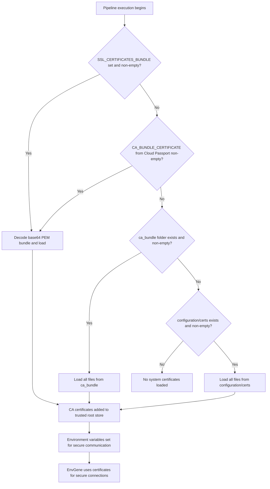

# System Certificate Configuration

- [System Certificate Configuration](#system-certificate-configuration)
  - [Description](#description)
  - [Problem statement](#problem-statement)
  - [Approach](#approach)
    - [Certificate source priority](#certificate-source-priority)
    - [Certificate management process](#certificate-management-process)
    - [Supported certificate types](#supported-certificate-types)
    - [Certificate chain ordering](#certificate-chain-ordering)
    - [How to obtain required certificates](#how-to-obtain-required-certificates)
      - [Using OpenSSL to retrieve server certificates](#using-openssl-to-retrieve-server-certificates)
      - [Extracting individual certificates from chain](#extracting-individual-certificates-from-chain)
      - [Using browser to export certificates](#using-browser-to-export-certificates)
      - [Verifying certificate chains](#verifying-certificate-chains)
  - [Usage examples](#usage-examples)
    - [GitLab CI/CD variable (`SSL_CERTIFICATES_BUNDLE`)](#gitlab-cicd-variable-ssl_certificates_bundle)
  - [Technical implementation](#technical-implementation)
  - [Troubleshooting](#troubleshooting)
    - [Common issues](#common-issues)
    - [Debugging tips](#debugging-tips)
  - [Related documentation](#related-documentation)

## Description

EnvGene loads system certificates during pipeline execution from the first non-empty source in a fixed priority list. EnvGene does not
merge certificates across sources. When the selected source is a folder, EnvGene applies every certificate file in that folder.

## Problem statement

When deploying environments in enterprise settings, teams face several certificate-related challenges:

1. Secure communication barriers:
   1. Internal services use self-signed certificates not trusted by default
   2. Artifact repositories require client certificate authentication

2. Manual certificate management:
   1. Installing certificates on build agents by hand is error-prone
   2. Certificate updates need manual intervention
   3. Different environments need different certificates

Goals:

1. Provide a consistent way to manage certificates across all environments
2. Automate certificate installation during pipeline execution
3. Support PEM CA certificate formats (`.crt`, `.pem`)
4. Remove the need for manual certificate management on build agents

## Approach

EnvGene provides a built-in mechanism for managing system certificates during pipeline execution. EnvGene evaluates four
sources in a fixed priority order and selects the first non-empty one. Lower-priority sources are ignored. EnvGene does not
merge certificates across sources.

### Certificate source priority

| Priority | Source                    | Kind                  | Value format                                                                                      |
|----------|---------------------------|-----------------------|---------------------------------------------------------------------------------------------------|
| 1        | `SSL_CERTIFICATES_BUNDLE` | GitLab CI/CD variable | Base64-encoded PEM CA certificate or bundle                                                       |
| 2        | `CA_BUNDLE_CERTIFICATE`   | Cloud Passport        | Base64-encoded PEM CA certificate or bundle                                                       |
| 3        | `ca_bundle`               | Repository folder     | Certificate files at repository root                                                              |
| 4        | `configuration/certs`     | Repository folder     | Certificate files under `configuration/`                                                          |

`CA_BUNDLE_CERTIFICATE` is read from `Devops.CA_BUNDLE_CERTIFICATE` in the [Cloud Passport](/docs/envgene-objects.md#cloud-passport).
`ca_bundle` lives at the repository root. `configuration/certs` is evaluated at the lowest priority for backward compatibility.

> [!IMPORTANT]
> EnvGene applies all certificate files from the selected source only. Certificates from other sources are not loaded.

### Certificate management process

The system certificate configuration feature in EnvGene automatically handles certificates from the resolved source defined in
[Certificate source priority](#certificate-source-priority). During pipeline execution:

1. EnvGene evaluates certificate sources in priority order and selects the first non-empty source
2. Detected certificates are loaded into the runner environment
3. CA certificates are added to the system's trusted root certificate store
4. Environment variables are set to ensure tools and libraries use the certificates
5. EnvGene uses these certificates for secure communication with external systems

> [!IMPORTANT]
> If `SSL_CERTIFICATES_BUNDLE` is set but cannot be decoded (invalid base64) or does not contain a valid PEM certificate
> after decoding, the pipeline fails with an explicit error. EnvGene does not fall back to a lower-priority source in this
> case - fallback only occurs when a source is empty or unset, not when it is set but invalid.

> [!IMPORTANT]
> If `CA_BUNDLE_CERTIFICATE` from Cloud Passport is set but cannot be decoded (invalid base64) or does not contain a valid
> PEM certificate after decoding, the pipeline fails with an explicit error. EnvGene does not skip to the next source
> silently - fallback only occurs when a source is empty or unset, not when it is set but invalid.



When every source in the priority list is empty or unset, the pipeline continues without loading additional system
certificates. This is a valid outcome - not a warning or error.

For step-by-step configuration of each source, see [Configure system certificates](/docs/how-to/system-certificate.md).

### Supported certificate types

- **CA certificates** (`.crt`, `.pem`): Root or intermediate certificates used to validate server certificates

When the selected source is a folder, EnvGene loads all certificate files in that folder. These naming conventions help with
organisation:

- `ca-*.pem` or `ca-*.crt` for CA certificates

### Certificate chain ordering

For certificate chains with multiple levels (root CA, intermediate CAs, and end-entity certificates), combine every certificate into a
single `.crt` or `.pem` file in the correct order. The order matters for validation.

Required order:

1. Root CA certificate (first)
2. Intermediate CA certificates (in hierarchical order)
3. End-entity certificate (last, if applicable)

Example certificate chain file (`ca-chain.pem`):

```text
-----BEGIN CERTIFICATE-----
[Root CA Certificate - First]
MIIDXTCCAkWgAwIBAgIJAKoK/OvvXMdTMA0GCSqGSIb3DQEBCwUAMEUxCzAJBgNV
BAYTAkFVMRMwEQYDVQQIDApTb21lLVN0YXRlMSEwHwYDVQQKDBhJbnRlcm5ldCBX
...
-----END CERTIFICATE-----
-----BEGIN CERTIFICATE-----
[Intermediate CA Certificate - Second]
MIIDXTCCAkWgAwIBAgIJAKoK/OvvXMdTMA0GCSqGSIb3DQEBCwUAMEUxCzAJBgNV
BAYTAkFVMRMwEQYDVQQIDApTb21lLVN0YXRlMSEwHwYDVQQKDBhJbnRlcm5ldCBX
...
-----END CERTIFICATE-----
-----BEGIN CERTIFICATE-----
[End-Entity Certificate - Last (if needed)]
MIIDXTCCAkWgAwIBAgIJAKoK/OvvXMdTMA0GCSqGSIb3DQEBCwUAMEUxCzAJBgNV
BAYTAkFVMRMwEQYDVQQIDApTb21lLVN0YXRlMSEwHwYDVQQKDBhJbnRlcm5ldCBX
...
-----END CERTIFICATE-----
```

- Each certificate must be in PEM format with proper `-----BEGIN CERTIFICATE-----` and `-----END CERTIFICATE-----` boundaries
- No empty lines should exist between certificates
- The order is critical for proper certificate validation
- If you have multiple certificate chains, create separate files for each chain

Example `ca_bundle` layout with certificate chains:

```text
/ca_bundle
  ca-chain-internal.pem
  ca-chain-external.pem
```

### How to obtain required certificates

Before configuring certificate chains, identify and obtain the required certificates from your target services.

#### Using OpenSSL to retrieve server certificates

For HTTPS services:

```bash
# Get the complete certificate chain from a server
openssl s_client -connect your-site.com:443 -showcerts

# Save the certificate chain to a file
openssl s_client -connect your-site.com:443 -showcerts < /dev/null 2>/dev/null | openssl x509 -outform PEM > server-cert.pem

# Get certificate chain with SNI (Server Name Indication) support
openssl s_client -connect your-site.com:443 -servername your-site.com -showcerts
```

For non-HTTPS services (custom ports):

```bash
# For services running on custom ports
openssl s_client -connect internal-service.company.com:8443 -showcerts

# For services with custom protocols
openssl s_client -connect ldap-server.company.com:636 -showcerts
```

#### Extracting individual certificates from chain

When you run `openssl s_client -showcerts`, you see output like:

```text
-----BEGIN CERTIFICATE-----
[Certificate 1 - Usually the server certificate]
-----END CERTIFICATE-----
-----BEGIN CERTIFICATE-----
[Certificate 2 - Intermediate CA]
-----END CERTIFICATE-----
-----BEGIN CERTIFICATE-----
[Certificate 3 - Root CA]
-----END CERTIFICATE-----
```

To create a proper certificate chain file:

1. Copy certificates in reverse order (Root CA first, then intermediates, then server cert if needed)
2. Save them to a single `.pem` file with proper ordering

#### Using browser to export certificates

1. Open the site in your browser
2. Click on the lock icon in the address bar
3. View certificate details
4. Export the certificate chain
5. Convert to PEM format if needed

#### Verifying certificate chains

```bash
# Verify certificate chain
openssl verify -CAfile ca-chain.pem target-cert.pem

# Check certificate details
openssl x509 -in certificate.pem -text -noout

# Test certificate chain against a server
openssl s_client -connect hostname:port -CAfile ca-chain.pem -verify_return_error
```

## Usage examples

For step-by-step configuration of each certificate source, see
[Configure system certificates](/docs/how-to/system-certificate.md).

### GitLab CI/CD variable (`SSL_CERTIFICATES_BUNDLE`)

**Scenario**: You store the corporate CA bundle as a GitLab CI/CD variable instead of committing certificate files to the
instance repository.

**Implementation**:

1. Export the CA certificate or bundle as a PEM file
2. Base64-encode the PEM content:

   ```bash
   base64 -w 0 ca-bundle.pem
   ```

3. Store the result in a GitLab CI/CD variable named `SSL_CERTIFICATES_BUNDLE`
4. When the pipeline runs, EnvGene decodes the variable and installs the certificates before jobs connect to external systems

| Variable                  | Value                                 | Masked      |
|---------------------------|---------------------------------------|-------------|
| `SSL_CERTIFICATES_BUNDLE` | Output of `base64 -w 0 ca-bundle.pem` | Recommended |

## Technical implementation

Under the hood, EnvGene uses a certificate handling script that:

1. Detects the operating system of the runner
2. Copies certificates to the appropriate system location based on the OS:
   - Debian/Ubuntu: `/usr/local/share/ca-certificates/`
   - CentOS/Red Hat: `/etc/pki/ca-trust/source/anchors/`
   - Alpine: appends to `/etc/ssl/certs/ca-certificates.crt`
3. Updates the CA trust store using the appropriate command for the OS:
   - Debian/Ubuntu: `update-ca-certificates --fresh`
   - CentOS/Red Hat: `update-ca-trust`
   - Alpine: `update-ca-certificates`
4. Sets `REQUESTS_CA_BUNDLE` to the OS-specific system CA bundle path:
   - Debian/Ubuntu and Alpine: `/etc/ssl/certs/ca-certificates.crt`
   - CentOS/Red Hat: `/etc/pki/tls/certs/ca-bundle.crt`

   The script also appends `export REQUESTS_CA_BUNDLE=...` to `~/.bashrc` so subsequent shell sessions inherit the value.
   
## Troubleshooting

### Common issues

1. **Certificate not recognised**:
   - Ensure the certificate is in the correct format
   - Check that the certificate is present in the selected source (`SSL_CERTIFICATES_BUNDLE`, Cloud Passport
     `Devops.CA_BUNDLE_CERTIFICATE`, `ca_bundle`, or `configuration/certs`)

2. **Connection failures**:
   - EnvGene does not check certificate expiry when loading certificates into the trust store. Expired certificates are
     installed without warning or error. Expiry-related failures appear later during TLS handshake when the client or
     server validates the chain.
   - Ensure the certificate is trusted by the target system

3. **Pipeline failures**:
   - Check pipeline logs for certificate loading errors
   - If a certificate file in the selected folder cannot be read (for example due to restrictive file permissions), the
     pipeline fails with a non-zero exit status. The error output identifies the file path. EnvGene does not skip
     unreadable files and continue with a partial bundle.

4. **Wrong source applied**:
   - Check which source EnvGene selected in the pipeline log. A higher-priority non-empty source hides all lower-priority
     sources

5. **Invalid certificate file in folder source**:
   - If a `.crt` or `.pem` file in the selected folder cannot be parsed as a valid certificate, the pipeline fails with
     an error identifying the specific file.
   - Fix or remove the invalid file. EnvGene does not skip invalid files and continue silently.

### Debugging tips

To debug certificate issues:

1. Check the pipeline logs for certificate loading messages
2. Verify that `REQUESTS_CA_BUNDLE` is set to the expected system CA bundle path
3. Use tools like `openssl` to validate certificate chains

## Related documentation

- [Configure system certificates](/docs/how-to/system-certificate.md) - step-by-step setup for each certificate source
- [System certificate use cases](/docs/use-cases/system-certificate.md) - observable behaviour and test scenarios
- [Cloud Passport processing](/docs/features/cloud-passport-processing.md) - how Cloud Passport parameters reach the
  environment
