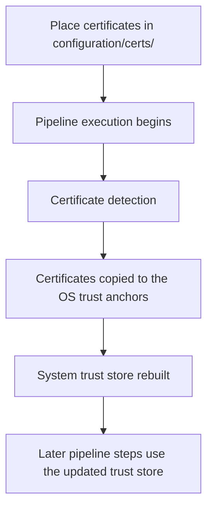

# System certificate configuration

- [System certificate configuration](#system-certificate-configuration)
  - [Problem statement](#problem-statement)
  - [Approach](#approach)
    - [Certificate management process](#certificate-management-process)
    - [Supported certificate types](#supported-certificate-types)
  - [Technical implementation](#technical-implementation)

For step-by-step instructions on placing, obtaining, and verifying certificates, see
[Configure system certificates](/docs/how-to/configure-system-certificates.md).

## Problem statement

When deploying environments in enterprise settings, teams face several certificate-related challenges:

1. Secure communication barriers:
   1. Internal services use self-signed certificates that are not trusted by default.
   2. Artifact repositories are exposed over TLS with private certificate authorities.

2. Manual certificate management:
   1. Installing certificates on build agents by hand is error-prone.
   2. Certificate updates require manual intervention.
   3. Different environments may require different certificates.

Goals:

1. Provide a consistent way to manage certificates across all environments.
2. Automate certificate installation during pipeline execution.
3. Eliminate manual certificate management on build agents.

## Approach

EnvGene provides a built-in mechanism for managing system certificates through a dedicated directory in the
environment instance repository. Certificates placed in this directory are automatically loaded and added to the
runner trust store during pipeline execution.

### Certificate management process

The feature handles certificates placed in the `configuration/certs/` directory of your environment instance
repository. During pipeline execution:

1. EnvGene checks for certificate files in the `configuration/certs/` directory.
2. Each certificate is added to the runner operating system trust store.
3. The system trust store is rebuilt so later pipeline steps use the updated certificates.

```mermaid
flowchart TD
    A[Place certificates in configuration/certs/] --> B[Pipeline execution begins]
    B --> C[Certificate detection]
    C --> D[Certificates copied to the OS trust anchors]
    D --> E[System trust store rebuilt]
    E --> F[Later pipeline steps use the updated trust store]
```

> [!NOTE]
> If `configuration/certs/` is absent or empty, EnvGene applies a default certificate baked into the runner image,
> when one is present. Otherwise the step is a no-op and no certificate is installed.

### Supported certificate types

The trust-store mechanism processes CA certificates in PEM format:

- **CA certificates** (`.crt`, `.pem`): root or intermediate certificates used to validate server certificates.

A single file may contain a full chain of concatenated PEM certificates. For how to assemble a chain file, see
[Build a certificate chain file](/docs/how-to/configure-system-certificates.md#build-a-certificate-chain-file).

## Technical implementation

Under the hood, EnvGene runs a certificate handling script that:

1. Detects the operating system of the runner.
2. Copies each certificate to the OS trust anchor directory:
   - Debian, Ubuntu, and Alpine: `/usr/local/share/ca-certificates/`
   - CentOS and Red Hat: `/etc/pki/ca-trust/source/anchors/`
3. Rebuilds the trust store with the command for the detected OS:
   - Debian and Ubuntu: `update-ca-certificates --fresh`
   - Alpine: `update-ca-certificates`
   - CentOS and Red Hat: `update-ca-trust`
4. Makes the refreshed trust store available to tools and libraries used by later pipeline steps.

Each source file keeps its own base name at the destination, with a `.crt` extension, so multiple certificate
files do not overwrite each other.
