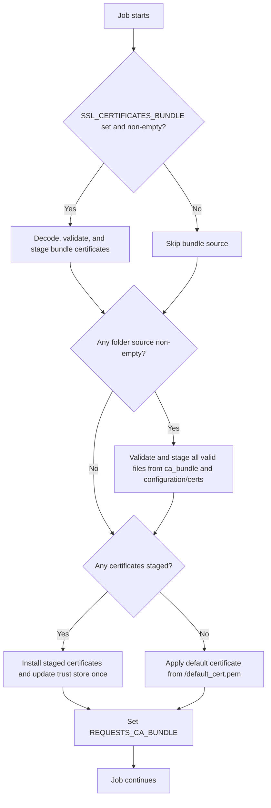

# System certificate configuration

- [System certificate configuration](#system-certificate-configuration)
  - [Description](#description)
  - [Problem statement](#problem-statement)
  - [Approach](#approach)
    - [Certificate sources](#certificate-sources)
    - [Certificate validation](#certificate-validation)
    - [Certificate management process](#certificate-management-process)
    - [Supported certificate types](#supported-certificate-types)
    - [Certificate chain ordering](#certificate-chain-ordering)
    - [How to obtain required certificates](#how-to-obtain-required-certificates)
      - [Using OpenSSL to retrieve server certificates](#using-openssl-to-retrieve-server-certificates)
      - [Extracting individual certificates from chain](#extracting-individual-certificates-from-chain)
      - [Using browser to export certificates](#using-browser-to-export-certificates)
      - [Verifying certificate chains](#verifying-certificate-chains)
  - [Usage examples](#usage-examples)
    - [CI/CD variable (`SSL_CERTIFICATES_BUNDLE`)](#cicd-variable-ssl_certificates_bundle)
  - [Technical implementation](#technical-implementation)
  - [Troubleshooting](#troubleshooting)
    - [Common issues](#common-issues)
    - [Debugging tips](#debugging-tips)
  - [Related documentation](#related-documentation)

## Description

EnvGene loads system certificates at the start of selected instance pipeline jobs. EnvGene applies every non-empty
configured source and merges the result into the runner trust store. An empty or unset source contributes nothing.

When `SSL_CERTIFICATES_BUNDLE`, `ca_bundle`, and `configuration/certs` are all empty or absent, EnvGene applies the
built-in default certificate from `/default_cert.pem` in the runner image. The pipeline does not fail in this case.

## Problem statement

When deploying environments in enterprise settings, teams face several certificate-related challenges:

1. Secure communication barriers:
   1. Internal services use self-signed certificates not trusted by default
   2. Artifact repositories require client certificate authentication

2. Manual certificate management:
   1. Installing certificates on build agents by hand is error-prone
   2. Certificate updates need manual intervention
   3. Different environments need different certificates

Goals:

1. Provide a consistent way to manage certificates across all environments
2. Automate certificate installation during pipeline execution
3. Support PEM CA certificate formats (`.crt`, `.pem`, and other file names in folder sources)
4. Remove the need for manual certificate management on build agents

## Approach

EnvGene provides a built-in mechanism for managing system certificates during pipeline execution. EnvGene evaluates
each configured source independently. Every non-empty source contributes its valid certificates to the merged trust
store.

### Certificate sources

| Source                    | Kind                       | Value format                                | How provided                                                                                    |
|---------------------------|----------------------------|---------------------------------------------|-------------------------------------------------------------------------------------------------|
| `SSL_CERTIFICATES_BUNDLE` | CI/CD variable             | Base64-encoded PEM CA certificate or bundle | GitLab project-level CI/CD variable, or GitHub repository variable/secret mapped via `env:` in the workflow |
| `ca_bundle`               | Repository folder          | Certificate files at repository root        | `/ca_bundle` at the repository root                                                             |
| `configuration/certs`     | Repository folder          | Certificate files under `configuration/`    | `/configuration/certs`. Kept for backward compatibility.                                          |
| Default certificate       | Built-in runner image file | PEM at `/default_cert.pem`                  | Built into the EnvGene runner image. Not merged with configured sources (see [Description](#description)) |

> [!IMPORTANT]
> EnvGene merges valid certificates from every non-empty configured source (`SSL_CERTIFICATES_BUNDLE`, `ca_bundle`, and
> `configuration/certs`). For default-certificate behaviour when all configured sources are empty, see
> [Description](#description).

### Certificate validation

EnvGene validates certificate content from each non-empty source before installation. The flow below applies to all
sources. For `SSL_CERTIFICATES_BUNDLE`, EnvGene base64-decodes the variable value first.

1. **Obtain PEM content** - For `ca_bundle` and `configuration/certs`, EnvGene reads every file in the folder (any file
   name or extension). For `SSL_CERTIFICATES_BUNDLE`, EnvGene uses the decoded variable value.
2. **Detect a PEM certificate block** - Content must contain `-----BEGIN CERTIFICATE-----`.
   - Folder file without the block: EnvGene skips the file and emits a warning in the job log.
   - `SSL_CERTIFICATES_BUNDLE` without the block after decode: the job fails with an explicit error. Certificates from
     other sources are not loaded.
3. **Validate PEM** - EnvGene confirms the content parses as a valid PEM certificate.
   - Folder file that fails validation: EnvGene collects the file path. After all files in the source are checked, if any
     invalid path was collected, the job fails once with a single error that lists every invalid path.
   - `SSL_CERTIFICATES_BUNDLE` that fails validation: the job fails with an explicit error. Certificates from other
     sources are not loaded.
4. **Read folder files** - If a file in `ca_bundle` or `configuration/certs` cannot be read, the job fails with an
   error that identifies the file path.

If `SSL_CERTIFICATES_BUNDLE` is set but cannot be base64-decoded, the job fails with an explicit error and certificates
from other sources are not loaded.

### Certificate management process

During pipeline execution:

1. EnvGene evaluates `SSL_CERTIFICATES_BUNDLE`, `ca_bundle`, and `configuration/certs` as described in
   [Certificate validation](#certificate-validation)
2. Valid certificates from all non-empty configured sources are merged into the runner trust store as described in
   [Technical implementation](#technical-implementation)
3. If no configured source contributed certificates, EnvGene applies the default certificate (see
   [Description](#description))
4. EnvGene sets `REQUESTS_CA_BUNDLE` (see [Technical implementation](#technical-implementation) for OS-specific paths)
5. EnvGene uses these certificates for outbound TLS from jobs that connect to external systems


```mermaid
flowchart TD
    A[Job starts] --> B{SSL_CERTIFICATES_BUNDLE set and non-empty?}
    B -->|Yes| C[Decode, validate, and stage bundle certificates]
    B -->|No| D[Skip bundle source]
    C --> E{Any folder source non-empty?}
    D --> E
    E -->|Yes| F[Validate and stage all valid files from ca_bundle and configuration/certs]
    E -->|No| G{Any certificates staged?}
    F --> G
    G -->|Yes| H[Install staged certificates and update trust store once]
    G -->|No| I[Apply default certificate from /default_cert.pem]
    H --> J[Set REQUESTS_CA_BUNDLE]
    I --> J
    J --> K[Job continues]
```

### Supported certificate types

- **CA certificates**: Root or intermediate certificates used to validate server certificates. PEM content is identified
  by `-----BEGIN CERTIFICATE-----` and `-----END CERTIFICATE-----` boundaries.

File names such as `ca-*.pem` or `ca-*.crt` are conventions only. For how folder sources are evaluated, see
[Certificate validation](#certificate-validation).

### Certificate chain ordering

For certificate chains with multiple levels (root CA, intermediate CAs, and end-entity certificates), combine every certificate into a
single `.crt` or `.pem` file in the correct order. The order matters for validation.

Required order:

1. Root CA certificate (first)
2. Intermediate CA certificates (in hierarchical order)
3. End-entity certificate (last, if applicable)

Example certificate chain file (`ca-chain.pem`):

```text
-----BEGIN CERTIFICATE-----
[Root CA Certificate - First]
MIIDXTCCAkWgAwIBAgIJAKoK/OvvXMdTMA0GCSqGSIb3DQEBCwUAMEUxCzAJBgNV
BAYTAkFVMRMwEQYDVQQIDApTb21lLVN0YXRlMSEwHwYDVQQKDBhJbnRlcm5ldCBX
...
-----END CERTIFICATE-----
-----BEGIN CERTIFICATE-----
[Intermediate CA Certificate - Second]
MIIDXTCCAkWgAwIBAgIJAKoK/OvvXMdTMA0GCSqGSIb3DQEBCwUAMEUxCzAJBgNV
BAYTAkFVMRMwEQYDVQQIDApTb21lLVN0YXRlMSEwHwYDVQQKDBhJbnRlcm5ldCBX
...
-----END CERTIFICATE-----
-----BEGIN CERTIFICATE-----
[End-Entity Certificate - Last (if needed)]
MIIDXTCCAkWgAwIBAgIJAKoK/OvvXMdTMA0GCSqGSIb3DQEBCwUAMEUxCzAJBgNV
BAYTAkFVMRMwEQYDVQQIDApTb21lLVN0YXRlMSEwHwYDVQQKDBhJbnRlcm5ldCBX
...
-----END CERTIFICATE-----
```

- Each certificate must be in PEM format with proper `-----BEGIN CERTIFICATE-----` and `-----END CERTIFICATE-----` boundaries
- Do not add empty lines between certificates
- The order is critical for proper certificate validation
- If you have multiple certificate chains, create separate files for each chain

Example `ca_bundle` layout with certificate chains:

```text
/ca_bundle
  ca-chain-internal.pem
  ca-chain-external.pem
```

### How to obtain required certificates

Before configuring certificate chains, identify and obtain the required certificates from your target services.

#### Using OpenSSL to retrieve server certificates

For HTTPS services:

```bash
# Get the complete certificate chain from a server
openssl s_client -connect your-site.com:443 -showcerts

# Save the certificate chain to a file
openssl s_client -connect your-site.com:443 -showcerts < /dev/null 2>/dev/null | openssl x509 -outform PEM > server-cert.pem

# Get certificate chain with SNI (Server Name Indication) support
openssl s_client -connect your-site.com:443 -servername your-site.com -showcerts
```

For non-HTTPS services (custom ports):

```bash
# For services running on custom ports
openssl s_client -connect internal-service.company.com:8443 -showcerts

# For services with custom protocols
openssl s_client -connect ldap-server.company.com:636 -showcerts
```

#### Extracting individual certificates from chain

When you run `openssl s_client -showcerts`, you see output like:

```text
-----BEGIN CERTIFICATE-----
[Certificate 1 - Usually the server certificate]
-----END CERTIFICATE-----
-----BEGIN CERTIFICATE-----
[Certificate 2 - Intermediate CA]
-----END CERTIFICATE-----
-----BEGIN CERTIFICATE-----
[Certificate 3 - Root CA]
-----END CERTIFICATE-----
```

To create a proper certificate chain file:

1. Copy certificates in reverse order (Root CA first, then intermediates, then server cert if needed)
2. Save them to a single `.pem` file with proper ordering

#### Using browser to export certificates

1. Open the site in your browser
2. Click on the lock icon in the address bar
3. View certificate details
4. Export the certificate chain
5. Convert to PEM format if needed

#### Verifying certificate chains

```bash
# Verify certificate chain
openssl verify -CAfile ca-chain.pem target-cert.pem

# Check certificate details
openssl x509 -in certificate.pem -text -noout

# Test certificate chain against a server
openssl s_client -connect hostname:port -CAfile ca-chain.pem -verify_return_error
```

## Usage examples

For step-by-step configuration of each certificate source, see
[Configure system certificates](/docs/how-to/system-certificate.md).

### CI/CD variable (`SSL_CERTIFICATES_BUNDLE`)

Store the corporate CA bundle in a CI/CD variable instead of committing certificate files to the instance repository.

1. Export the CA certificate or bundle as a PEM file.
2. Base64-encode the PEM content:

   ```bash
   base64 -w 0 ca-bundle.pem
   ```

3. Store the base64-encoded value in `SSL_CERTIFICATES_BUNDLE` (see [Certificate sources](#certificate-sources)).
4. When the pipeline runs, EnvGene loads certificates as described in
   [Certificate management process](#certificate-management-process).

| Variable                  | Value                                 | Masked      |
|---------------------------|---------------------------------------|-------------|
| `SSL_CERTIFICATES_BUNDLE` | Output of `base64 -w 0 ca-bundle.pem` | Recommended |

> [!WARNING]
> GitLab limits a CI/CD variable value to 10,000 characters. A single CA or a short chain of two or three certificates
> usually fits. For larger bundles, store certificate files in `ca_bundle` or `configuration/certs` instead.

## Technical implementation

EnvGene uses a certificate handling script that:

1. Detects the operating system of the runner
2. Validates certificate content from each non-empty source as described in [Certificate validation](#certificate-validation)
3. Copies each valid certificate to the OS trust directory under a normalised `<basename>.crt` file name:
   - Debian/Ubuntu: `/usr/local/share/ca-certificates/`
   - CentOS/Red Hat: `/etc/pki/ca-trust/source/anchors/`
   - Alpine: `/usr/local/share/ca-certificates/`
4. Updates the CA trust store once per job using the appropriate command for the OS:
   - Debian/Ubuntu: `update-ca-certificates --fresh`
   - CentOS/Red Hat: `update-ca-trust`
   - Alpine: `update-ca-certificates`
5. Sets `REQUESTS_CA_BUNDLE` to the OS-specific system CA bundle path:
   - Debian/Ubuntu and Alpine: `/etc/ssl/certs/ca-certificates.crt`
   - CentOS/Red Hat: `/etc/pki/tls/certs/ca-bundle.crt`
   - Appends `export REQUESTS_CA_BUNDLE=...` to `~/.bashrc` so subsequent shell sessions inherit the value.

## Troubleshooting

### Common issues

1. **Certificate not recognised**:
   - Ensure the certificate is in PEM format with `-----BEGIN CERTIFICATE-----` boundaries
   - Check that the certificate is present in a configured source (`SSL_CERTIFICATES_BUNDLE`, `ca_bundle`, or
     `configuration/certs`)

2. **Pipeline failures**:
   - Check pipeline logs for certificate loading errors
   - See [Certificate validation](#certificate-validation) for read errors, invalid folder files, and invalid
     `SSL_CERTIFICATES_BUNDLE` values

3. **File skipped with warning**:
   - See [Certificate validation](#certificate-validation) (step 2, folder files without a PEM block)

4. **Invalid `SSL_CERTIFICATES_BUNDLE` value**:
   - See [Certificate validation](#certificate-validation) (base64 decode, PEM block, and PEM validation)

### Debugging tips

1. Check the pipeline logs for certificate loading messages.
2. Verify that `REQUESTS_CA_BUNDLE` is set to the expected system CA bundle path (see
   [Technical implementation](#technical-implementation)).
3. Use `openssl` to validate certificate chains.

## Related documentation

- [Configure system certificates](/docs/how-to/system-certificate.md) - step-by-step setup for each certificate source
- [System certificate use cases](/docs/use-cases/system-certificate.md) - behaviour and test scenarios
