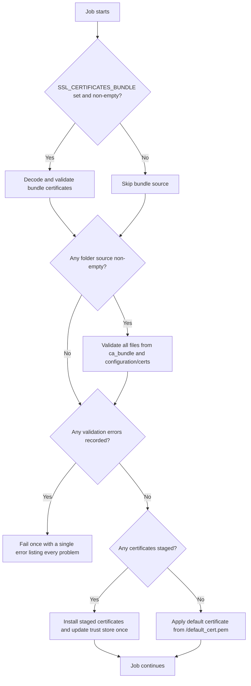

# System certificate configuration

- [System certificate configuration](#system-certificate-configuration)
  - [Description](#description)
  - [Problem statement](#problem-statement)
  - [Approach](#approach)
    - [Certificate sources](#certificate-sources)
    - [Certificate validation](#certificate-validation)
    - [Certificate management process](#certificate-management-process)
    - [Supported certificate types](#supported-certificate-types)
  - [Usage examples](#usage-examples)
    - [CI/CD variable (`SSL_CERTIFICATES_BUNDLE`)](#cicd-variable-ssl_certificates_bundle)
  - [Technical implementation](#technical-implementation)
  - [Related documentation](#related-documentation)

## Description

EnvGene loads system certificates at the start of the `env-prepare` and `cmdb_import` instance pipeline jobs.
EnvGene applies every non-empty configured source and merges the result into the runner trust store. An empty or
unset source contributes nothing.

When `SSL_CERTIFICATES_BUNDLE`, `ca_bundle`, and `configuration/certs` are all empty or absent, EnvGene applies the
built-in default certificate from `/default_cert.pem`, when the runner image ships one. Otherwise the certificate
loading step is a no-op and no certificate is installed. The pipeline does not fail in either case.

## Problem statement

When deploying environments in enterprise settings, teams face several certificate-related challenges:

1. Secure communication barriers:
   1. Internal services use self-signed certificates not trusted by default
   2. Artifact repositories are exposed over TLS with private certificate authorities

2. Manual certificate management:
   1. Installing certificates on build agents by hand is error-prone
   2. Certificate updates need manual intervention
   3. Different environments need different certificates

Goals:

1. Provide a consistent way to manage certificates across all environments
2. Automate certificate installation during pipeline execution
3. Support PEM CA certificate formats (`.crt`, `.pem`, and other filenames in folder sources)
4. Remove the need for manual certificate management on build agents

## Approach

EnvGene provides a built-in mechanism for managing system certificates during pipeline execution. EnvGene evaluates
each configured source independently. Every non-empty source contributes its valid certificates to the merged trust
store.

### Certificate sources

| Source                    | Kind              | Value format                                | How provided                                    |
|---------------------------|-------------------|---------------------------------------------|-------------------------------------------------|
| `SSL_CERTIFICATES_BUNDLE` | CI/CD variable    | Base64-encoded PEM CA certificate or bundle | GitLab CI/CD variable or GitHub variable/secret |
| `ca_bundle`               | Repository folder | PEM certificate files, any filename         | `/ca_bundle` at the repository root             |
| `configuration/certs`     | Repository folder | PEM certificate files, any filename         | `/configuration/certs`, current behaviour       |
| Default certificate       | Runner image file | PEM at `/default_cert.pem`                  | Built into the runner image, when present       |

For the GitHub-specific variable mapping, see
[Provide certificates through
`SSL_CERTIFICATES_BUNDLE`](/docs/how-to/configure-system-certificates.md#provide-certificates-through-ssl_certificates_bundle).

> [!IMPORTANT]
> EnvGene merges valid certificates from every non-empty configured source (`SSL_CERTIFICATES_BUNDLE`, `ca_bundle`, and
> `configuration/certs`). For default-certificate behaviour when all configured sources are empty, see
> [Description](#description).

### Certificate validation

EnvGene validates certificate content from each non-empty source before installation. The flow below applies to all
sources. For `SSL_CERTIFICATES_BUNDLE`, EnvGene base64-decodes the variable value first.

1. **Obtain PEM content** - For `ca_bundle` and `configuration/certs`, EnvGene reads every file in the folder (any
   filename or extension). For `SSL_CERTIFICATES_BUNDLE`, EnvGene uses the decoded variable value.
2. **Detect a PEM certificate block** - Content must contain `-----BEGIN CERTIFICATE-----`.
   - Folder file without the block: EnvGene skips the file and emits a warning in the job log.
   - `SSL_CERTIFICATES_BUNDLE` without the block after decode: EnvGene records a validation error.
3. **Validate PEM** - EnvGene confirms the content parses as a valid PEM certificate. Content that fails validation is
   recorded as a validation error with the variable name or file path.
4. **Read folder files** - A file in `ca_bundle` or `configuration/certs` that cannot be read is recorded as a
   validation error with its file path.

A `SSL_CERTIFICATES_BUNDLE` value that cannot be base64-decoded is also recorded as a validation error.

EnvGene checks every source to the end before failing. When at least one validation error was recorded, the job fails
once with a single error that lists every problem across all sources: the variable name for
`SSL_CERTIFICATES_BUNDLE` and the file path for folder files. No certificate is installed in this case.

### Certificate management process

During pipeline execution:

1. EnvGene evaluates `SSL_CERTIFICATES_BUNDLE`, `ca_bundle`, and `configuration/certs` as described in
   [Certificate validation](#certificate-validation)
2. Valid certificates from all non-empty configured sources are merged into the runner trust store as described in
   [Technical implementation](#technical-implementation)
3. If no configured source contributed certificates, EnvGene applies the default certificate (see
   [Description](#description))
4. EnvGene uses these certificates for outbound TLS from jobs that connect to external systems

```mermaid
flowchart TD
    A[Job starts] --> B{SSL_CERTIFICATES_BUNDLE set and non-empty?}
    B -->|Yes| C[Decode and validate bundle certificates]
    B -->|No| D[Skip bundle source]
    C --> E{Any folder source non-empty?}
    D --> E
    E -->|Yes| F[Validate all files from ca_bundle and configuration/certs]
    E -->|No| G{Any validation errors recorded?}
    F --> G
    G -->|Yes| H[Fail once with a single error listing every problem]
    G -->|No| I{Any certificates staged?}
    I -->|Yes| J[Install staged certificates and update trust store once]
    I -->|No| K[Apply default certificate from /default_cert.pem]
    J --> M[Job continues]
    K --> M
```

### Supported certificate types

- **CA certificates**: Root or intermediate certificates used to validate server certificates. PEM content is identified
  by `-----BEGIN CERTIFICATE-----` and `-----END CERTIFICATE-----` boundaries.

Filenames such as `ca-*.pem` or `ca-*.crt` are conventions only. For how folder sources are evaluated, see
[Certificate validation](#certificate-validation).

A single file may contain a full chain of concatenated PEM certificates. For how to assemble a chain file, see
[Build a certificate chain file](/docs/how-to/configure-system-certificates.md#build-a-certificate-chain-file).

## Usage examples

For step-by-step configuration of each certificate source, see
[Configure system certificates](/docs/how-to/configure-system-certificates.md).

### CI/CD variable (`SSL_CERTIFICATES_BUNDLE`)

Store the corporate CA bundle in a CI/CD variable instead of committing certificate files to the instance repository.
EnvGene base64-decodes the value and merges the certificates with the other configured sources.

> [!WARNING]
> GitLab limits a CI/CD variable value to 10,000 characters. A GitHub secret is limited to 48 KB. For larger bundles,
> store certificate files in `ca_bundle` or `configuration/certs` instead.

## Technical implementation

EnvGene uses a certificate handling script that:

1. Detects the operating system of the runner
2. Validates certificate content from each non-empty source as described in [Certificate
   validation](#certificate-validation)
3. Copies each valid certificate to the OS trust directory under a normalised `<basename>.crt` filename:
   - Debian/Ubuntu: `/usr/local/share/ca-certificates/`
   - CentOS/Red Hat: `/etc/pki/ca-trust/source/anchors/`
   - Alpine: `/usr/local/share/ca-certificates/`
4. Updates the CA trust store once per job using the appropriate command for the OS:
   - Debian/Ubuntu: `update-ca-certificates --fresh`
   - CentOS/Red Hat: `update-ca-trust`
   - Alpine: `update-ca-certificates`

## Related documentation

- [Configure system certificates](/docs/how-to/configure-system-certificates.md) - step-by-step setup for each
  certificate source
- [System certificate use cases](/docs/use-cases/system-certificate.md) - behaviour and test scenarios
