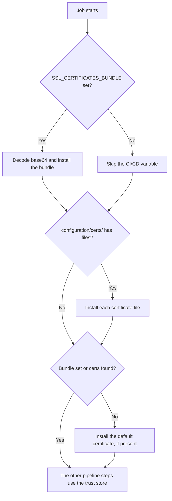

# System certificate configuration

- [System certificate configuration](#system-certificate-configuration)
  - [Problem statement](#problem-statement)
  - [Approach](#approach)
    - [Certificate sources](#certificate-sources)
    - [Certificate management process](#certificate-management-process)
    - [Supported certificate types](#supported-certificate-types)
  - [Technical implementation](#technical-implementation)

For step-by-step instructions on placing, obtaining, and verifying certificates, see
[Configure system certificates](/docs/how-to/configure-system-certificates.md).

## Problem statement

When deploying environments in enterprise settings, teams face certificate-related challenges.
Internal services and artifact repositories are often exposed over TLS with self-signed certificates
or private certificate authorities that the runner does not trust by default. Installing these
certificates on build agents by hand is error-prone, updates require manual intervention, and
different environments can require different certificates.

The system certificate mechanism has these goals:

1. Provide a consistent way to manage certificates across all environments.
2. Install certificates automatically during pipeline execution.
3. Remove the need to manage certificates on build agents by hand.

## Approach

EnvGene provides a built-in mechanism for managing system certificates during pipeline execution.
EnvGene reads certificates from a CI/CD variable and from a directory in the environment instance
repository, then adds them to the trust store before the other pipeline steps run.

### Certificate sources

EnvGene reads certificates from the sources below.

| Source                    | Kind              | Value format                                | Location                                               |
|---------------------------|-------------------|---------------------------------------------|--------------------------------------------------------|
| `SSL_CERTIFICATES_BUNDLE` | CI/CD variable    | base64-encoded PEM CA certificate or bundle | Pipeline CI/CD variable                                |
| `configuration/certs/`    | Repository folder | One or more PEM certificate files           | `configuration/certs/` at the instance repository root |
| Default certificate       | Runner image file | PEM certificate                             | `/default_cert.pem`, built into the runner image       |

EnvGene applies `SSL_CERTIFICATES_BUNDLE` and `configuration/certs/` independently and adds every
certificate they hold to the trust store. If `SSL_CERTIFICATES_BUNDLE` is not set and
`configuration/certs/` contains no files, EnvGene falls back to the default certificate built into
the runner image, when one is present. When no source provides a certificate, EnvGene installs
nothing and the pipeline continues.

### Certificate management process

During pipeline execution, EnvGene reads the configured sources, installs the certificates it finds,
and rebuilds the trust store so that the other pipeline steps use it.

```mermaid
flowchart TD
    A[Job starts] --> B{SSL_CERTIFICATES_BUNDLE set?}
    B -->|Yes| C[Decode base64 and install the bundle]
    B -->|No| D[Skip the CI/CD variable]
    C --> E{configuration/certs/ has files?}
    D --> E
    E -->|Yes| F[Install each certificate file]
    E -->|No| G{Bundle set or certs found?}
    F --> G
    G -->|No| H[Install the default certificate, if present]
    G -->|Yes| J[The other pipeline steps use the trust store]
    H --> J
```

> [!IMPORTANT]
> `SSL_CERTIFICATES_BUNDLE` must hold base64-encoded PEM content. If the value is not valid base64,
> the job fails with an explicit error.

### Supported certificate types

EnvGene processes CA certificates in PEM format: root or intermediate certificates (`.crt`, `.pem`)
used to validate server certificates. A single file may contain a full chain of concatenated PEM
certificates. For how to assemble a chain file, see
[Build a certificate chain file](/docs/how-to/configure-system-certificates.md#build-a-certificate-chain-file).

## Technical implementation

EnvGene runs a certificate handling script. For each certificate the script:

1. Copies the certificate to `/usr/local/share/ca-certificates/` under a `<basename>.crt` filename,
   so multiple certificate files do not overwrite each other.
2. Rebuilds the trust store with `update-ca-certificates`.
