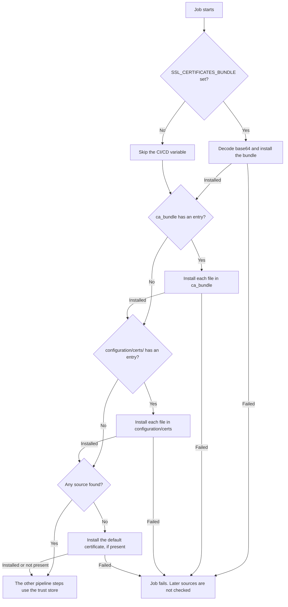

# System certificate configuration

- [System certificate configuration](#system-certificate-configuration)
  - [Problem statement](#problem-statement)
  - [Approach](#approach)
    - [Certificate sources](#certificate-sources)
    - [Certificate management process](#certificate-management-process)
    - [Supported certificate types](#supported-certificate-types)
  - [Technical implementation](#technical-implementation)

For step-by-step instructions on setting `SSL_CERTIFICATES_BUNDLE`, obtaining certificates, and verifying them, see
[Configure system certificates](/docs/how-to/configure-system-certificates.md).

## Problem statement

When deploying environments in enterprise settings, teams face certificate-related challenges.
Internal services and artifact repositories are often exposed over TLS with self-signed certificates
or private certificate authorities that the runner does not trust by default. Installing these
certificates on build agents by hand is error-prone, updates require manual intervention, and
different environments can require different certificates.

The system certificate mechanism has these goals:

1. Provide a consistent way to manage certificates across all environments.
2. Install certificates automatically during pipeline execution.
3. Remove the need to manage certificates on build agents by hand.

## Approach

EnvGene provides a built-in mechanism for managing system certificates during pipeline execution.
EnvGene reads certificates once, at the start of the `env-prepare` job, from a CI/CD variable and from
two directories in the environment instance repository, then adds them to the trust store before the
other pipeline steps run.

### Certificate sources

EnvGene reads certificates from the sources below, in this order.

| Source                    | Kind              | Value format                                | Location                                               |
|---------------------------|-------------------|---------------------------------------------|--------------------------------------------------------|
| `SSL_CERTIFICATES_BUNDLE` | CI/CD variable    | base64-encoded PEM certificate or bundle    | Pipeline CI/CD variable                                |
| `ca_bundle`               | Repository folder | One or more PEM certificate files           | `/ca_bundle` at the instance repository root           |
| `configuration/certs/`    | Repository folder | One or more PEM certificate files           | `configuration/certs/` at the instance repository root |
| Default certificate       | Runner image file | PEM certificate                             | `/default_cert.pem`, built into the runner image       |

EnvGene applies `SSL_CERTIFICATES_BUNDLE`, `/ca_bundle`, and `configuration/certs/` independently and
adds every certificate they hold to the trust store. It reads only files directly in each directory.
If `SSL_CERTIFICATES_BUNDLE` is not set and neither directory contains an entry, EnvGene falls back to
the default certificate built into the runner image, when one is present. An empty directory does not
block the default certificate. When no source provides a certificate, EnvGene installs nothing and
the pipeline continues.

### Certificate management process

During pipeline execution, EnvGene reads the configured sources, installs the certificates it finds,
and rebuilds the trust store so that the other pipeline steps use it.

```mermaid
flowchart TD
    A[Job starts] --> B{SSL_CERTIFICATES_BUNDLE set?}
    B -->|Yes| C[Decode base64 and install the bundle]
    B -->|No| D[Skip the CI/CD variable]
    C -->|Installed| E{ca_bundle has an entry?}
    C -->|Failed| X[Job fails. Later sources are not checked]
    D --> E
    E -->|Yes| F[Install each file in ca_bundle]
    E -->|No| G{configuration/certs/ has an entry?}
    F -->|Installed| G
    F -->|Failed| X
    G -->|Yes| H[Install each file in configuration/certs]
    G -->|No| I{Any source found?}
    H -->|Installed| I
    H -->|Failed| X
    I -->|No| J[Install the default certificate, if present]
    I -->|Yes| K[The other pipeline steps use the trust store]
    J -->|Installed or not present| K
    J -->|Failed| X
```

> [!IMPORTANT]
> `SSL_CERTIFICATES_BUNDLE` must hold base64-encoded PEM content. If the value is not valid base64,
> or if it contains raw PEM text, the job fails with an explicit error.

A decoded bundle or a folder file must contain at least one `-----BEGIN CERTIFICATE-----` block. Each
block must parse as an X.509 certificate and must not be expired at the time of the run. A failed check
stops the job. EnvGene does not check the remaining sources after that failure.

### Supported certificate types

EnvGene processes CA certificates in PEM format: root or intermediate certificates (`.crt`, `.pem`)
used to validate server certificates. The filename does not select certificates. A single file may
contain a full chain of concatenated PEM certificates.

## Technical implementation

The EnvGene orchestrator installs the certificates in its own process before the first pipeline step.
It does this after the sparse checkout, because `configuration/certs/` exists only after the checkout.
The orchestrator:

1. Copies each certificate to `/usr/local/share/ca-certificates/` under a `<basename>.crt` filename,
   so multiple certificate files do not overwrite each other.
2. Rebuilds the trust store once with `update-ca-certificates`.
3. Sets `REQUESTS_CA_BUNDLE` to `/etc/ssl/certs/ca-certificates.crt` and writes it to `envgene-vars.env`.
   Commands that run after the orchestrator in the same job load this file and use the rebuilt trust store.
