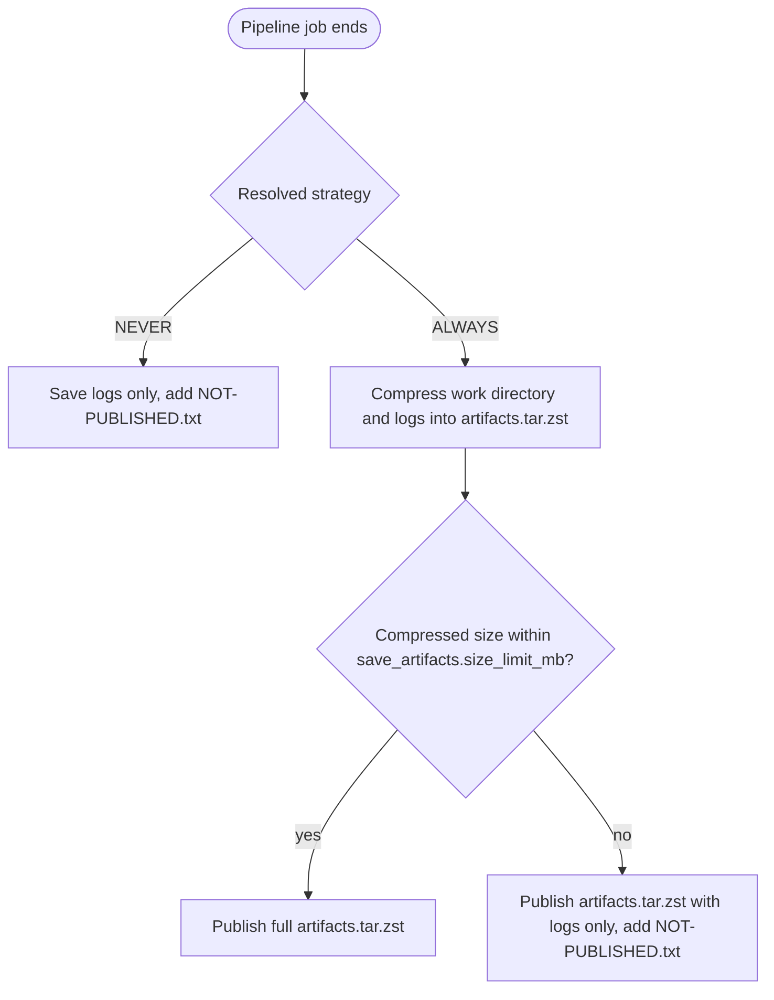

# Troubleshooting artifacts

- [Troubleshooting artifacts](#troubleshooting-artifacts)
  - [Overview](#overview)
  - [Security](#security)
  - [Scope](#scope)
  - [Save criteria](#save-criteria)
    - [Strategy](#strategy)
    - [Size limit](#size-limit)
  - [Multi-environment runs](#multi-environment-runs)

## Overview

By default, EnvGene saves the work directory of an instance repository pipeline run and publishes it as a job
artifact for troubleshooting. The artifact holds the intermediate and output files the run produced, so an
operator can inspect them without rerunning the pipeline. When `ENV_NAMES` lists several environments, each one
runs in its own isolated work directory, and the artifact includes all of them, one per environment, together
with the per-environment pipeline logs.

EnvGene compresses everything into a single `artifacts.tar.zst`, and the runner adds no further compression to
it. To inspect a run, download `artifacts.tar.zst` and extract it. It is a single archive, so the CI web UI
cannot browse into it.

## Security

EnvGene decrypts credential files at the start of the job and encrypts them at the end. On a successful run,
all credential values in the artifact are encrypted. A failure before the encrypt pass leaves plaintext
credential values in a failed run's artifact. Treat failure artifacts as potentially sensitive. See
[Credential encryption](/docs/features/credential-encryption.md).

## Scope

The job artifact is `artifacts.tar.zst`, plus a plain `NOT-PUBLISHED.txt` at the root only when the work
directory is dropped (see [Save criteria](#save-criteria)). Extracted, `artifacts.tar.zst` holds the work
directory as the run left it. Each run works in its own isolated Git worktree that commits its result
independently, laid out under a `<cluster-name>-<environment-name>/` wrapper. The tree below shows the full layout.

```text
<cluster-name>-<environment-name>/               # isolated worktree of one run (multi-env: one sibling per environment)
├── pipeline.log                                 # this environment's pipeline log, always saved
├── ARGO_DPG_CONTEXT.env                         # encrypted dotenv for the ArgoCD sync job, not troubleshooting content
├── appdefs/                                     # Effective Application Definitions
├── regdefs/                                     # Effective Registry Definitions
├── configuration/                               # Repository wide configuration
├── sboms/                                       # SBOMs
├── environments/
│   ├── <shared-site-dirs>/                      # Shared repository wide paramsets, resource profiles, credentials
│   └── <cluster-name>/
│       ├── <shared-cluster-dirs>/               # Shared cluster wide paramsets, resource profiles, credentials. Cloud Passport
│       └── <environment-name>/                  # env instance, Inventory, effective-set, sd.yml, deploy-plan.yml, namespace-map.yml
├── cmdb-import/                                 # CMDB import structure
├── templates/                                   # downloaded env template
│   ├── common/                                  # non Blue-Green or Blue-Green common template
│   ├── origin/                                  # Blue-Green origin template
│   └── peer/                                    # Blue-Green peer template
└── app-artifacts/
    └── <app-name>/
        └── <app-version>/
            └── dd.json
```

`environments/` holds the processed environments plus the repository-wide and cluster-wide shared directories:
parameter sets, resource profiles, credentials, and the cluster's Cloud Passport. Under each environment you
find the Environment Instance, the `env_definition.yml`, the Effective Set, the Solution Descriptor,
environment-specific parameter sets, resource profiles, credentials, `deploy-plan.yml`, `namespace-map.yml`.

> [!NOTE]
> The `.git` metadata is not saved. Under `tmp/` in the work directory, only the downloaded environment
> templates, the `dd.json` deployment descriptors of the application artifact cache, and the per-environment
> logs are saved. Templates and descriptors appear under the wrapper as `templates/` and `app-artifacts/`, and
> the log appears as `pipeline.log` inside the same wrapper. Everything else under `tmp/` is left out.

## Save criteria

Two checks decide what is saved:

- [Strategy](#strategy)
- [Size limit](#size-limit)

The per-environment logs are always saved. The strategy and the size limit decide only whether the work
directory is saved with them. `NEVER` saves the logs only. Under `ALWAYS`, EnvGene compresses the work
directory and logs into `artifacts.tar.zst` and checks its size: within the limit the full archive is
published, over the limit EnvGene republishes it with only the logs. Whenever the work directory is dropped,
by `NEVER` or by size, a plain `NOT-PUBLISHED.txt` at the artifact root states the reason.



The resolved strategy is the `SAVE_ARTIFACTS_STRATEGY` CI/CD variable, then `save_artifacts.strategy`, then
the `ALWAYS` default (see [Strategy](#strategy)).

### Strategy

The strategy has two controls:

1. [`save_artifacts.strategy`](/docs/envgene-configs.md#configyml) in `/configuration/config.yml` is the
   repository-wide policy. The default is `ALWAYS`.
2. The [`SAVE_ARTIFACTS_STRATEGY`](/docs/instance-pipeline-parameters.md#save_artifacts_strategy) CI/CD
   variable overrides the policy for a single pipeline run. To force a save on a single run, set the variable
   to `ALWAYS`.

The precedence is CI/CD variable over `config.yml` over the `ALWAYS` default.

Repository policy in `/configuration/config.yml`:

```yaml
save_artifacts:
  # Optional. Default value - `ALWAYS`
  strategy: enum [`ALWAYS`, `NEVER`]
  # Optional. Default value - 100. Maximum compressed size in MB of `artifacts.tar.zst`
  size_limit_mb: integer
```

Per-run override as a CI/CD variable:

```yaml
# Optional. No default value
SAVE_ARTIFACTS_STRATEGY: enum [`ALWAYS`, `NEVER`]
```

### Size limit

EnvGene compresses the work directory and logs into `artifacts.tar.zst` with zstd, then compares the size of
that archive to the limit. The default limit is 100 MB. Over it, EnvGene drops the work directory and keeps
only the per-environment logs, so a run's logs stay available even when its work directory is too large. The
job does not fail on size, so `ALWAYS` is safe even when runs produce large output.

The limit is set by [`save_artifacts.size_limit_mb`](/docs/envgene-configs.md#configyml) in
`/configuration/config.yml`, and is the size of the compressed archive. The runner is set to its lowest
compression (`FF_USE_FASTZIP` with `ARTIFACT_COMPRESSION_LEVEL: fastest` on GitLab, `compression-level: 0` on
GitHub), so it adds no further compression to `artifacts.tar.zst` and the published artifact matches the
measured size, fitting the CI platform's default job artifact limit (100 MB on GitLab).

## Multi-environment runs

When [`ENV_NAMES`](/docs/instance-pipeline-parameters.md#env_names) lists more than one environment, each
environment runs in its own isolated Git worktree and commits its result independently. Each environment
produces its own `<cluster-name>-<environment-name>/` artifact wrapper, one per environment. An environment that
fails partway through still publishes the partial output produced up to the failure point. The per-environment
logs are always saved, so a failed run's logs stay available even when its work directory is incomplete or
dropped by size or by `NEVER`.

To avoid a large work directory in the artifact on every run, set `save_artifacts.strategy: NEVER` in
`config.yml`. To troubleshoot, rerun the affected environment with `SAVE_ARTIFACTS_STRATEGY: ALWAYS`.
