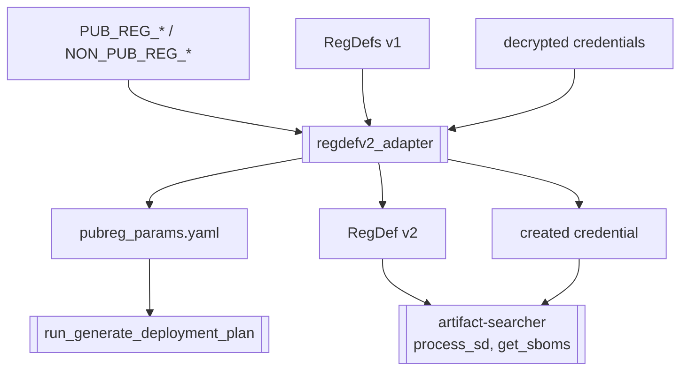

# `regdefv2_adapter`

- [`regdefv2_adapter`](#regdefv2_adapter)
  - [Description](#description)
  - [Overview](#overview)
  - [Input parameters](#input-parameters)
  - [Processing flow](#processing-flow)
  - [Parameter mapping](#parameter-mapping)
  - [Parameter file](#parameter-file)
  - [Result](#result)
  - [Error handling](#error-handling)
  - [Related documentation](#related-documentation)

## Description

The `regdefv2_adapter` step gives EnvGene's artifact downloaders registry authentication for public cloud
and non-public registries. The **registry auth parameters** are the flat `PUB_REG_*`, `NON_PUB_REG_*`,
`MAVEN_PROVIDER`, and `HELM_REPO_BASE_URL` values the DevOps toolset already uses for registry access.
Requiring operators to also author a RegDef v2 `authConfig` for EnvGene would make them enter the same auth
twice, so this step synthesizes that auth from those parameters instead. Its outputs are transient and are
not committed. It is a transitional step, removed once operators author RegDef v2 directly and the registry
auth parameters are retired.

EnvGene has two artifact download paths with different auth models, so the step feeds each in the form its
library consumes:

- The artifact-searcher path (Solution Descriptor in `process_sd`, application in `get_sboms`) already
  consumes a RegDef v2 `authConfig`.
- The dpg path (`generate_deployment_plan`) reads registry auth parameters.

The decision behind this step is recorded in
[ADR-0001](/docs/adr/0001-adapt-registry-auth-from-e2e-parameters.md). The step is defined in the Instance
pipeline flow as [`1.11 regdefv2_adapter`](/docs/technical-design/instance-pipeline/flow.md).

## Overview



## Input parameters

| Parameter                | Source                | Required    | Default | Values / format                       | Effect                                                                              |
| -------------------------| --------------------- | ----------- | ------- | ------------------------------------- | ----------------------------------------------------------------------------------- |
| registry auth parameters | Cloud `e2eParameters` | Conditional | None    | see [Parameter file](#parameter-file) | Provider-specific auth values the step resolves and maps                            |
| `credentials.yml`        | Instance repo         | Yes         | None    | decrypted at pipeline start           | Source of the registry secret, and where the step writes the created credential     |
| `LOCAL_PUBREG_FILE`      | Environment           | Yes         | None    | file path                             | Destination path for the dpg parameter file (see [Parameter file](#parameter-file)) |

## Processing flow

1. **Decide whether to run**

   - `PIPELINE_TYPE: GITLAB_DEPLOY` and
     (`OPERATION_TYPE: DEPLOY` or (`OPERATION_TYPE: BGD` and `BGD_OPERATION: warmup`)), or
   - `PIPELINE_TYPE: LEGACY` and `OPERATION_TYPE: DEPLOY` and
     (`SD_VERSION` or `SD_DATA` or `GENERATE_EFFECTIVE_SET: true`)

2. **Resolve the registry auth parameters**

   The step renders the Cloud object, processes the Cloud paramsets into parameters, reads the whole
   `e2eParameters` section, and expands credential macros to resolve the secret values against the
   credentials decrypted at pipeline start. This render is not consumed by later pipeline steps
   and is not written to the repository.

3. **Write the parameter file for dpg**

   The step writes all the resolved registry auth parameters to the path in `LOCAL_PUBREG_FILE` environment
   variable. The file is a flat YAML map, one key per parameter with a string value
   (see [Parameter file](#parameter-file)). The file is transient and kept out of the commit.

4. **Synthesize RegDef v2 for artifact-searcher**

   When `MAVEN_PROVIDER` is a public cloud provider (`aws`, `azure`, `gcp`), the step synthesizes a RegDef v2
   for each Maven registry that is not already at `version: "2.0"`. It builds the v2 from the existing v1
   RegDef, copying the v1 `mavenConfig` coordinates unchanged and replacing only the auth: it maps the
   parameters to an `authConfig` (see [Parameter mapping](#parameter-mapping)) and sets `version: "2.0"`. The
   Maven coordinates are not present in the registry auth parameters, so they come only from the committed v1
   RegDef. The `authConfig` references a credential by `credentialsId`, so the step also creates that
   credential from the resolved key and secret. The RegDef v2
   and the credential are written to transient locations that the artifact downloaders read for the run, not
   into the committed instance repository. When `MAVEN_PROVIDER` is `nexus` or `artifactory`, the registry
   keeps its RegDef v1, which already carries its basic auth, so the step synthesizes no v2.

   The auth is global. EnvGene downloads only Maven artifacts and `MAVEN_PROVIDER` is a single value, so one
   auth applies to every Maven registry the solution uses, while coordinates come from each RegDef. This
   assumes a single Maven registry type per instance.

## Parameter mapping

For a public cloud registry the step maps the `PUB_REG_*` parameters onto a RegDef v2 `authConfig`.

| registry auth parameter         | `authConfig` field     |
| ------------------------------- | ---------------------- |
| `PUB_REG_PROVIDER`              | `provider`             |
| `PUB_REG_METHOD`                | `authMethod`           |
| `PUB_REG_KEY`, `PUB_REG_SECRET` | `<credentialsId>`      |
| `PUB_REG_REGION`                | `awsRegion`            |
| `PUB_REG_DOMAIN`                | `awsDomain`            |
| `PUB_REG_ROLE_ARN`              | `awsRoleARN`           |
| `PUB_REG_ROLE_SESSION_PREFIX`   | `awsRoleSessionPrefix` |
| `PUB_REG_OIDC_URL`              | `gcpOIDC.URL`          |
| `PUB_REG_PROJECT`               | `gcpRegProject`        |
| `PUB_REG_POOL_ID`               | `gcpRegPoolId`         |
| `PUB_REG_PROVIDER_ID`           | `gcpRegProviderId`     |
| `PUB_REG_SA_EMAIL`              | `gcpRegSAEmail`        |
| `PUB_REG_TENANT_ID`             | `azureTenantId`        |
| `PUB_REG_ACR_RESOURCE`          | `azureACRResource`     |
| `PUB_REG_ACR_NAME`              | `azureACRName`         |

Two fields are not a direct copy:

- `authType` is derived from `PUB_REG_METHOD`. Method `secret` maps to `longLived`. The other methods map to
  `shortLived`.
- `credentialsId` is a reference, while the registry auth key and secret arrive as values. For the
  artifact-searcher path the step creates a credential, holding the key as the username and the secret as the
  password, and sets `credentialsId` to it. This credential is transient and is not written into the
  committed credential store.

## Parameter file

`pubreg_params.yaml` is a flat YAML map, one key per parameter with a string value:

```yaml
MAVEN_PROVIDER: aws
PUB_REG_METHOD: assume_role
PUB_REG_KEY: <access-key>
PUB_REG_SECRET: <secret-key>
PUB_REG_REGION: eu-west-1
PUB_REG_DOMAIN: codeartifact-domain
PUB_REG_ROLE_ARN: arn:aws:iam::123456789012:role/YourRole
```

The complete parameter list:

| Parameter                     | Scope      | Purpose                                                                           |
| ----------------------------- | ---------- | --------------------------------------------------------------------------------- |
| `MAVEN_PROVIDER`              | common     | Registry type: nexus, artifactory, aws, azure, gcp                                |
| `PUB_REG_PROVIDER`            | common     | Public cloud provider                                                             |
| `PUB_REG_METHOD`              | common     | Auth method: secret, assume_role, federation, service_account, oauth2, basic_auth |
| `PUB_REG_KEY`                 | common     | Access key or client id                                                           |
| `PUB_REG_SECRET`              | common     | Secret key, client secret, or service account JSON                                |
| `PUB_REG_REGION`              | aws        | Region                                                                            |
| `PUB_REG_DOMAIN`              | aws        | CodeArtifact domain                                                               |
| `PUB_REG_REPOSITORY`          | aws        | Repository                                                                        |
| `PUB_REG_ROLE_ARN`            | aws        | Role ARN, assume_role only                                                        |
| `PUB_REG_ROLE_SESSION_PREFIX` | aws        | Session name prefix, assume_role only                                             |
| `PUB_REG_PROJECT`             | gcp        | Project number                                                                    |
| `PUB_REG_PROVIDER_ID`         | gcp        | Workload identity provider id, federation only                                    |
| `PUB_REG_POOL_ID`             | gcp        | Workload identity pool id, federation only                                        |
| `PUB_REG_SA_EMAIL`            | gcp        | Service account email                                                             |
| `PUB_REG_OIDC_URL`            | gcp        | External OIDC server url, federation only                                         |
| `PUB_REG_OIDC_METHOD`         | gcp        | External OIDC auth method, federation only                                        |
| `PUB_REG_OIDC_CUSTOM_PARAM`   | gcp        | Extra OIDC request params, federation only                                        |
| `PUB_REG_OIDC_PROVIDER`       | gcp        | OIDC provider, dpg reader only                                                    |
| `PUB_REG_OIDC_CLIENT_ID`      | gcp        | OIDC client id, dpg reader only                                                   |
| `PUB_REG_OIDC_CLIENT_SECRET`  | gcp        | OIDC client secret, dpg reader only                                               |
| `PUB_REG_TENANT_ID`           | azure      | AD tenant id                                                                      |
| `PUB_REG_ACR_RESOURCE`        | azure      | ACR target resource                                                               |
| `PUB_REG_ACR_NAME`            | azure      | ACR name                                                                          |
| `PUB_REG_AA_RESOURCE`         | azure      | Azure Artifacts resource                                                          |
| `NON_PUB_REG_METHOD`          | non-public | none or basic_auth                                                                |
| `NON_PUB_REG_KEY`             | non-public | User, basic_auth only                                                             |
| `NON_PUB_REG_SECRET`          | non-public | Password, basic_auth only                                                         |
| `HELM_REPO_BASE_URL`          | helm       | Helm repo base url                                                                |

## Result

1. The dpg path authenticates to public cloud and non-public registries using the resolved registry auth
   parameters.

2. The artifact-searcher path authenticates to public cloud registries using the synthesized RegDef v2, and
   to non-public registries using the existing RegDef v1.

3. The adapter's three outputs (the parameter file, the RegDef v2, and the credential) are transient and live
   outside the committed instance repository. dpg reads the parameter file and the artifact downloaders read
   the RegDef v2 and the credential, all from those transient locations for the run. Nothing the adapter
   produces is committed, so the committed RegDefs stay at v1 for consumers that do not read v2, and the
   committed
   credential store is untouched.

4. The env template download (`process_env_template`) is unaffected. It authenticates through its Artifact
   Definition. `generate_argocd_repo` performs no download and reads the local deployment descriptor cache.

## Error handling

1. The step fails when an auth method is present but a parameter that the selected provider and
   method require is missing. The error names the missing parameter.

2. The step fails when a resolved registry auth parameter references a credential that is not present in the
   decrypted credentials. The error names the credential reference.

## Related documentation

- [ADR-0001](/docs/adr/0001-adapt-registry-auth-from-e2e-parameters.md)
- [`process_deployment_plan`](/docs/technical-design/instance-pipeline/steps/process-deployment-plan.md)
