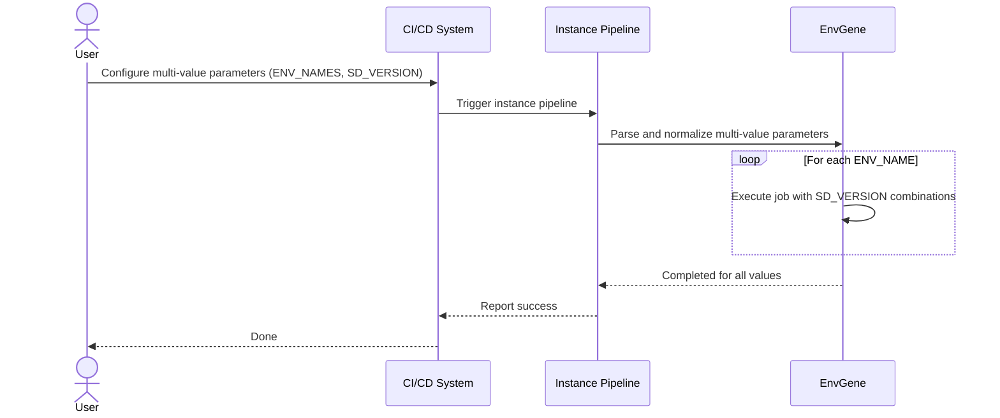

# Instance Pipeline Use Cases

## Multiple Values Support for Instance Pipeline Parameters

### Description

This use case demonstrates how instance pipeline parameters can accept **multiple values** using various delimiters.
It unifies behavior across parameters such as `ENV_NAMES` and `SD_VERSION`, making automation pipelines more flexible and readable.

The supported separators for multiple values are:

| Separator | Example |
|------------|----------|
| `\n` (newline) | `value1\nvalue2` |
| `;` (semicolon) | `value1;value2` |
| `,` (comma) | `value1,value2` |
| (space) | `value1 value2` |

> [!Note]
> The pipeline automatically normalizes values using these separators — there is no functional difference between them.

---

### Pre-requisites

1. Instance pipeline parameters that support multiple values:
   - `ENV_NAMES`
   - `SD_VERSION`
   - `SD_DATA`
2. The instance pipeline must have multi-value support enabled (as per the current contract update).

---

### Steps

#### **Example 1 — Multiple Environments**

1. User sets multiple environments for deployment:

   ```yaml
   ENV_NAMES: |
     k8s-01/dev
     k8s-01/staging
     k8s-01/prod

   ```

2. Pipeline interprets all listed environments and executes jobs sequentially for each.
   **Equivalent single-line inputs:**

   ```yaml

    # Using newline (\n) explicitly
    ENV_NAMES: "k8s-01/dev\nk8s-01/staging\nk8s-01/prod"

    # Using semicolon
    ENV_NAMES: "k8s-01/dev; k8s-01/staging; k8s-01/prod"

    # Using comma
    ENV_NAMES: "k8s-01/dev, k8s-01/staging, k8s-01/prod"

    # Using space
    ENV_NAMES: "k8s-01/dev k8s-01/staging k8s-01/prod"

   ```

#### **Example 2 — Multiple SD Versions**

1. User specifies multiple SD versions to merge:

   ```yaml

   SD_VERSION: |
     MONITORING:0.64.2
     DATABASE:1.1.5
     LOGGING:2.0.0

    ```

2. EnvGene merges the listed SD versions using the configured merge mode (SD_REPO_MERGE_MODE).

   **Equivalent single-line inputs:**

    ```yaml
    # Using newline (\n) explicitly
    SD_VERSION: "MONITORING:0.64.2\nDATABASE:1.1.5\nLOGGING:2.0.0"

    # Using semicolon
    SD_VERSION: "MONITORING:0.64.2; DATABASE:1.1.5; LOGGING:2.0.0"

    # Using comma
    SD_VERSION: "MONITORING:0.64.2, DATABASE:1.1.5, LOGGING:2.0.0"

    # Using space
    SD_VERSION: "MONITORING:0.64.2 DATABASE:1.1.5 LOGGING:2.0.0"

    ```

#### **Example 3 — Combined Multi-Parameter Usage**

1. User defines environments and SDs together:

   ```yaml
   ENV_NAMES: "ocp-01/dev ocp-01/test"
   SD_VERSION: "APP_A:1.0.0, APP_B:1.2.0"
   ```

2. Pipeline runs sequentially for each environment, applying the specified SD versions per run.

### Results

1. Instance pipeline correctly interprets and expands all parameters that support multiple values.
2. Behavior is consistent across YAML configuration and CI/CD pipeline triggers.
3. Use cases become reusable and standardized across environments.

### Diagram


