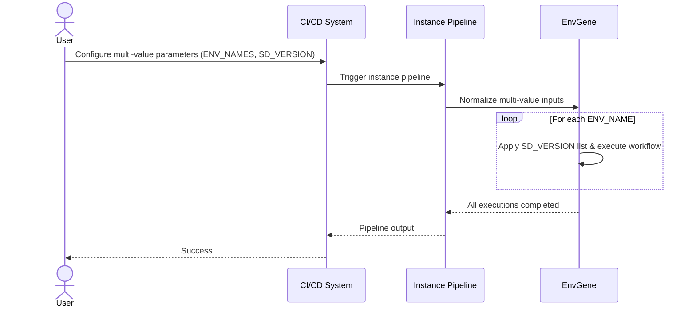

# Instance Pipeline Use Cases

- [Instance Pipeline Use Cases](#instance-pipeline-use-cases)
  - [Multi-Value Support for Instance Pipeline Parameters](#multi-value-support-for-instance-pipeline-parameters)
  - [Overview](#overview)
    - [Supported Separators](#supported-separators)
  - [Pre-requisites](#pre-requisites)
  - [Operations \& Use Cases](#operations--use-cases)
    - [1. Multiple Environments (ENV\_NAMES)](#1-multiple-environments-env_names)
      - [Trigger pipeline with multiple environments](#trigger-pipeline-with-multiple-environments)
      - [Steps for multiple Environments](#steps-for-multiple-environments)
      - [Results for multiple Environments](#results-for-multiple-environments)
    - [2. Multiple SD Versions (SD\_VERSION)](#2-multiple-sd-versions-sd_version)
      - [Trigger pipeline with multiple SD Versions](#trigger-pipeline-with-multiple-sd-versions)
      - [Steps for multiple SD Versions](#steps-for-multiple-sd-versions)
      - [Results for multiple SD Versions](#results-for-multiple-sd-versions)
    - [3. Combined Multi-Parameter Usage](#3-combined-multi-parameter-usage)
      - [Trigger pipeline with multiple Environments and SD Versions](#trigger-pipeline-with-multiple-environments-and-sd-versions)
      - [Steps](#steps)
      - [Results](#results)
  - [Final Results Summary](#final-results-summary)
  - [Diagram](#diagram)

## Multi-Value Support for Instance Pipeline Parameters

This section describes how instance pipeline parameters can accept **multiple values**, such as [ENV_NAMES](/docs/instance-pipeline-parameters.md#env_names) and [SD_VERSION](/docs/instance-pipeline-parameters.md#sd_version).
The behavior is consistent across pipelines, with GitLab and GitHub pipelines included in each use case.

## Overview

Instance pipeline parameters that support multi-value input can accept values separated by **newline**, **semicolon**, **comma**, or **space**.
The pipeline automatically normalizes these values, so all separators are treated equivalently.

### Supported Separators

| Separator      | Example          |
|----------------|-----------------|
| Newline (\n)   | value1\nvalue2  |
| Semicolon ( ; )  | value1;value2   |
| Comma (,)      | value1,value2   |
| Space ( )      | value1 value2   |

> [!Note]
> The pipeline automatically normalizes values using these separators — there is no functional difference between them.

## Pre-requisites

1. Instance pipeline parameters that support multiple values:

   - [ENV_NAMES](/docs/instance-pipeline-parameters.md#env_names)
   - [SD_VERSION](/docs/instance-pipeline-parameters.md#sd_version)
2. Instance pipeline must have multi-value support enabled (per contract update).

## Operations & Use Cases

### 1. Multiple Environments ([ENV_NAMES](/docs/instance-pipeline-parameters.md#env_names))

- [ENV_NAMES](/docs/instance-pipeline-parameters.md#env_names) defined with one or more values:

```yaml
ENV_NAMES: |
  k8s-01/dev
  k8s-01/staging
  k8s-01/prod
```

#### Trigger pipeline with multiple environments

- **GitLab:**

```yaml
# Using newline (\n)
ENV_NAMES: "k8s-01/dev\nk8s-01/staging\nk8s-01/prod"
```

- **GitHub:**

```yaml

# Using comma
ENV_NAMES: "k8s-01/dev, k8s-01/staging, k8s-01/prod"
GH_ADDITIONAL_PARAMS: {}
```

#### Steps for multiple Environments

1. Pipeline normalizes multi-value [ENV_NAMES](/docs/instance-pipeline-parameters.md#env_names) into a list.
2. Executes jobs sequentially per environment.

#### Results for multiple Environments

1. Each environment triggers an isolated pipeline execution.
2. Behavior is consistent across delimiters.

### 2. Multiple SD Versions ([SD_VERSION](/docs/instance-pipeline-parameters.md#sd_version))

- [SD_VERSION](/docs/instance-pipeline-parameters.md#sd_version) defined with one or more values.
- [SD_REPO_MERGE_MODE](/docs/instance-pipeline-parameters.md#sd_repo_merge_mode) specified.
- [SD_SOURCE_TYPE](/docs/instance-pipeline-parameters.md#sd_source_type): set to `artifact`

```yaml
SD_VERSION: |
  MONITORING:0.64.2
  DATABASE:1.1.5
  LOGGING:2.0.0
```

#### Trigger pipeline with multiple SD Versions

- **GitLab:**

```yaml

ENV_NAMES : "ocp-01/dev"
# Using semicolon
SD_VERSION: "MONITORING:0.64.2; DATABASE:1.1.5; LOGGING:2.0.0"
SD_REPO_MERGE_MODE: "basic-merge"
SD_SOURCE_TYPE: "artifact"
```

- **GitHub:**

```yaml
ENV_NAMES : "ocp-01/dev"
GH_ADDITIONAL_PARAMS: {
  "SD_VERSION": "MONITORING:0.64.2,DATABASE:1.1.5,LOGGING:2.0.0",
  "SD_REPO_MERGE_MODE": "basic-merge",
  "SD_SOURCE_TYPE": "artifact"
}
```

#### Steps for multiple SD Versions

1. Pipeline parses multiple SD version entries.
2. EnvGene merges the listed SD versions using the configured merge mode ([SD_REPO_MERGE_MODE](/docs/instance-pipeline-parameters.md#sd_repo_merge_mode)).
3. Merge applies per environment if multiple environments exist.

#### Results for multiple SD Versions

1. All SD versions are merged correctly.
2. Merge strategy is consistent.

### 3. Combined Multi-Parameter Usage

- Multiple environments and SD versions defined.

#### Trigger pipeline with multiple Environments and SD Versions

- **GitLab:**

```bash
ENV_NAMES="ocp-01/dev,ocp-01/test"
SD_VERSION="APP_A:1.0.0,APP_B:1.2.0"
SD_REPO_MERGE_MODE="basic-merge"
SD_SOURCE_TYPE: "artifact"
```

- **GitHub:**

```yaml
ENV_NAMES: "ocp-01/dev ocp-01/test"
GH_ADDITIONAL_PARAMS: {
  "SD_VERSION": "APP_A:1.0.0,APP_B:1.2.0",
  "SD_REPO_MERGE_MODE": "basic-merge",
  "SD_SOURCE_TYPE": "artifact"
}
```

> [!Note]
> Similar separators (`\n`, `;`, `,`, space) can be used here for [ENV_NAMES](/docs/instance-pipeline-parameters.md#env_names) and [SD_VERSION](/docs/instance-pipeline-parameters.md#sd_version) as demonstrated in the previous examples.

#### Steps

1. Normalize [ENV_NAMES](/docs/instance-pipeline-parameters.md#env_names) → list of environments.
2. Normalize [SD_VERSION](/docs/instance-pipeline-parameters.md#sd_version) → list of SD versions.
3. Execute pipeline sequentially per environment, applying all SD versions.

#### Results

1. Each environment processed in order.
2. SD versions applied consistently per run.

## Final Results Summary

1. Instance pipeline correctly interprets multi-value parameters.
2. Supported delimiters are equivalent in effect.
3. Pipelines are reusable, flexible, and automation-friendly.

## Diagram


