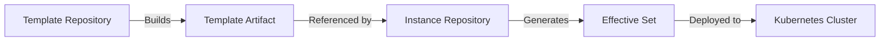
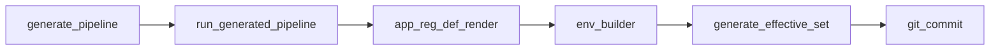
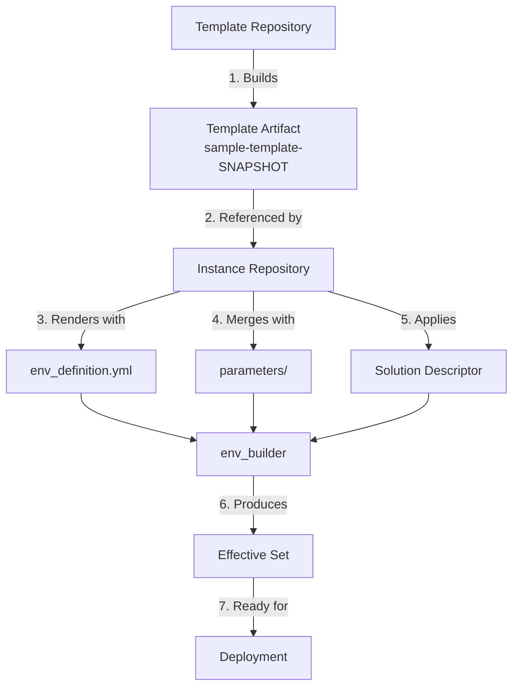

# Getting Started with EnvGene: Your First Environment

This guide walks you through creating your first environment using EnvGene from scratch. By the end, you'll understand the core concepts and have a working environment deployed using the sample configurations in this directory.

- [Getting Started with EnvGene: Your First Environment](#getting-started-with-envgene-your-first-environment)
  - [What You'll Learn](#what-youll-learn)
  - [What You'll Build](#what-youll-build)
  - [Prerequisites](#prerequisites)
  - [Understanding the Basics](#understanding-the-basics)
    - [What is a Template?](#what-is-a-template)
    - [What is an Instance?](#what-is-an-instance)
    - [How They Work Together](#how-they-work-together)
  - [Part 1: Creating Your First Template](#part-1-creating-your-first-template)
    - [Step 1: Set Up Template Repository](#step-1-set-up-template-repository)
    - [Step 2: Explore the Sample Template](#step-2-explore-the-sample-template)
    - [Step 3: Understand Template Structure](#step-3-understand-template-structure)
    - [Step 4: Build Your First Template Artifact](#step-4-build-your-first-template-artifact)
    - [What Just Happened?](#what-just-happened)
  - [Part 2: Creating Your First Environment Instance](#part-2-creating-your-first-environment-instance)
    - [Step 5: Set Up Instance Repository](#step-5-set-up-instance-repository)
    - [Step 6: Configure Platform Environment](#step-6-configure-platform-environment)
    - [Step 7: Configure Shared Credentials](#step-7-configure-shared-credentials)
    - [Step 8: Run Your First Pipeline](#step-8-run-your-first-pipeline)
    - [Step 9: Verify the Results](#step-9-verify-the-results)
  - [Part 3: Adding a Business Environment](#part-3-adding-a-business-environment)
    - [Step 10: Configure Environment Inventory](#step-10-configure-environment-inventory)
    - [Step 11: Add Environment-Specific Parameters](#step-11-add-environment-specific-parameters)
    - [Step 12: Run Pipeline to Generate Effective Set](#step-12-run-pipeline-to-generate-effective-set)
  - [Understanding What You Built](#understanding-what-you-built)
    - [The Flow](#the-flow)
    - [Generated Structure](#generated-structure)
  - [Reference Documentation](#reference-documentation)

## What You'll Learn

- The relationship between Templates and Instances
- How to create and publish a template artifact
- How to configure an environment
- How the pipeline processes your configuration

## What You'll Build

You'll create two environments in a single cluster:

1. **platform-env** - Infrastructure services (databases, messaging)
2. **solution-env** - Business applications (BSS, OSS components)

## Prerequisites

- Access to GitLab with CI/CD enabled
- Basic understanding of YAML syntax
- Git command-line knowledge
- Access to artifact registry

> **Time estimate:** 45-60 minutes

---

## Understanding the Basics

Before we start building, let's understand the key concepts.

### What is a Template?

A **Template** is a reusable blueprint that defines:

- Solution structure - what namespaces exist (e.g., `platform`, `bss`, `oss`)
- Default configuration parameters

Think of it as a cookie cutter - it defines the shape, but doesn't create the actual cookie yet.

### What is an Instance?

An **Instance** is a specific environment created from a template:

- Uses a template as its base
- Adds environment-specific values
- Overrides default parameters
- Produces deployable configuration

This is the actual cookie - made from the cookie cutter, but with your specific ingredients.

### How They Work Together



1. Template repository builds a versioned artifact
2. Instance repository references that artifact
3. Pipeline merges template + overrides = effective set
4. Effective set is used to deploy to cluster

---

## Part 1: Creating Your First Template

### Step 1: Set Up Template Repository

Clone your template repository:

```bash
git clone <your-template-repo-url>
cd <template-repo>
```

### Step 2: Explore the Sample Template

Navigate to the example folder:

```bash
cd example/templates/
ls -la
```

You should see:

```plaintext
TBD
```

### Step 3: Understand Template Structure

Let's look at a key file - `env_templates/platform.yml`:

```yaml
TBD
```

**Why this matters:**

TBD

Now look at `env_templates/Namespaces/platform/consul.yml.j2`:

```yaml
TBD
```

**What's happening:**

- `.j2` extension means it's a Jinja2 template
- It will be rendered with variables you provide

### Step 4: Build Your First Template Artifact

Copy the sample template to your templates directory:

```bash
cp -r example/templates/* templates/
git add templates/
git commit -m "feat: Add sample template"
git push
```

**Watch the pipeline:**

1. Go to your GitLab project → CI/CD → Pipelines
2. You should see a pipeline running with these jobs:
   - `dp_build` - Building and validating templates
   - `report_artifacts` - Recording what was built
   - `semantic_release` - Publishing the artifact TBD

Wait for the pipeline to complete (usually 2-5 minutes).

### What Just Happened?

Your pipeline created a template artifact with a version like:

```plaintext
TBD
```

This artifact now contains all your template files in a packaged format, ready to be used by instances.

---

## Part 2: Creating Your First Environment Instance

### Step 5: Set Up Instance Repository

Clone your instance repository:

```bash
git clone <your-instance-repo-url>
cd <instance-repo>
```

Copy the sample environment:

```bash
cp -r example/environments/cluster-01 environments/
```

### Step 6: Configure Platform Environment

Open `environments/cluster-01/platform-env/Inventory/env_definition.yml`:

```yaml
TBD
```

**What each field means:**

TBD

**Important:** The `envTemplate.artifact` value must match what your template pipeline produced.

### Step 7: Configure Shared Credentials

Open `environments/cluster-01/credentials/share-creds.yml`:

```yaml
TBD
```

**Why this matters:**

- Credentials are shared across environments in the same cluster
- In real scenarios, these would be encrypted
- For learning, we're using plain text

### Step 8: Run Your First Pipeline

Commit and push your changes:

```bash
git add environments/
git commit -m "Add platform environment configuration"
git push
```

Trigger the instance pipeline manually:

1. Go to GitLab → CI/CD → Pipelines → Run Pipeline
2. Set these variables:

    ```yaml
    ENV_NAMES: cluster-01/platform-env
    ENV_BUILDER: true
    GENERATE_EFFECTIVE_SET: true
    SD... TBD
    ```

3. Click "Run Pipeline"

**What's happening:**



- `generate_pipeline` - Creates a temporary pipeline config
- `app_reg_def_render` - Resolves application definitions
- `env_builder` - Merges template + your overrides
- `generate_effective_set` - Produces final configuration
- `git_commit` - Commits results back to repo

### Step 9: Verify the Results

After the pipeline completes, pull the changes:

```bash
git pull
```

Look at the generated structure:

```bash
ls -la environments/cluster-01/platform-env/
```

You should see:

```plaintext
TBD
```

---

## Part 3: Adding a Business Environment

Now let's add business applications on top of the platform.

### Step 10: Configure Environment Inventory

Open `environments/cluster-01/solution-env/Inventory/env_definition.yml`:

```yaml
TBD
```

**What's different:**

- `envTemplate.name: "solution"` - Uses the other template
- `envSpecificParamsets` - Overrides parameters per namespace
- `cloudPassport` - Cloud-specific configuration

### Step 11: Add Environment-Specific Parameters

Open `environments/cluster-01/solution-env/Inventory/parameters/cloud-env-specific.yml`:

```yaml
TBD
```

**Why this is powerful:**

- Template defines defaults
- You override only what's different
- Same template, different values per environment

### Step 12: Run Pipeline to Generate Effective Set

Trigger the pipeline with a solution descriptor:

```yaml
TBD
```

**What's the Solution Descriptor?**

- Lists specific application versions to deploy
- `deployPostfix` maps to namespace (bss, oss, core)

---

## Understanding What You Built

### The Flow



### Generated Structure

You now has:

```plaintext
TBD
```

---

**Congratulations!** You've successfully created your first EnvGene environment from scratch. You now understand the core workflow and are ready to build more complex environments.

## Reference Documentation

For detailed documentation on EnvGene objects and configuration:

- [EnvGene Objects Reference](https://github.com/Netcracker/qubership-envgene/blob/main/docs/envgene-objects.md)
- [Environment Configuration](https://github.com/Netcracker/qubership-envgene/blob/main/docs/envgene-configs.md)
- [Pipeline Parameters](https://github.com/Netcracker/qubership-envgene/blob/main/docs/instance-pipeline-parameters.md)
- [How-to Guides](https://github.com/Netcracker/qubership-envgene/tree/main/docs/how-to)
- [All Documentation](https://github.com/Netcracker/qubership-envgene/tree/main/docs)
- [EnvGene Main README](https://github.com/Netcracker/qubership-envgene/blob/main/README.md)
