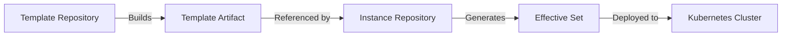
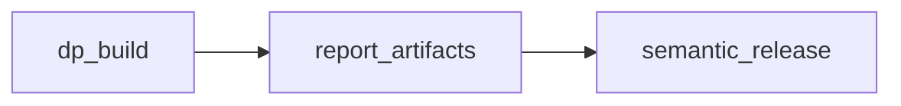
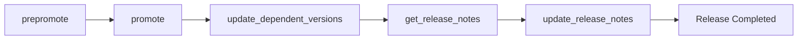
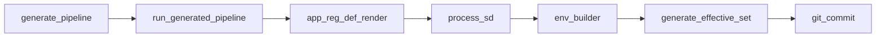
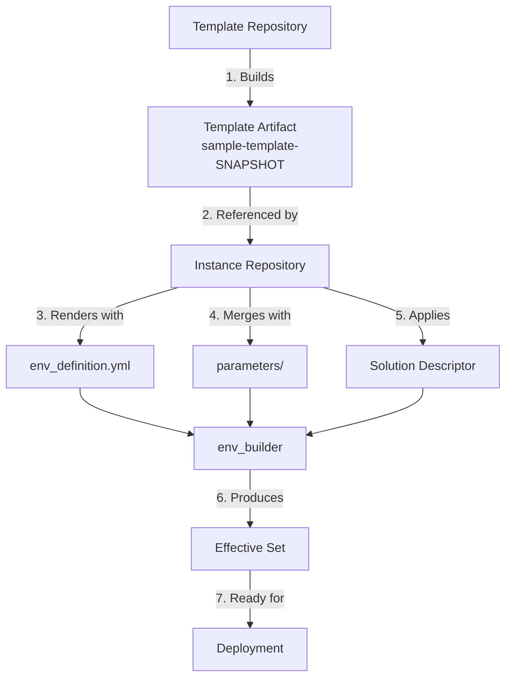

# Getting Started with EnvGene: Your First Environment

- [Getting Started with EnvGene: Your First Environment](#getting-started-with-envgene-your-first-environment)
  - [What You'll Learn](#what-youll-learn)
  - [Prerequisites](#prerequisites)
  - [Scenario](#scenario)
    - [What is a Template?](#what-is-a-template)
    - [What is an Instance?](#what-is-an-instance)
    - [How They Work Together](#how-they-work-together)
  - [Part 1: Creating Your First Template](#part-1-creating-your-first-template)
    - [Step 1: Explore the Sample Template](#step-1-explore-the-sample-template)
    - [Step 2: Understand Template Structure](#step-2-understand-template-structure)
    - [Step 3: Build Your First Template Artifact](#step-3-build-your-first-template-artifact)
    - [Understanding the Template Artifact](#understanding-the-template-artifact)
  - [Part 2: Creating Your First Environment Instance](#part-2-creating-your-first-environment-instance)
    - [Step 4: Set Up Configuration Folder](#step-4-set-up-configuration-folder)
    - [Step 5: Set Up environments Folder](#step-5-set-up-environments-folder)
    - [Step 6: Review Platform Environment Configuration](#step-6-review-platform-environment-configuration)
    - [Step 7: Review Shared Credentials](#step-7-review-shared-credentials)
    - [Step 8: Build the Platform Environment](#step-8-build-the-platform-environment)
    - [Step 9: Verify the Results](#step-9-verify-the-results)
  - [Part 3: Building a Business Environment](#part-3-building-a-business-environment)
    - [Step 10: Review Solution Environment Configuration](#step-10-review-solution-environment-configuration)
    - [Step 11: Review Environment-Specific Parameters](#step-11-review-environment-specific-parameters)
    - [Step 12: Build the Solution Environment](#step-12-build-the-solution-environment)
  - [The Complete Flow](#the-complete-flow)
    - [The Flow](#the-flow)
  - [Summary](#summary)
  - [Reference Documentation](#reference-documentation)

> [!NOTE]
> **You are in an Instance Repository.** This guide covers both template creation (Part 1, done in a Template Repository) and instance configuration (Parts 2-3, done here).

**Repository Context:** This README can be used in both Template and Instance repositories. The instructions will guide you based on where you are.

- **Part 1** - Creating a Template (done in a Template Repository)
- **Part 2–3** - Creating an Instance (done in an Instance Repository)

By the end, you will have a working environment and understand how the pipeline uses your configuration.

## What You'll Learn

- The relationship between Templates and Instances
- How to create and publish a template artifact
- How to configure an environment
- How the pipeline processes your configuration

## Prerequisites

- Access to GitLab with CI/CD enabled
- Basic understanding of YAML syntax
- Git command-line knowledge

> [!NOTE]
> **Choose your path based on where you are:**
>
> - **In a Template Repository?** Follow Part 1 to create and publish templates (requires write access to registry)
> - **In an Instance Repository?** Skip to Part 2 to configure environments (requires read access to registry)

## Scenario

You are setting up your first EnvGene environment in `cluster-01`. You will create two environments:

- **platform-env** - Infrastructure services (ArangoDB, Consul, OpenSearch)
- **solution-env** - Business applications (BSS, OSS, Core)

By the end, you will have generated the Effective Set and understand how template + instance work together.

### What is a Template?

A **Template** is a reusable blueprint that defines solution structure (what namespaces exist) and default configuration parameters.

### What is an Instance?

An **Instance** is a specific environment created from a template. It adds environment-specific values and overrides default parameters to produce deployable configuration.

### How They Work Together



1. Template repository builds a versioned artifact
2. Instance repository references that artifact
3. Pipeline merges template + overrides = effective set
4. Effective set is used to deploy to cluster

## Part 1: Creating Your First Template

> [!NOTE]
> Part 1 requires access to a Template Repository (a separate repo) with CI/CD enabled. If you already have a published template artifact, skip to Part 2.

Part 1 is done in a **template repository**, not in this instance repo. Do Part 1 only if you need to create and publish a template artifact.

### Step 1: Explore the Sample Template

Navigate to the example folder:

```bash
cd example/templates/
ls -la
```

You should see:

```text
templates/
├── env_templates/
│   ├── Namespaces/
│   │   ├── platform/
│   │   │   ├── arangodb.yml.j2
│   │   │   ├── consul.yml.j2
│   │   │   └── opensearch.yml.j2
│   │   ├── solution/
│   │   │   ├── bss.yml.j2
│   │   │   ├── oss.yml.j2
│   │   │   └── core.yml.j2
│   │   ├── tenant.yml.j2
│   │   └── cloud.yml.j2
│   │
│   ├── platform.yml
│   └── solution.yml
│
├── appdefs/
├── regdefs/
├── parameters/
└── resource_profile/
```

### Step 2: Understand Template Structure

Let's look at a key file, a Template Descriptor - `env_templates/platform.yml`:

```yaml
tenant: "{{ templates_dir }}/env_templates/Namespaces/tenant.yml.j2"
cloud: "{{ templates_dir }}/env_templates/Namespaces/cloud.yml.j2"
namespaces:
  - template_path: "{{ templates_dir }}/env_templates/Namespaces/platform/arangodb.yml.j2"
  - template_path: "{{ templates_dir }}/env_templates/Namespaces/platform/consul.yml.j2"
  - template_path: "{{ templates_dir }}/env_templates/Namespaces/platform/dbaas.yml.j2"
  - template_path: "{{ templates_dir }}/env_templates/Namespaces/platform/jaeger.yml.j2"
  - template_path: "{{ templates_dir }}/env_templates/Namespaces/platform/kafka.yml.j2"
  - template_path: "{{ templates_dir }}/env_templates/Namespaces/platform/opensearch.yml.j2"
```

This file defines the structure of an environment by linking all required component templates. It determines what gets deployed, ensures consistency across environments, and serves as the blueprint referenced by the Environment Inventory.

Now look at Namespace template `env_templates/Namespaces/platform/consul.yml.j2`:

```yaml
name: "consul"
credentialsId: ""
isServerSideMerge: false
labels: []
cleanInstallApprovalRequired: false
mergeDeployParametersAndE2EParameters: true
deployParameters: {}
e2eParameters: {}
technicalConfigurationParameters: {}
deployParameterSets:
  - "consul"
e2eParameterSets: []
technicalConfigurationParameterSets: []
```

- `.j2` extension means it's a Jinja2 template
- It will be rendered with variables you provide (this example omits Jinja syntax for simplicity)

### Step 3: Build Your First Template Artifact

Copy the sample template to your templates directory:

```bash
cp -r example/templates/* templates/
git add templates/
git commit -m "feat: Add sample template"
git push
```

**Watch the pipeline:**

1. Go to your GitLab project → CI/CD → Pipelines
2. You should see a pipeline running with these jobs:
   - `dp_build` - Building and validating templates
   - `report_artifacts` - Recording what was built
   - `semantic_release` - Publishing the artifact



**Promote / Release Pipeline:**

Once the `semantic_release` job completes successfully, it automatically triggers a new pipeline responsible for promoting the published template artifact to the release stage.



**Jobs:**

- `prepromote` → Validates promotion conditions.
- `promote` → Promotes to release branch.
- `update_dependent_versions` → Updates dependent modules.
- `get_release_notes` → Extracts commit-based release notes.
- `update_release_notes` → Publishes release documentation.

Wait for the pipeline to complete (usually 2-5 minutes).

### Understanding the Template Artifact

Your pipeline created a template artifact with a version like:

```text
artifact: template-project:feature-template-sample-20260303.022442-18
```

> [!NOTE]
> Your actual version will differ - it's based on your commit timestamp and build number.

This artifact now contains all your template files in a packaged format, ready to be used by instances.

## Part 2: Creating Your First Environment Instance

From here on, all steps are done **in this repository**. Copy the sample configuration and environments from the `example/` folder in this repo.

### Step 4: Set Up Configuration Folder

Copy the configuration folder from `example/`:

```bash
cp -r example/configuration configuration/
```

The folder structure should look like this:

``` text
configuration/
├── artifact_definitions/
│   └── <artifact-definition-name>.yaml
├── credentials/
│   └── credentials.yml
└── config.yml
```

- `<artifact-definition-name>.yaml` - Describes where the Environment Template artifact is stored in the registry. It is used to resolve the `application:version` format into the registry and Maven artifact parameters required to download it.

> [!IMPORTANT]
>
> - All fields inside this file must be replaced with actual project-specific values.

- `credentials.yml` - Stores credential definitions.
- `config.yml` - Defines EnvGene configuration.

### Step 5: Set Up environments Folder

Copy the sample environment:

```bash
cp -r example/environments/cluster-01 environments/
```

### Step 6: Review Platform Environment Configuration

The `env_definition.yml` defines which template to use, which artifact version, and what parameters to override. Review its structure:

Open `environments/cluster-01/platform-env/Inventory/env_definition.yml`:

```yaml
inventory: {}
envTemplate:
  name: "platform"
  artifact: "template-project:feature-template-sample-20260303.022442-18"
  additionalTemplateVariables:
    use_env_prefix: true
  sharedTemplateVariables: []
  envSpecificParamsets: {}
  envSpecificE2EParamsets: {}
  envSpecificTechnicalParamsets: {}
  envSpecificResourceProfiles: {}
  sharedMasterCredentialFiles:
    - "share-creds"
```

Comments from the real file are not shown here for simplicity.

**What each field means:**

- `inventory`: Defines environment metadata and configuration (tenant, cloud, credentials, etc.). Acts as the recipe for creating the environment.
- `envTemplate.name`: Name of the Environment Template to use. Must match the Template Descriptor name inside the referenced artifact.
- `envTemplate.artifact`: Template artifact in application:version format used to render the environment.
- `additionalTemplateVariables`: Extra variables passed to templates during rendering.
- `sharedTemplateVariables`: Common variable files merged into template variables.
- `envSpecificParamsets`: Environment-specific deployment parameter overrides.
- `envSpecificE2EParamsets`: Environment-specific CI/CD or pipeline parameters.
- `envSpecificTechnicalParamsets`: Runtime/technical parameter overrides.
- `envSpecificResourceProfiles`: Resource (CPU/memory) overrides for this environment.

> [!IMPORTANT]
> The `envTemplate.artifact` value must match what your template pipeline produced.

### Step 7: Review Shared Credentials

Shared credentials are referenced in `env_definition.yml` (via `sharedMasterCredentialFiles`) and used across all environments in this cluster. Let's look at the format:

Open `environments/cluster-01/credentials/share-creds.yml`:

```yaml
registry-cred:
  type: "usernamePassword"
  data:
    username: "user-placeholder-123"
    password: "pass-placeholder-123"
sso-idp-admin-login:
  type: "secret"
  data:
    secret: "token-placeholder-123"
streaming:
  type: "usernamePassword"
  data:
    username: "user-placeholder-123"
    password: "pass-placeholder-123"
postgres-dba-cred:
  type: "usernamePassword"
  data:
    username: "user-placeholder-123"
    password: "pass-placeholder-123"
kafka-monitoring-creds:
  type: "usernamePassword"
  data:
    username: "user-placeholder-123"
    password: "pass-placeholder-123"
```

**Why this matters:**

- Credentials are shared across environments in the same cluster
- In production scenarios, these would be encrypted
- For learning, we're using plain text

### Step 8: Build the Platform Environment

Commit and push your changes:

```bash
git add environments/
git commit -m "Add platform environment configuration"
git push
```

Trigger the instance pipeline manually:

1. Go to GitLab → CI/CD → Pipelines → Run Pipeline
2. To generate the Effective Set for the platform environment, EnvGene needs to know which applications (and versions) are deployed. You provide this via the Solution Descriptor (SD). For platform-env, we pass SD inline via pipeline variables (`SD_SOURCE_TYPE: json` and `SD_DATA`). Later (Step 12) you'll do the same for solution-env with BSS/OSS apps.

   Set these variables:

    ```yaml
    ENV_NAMES: cluster-01/platform-env
    ENV_BUILDER: true
    GENERATE_EFFECTIVE_SET: true
    SD_SOURCE_TYPE: json
    SD_DATA: <see below>
    ```

    ```text
    '{"version":2.1,"type":"solutionDeploy","deployMode":"composite","applications":[{"version":"<replace-with-arangodb-app:ver>","deployPostfix":"arangodb"},{"version":"<replace-with-consul-app:ver>","deployPostfix":"consul"},{"version":"<replace-with-opensearch-app:ver>","deployPostfix":"opensearch"}]}'
    ```

    Replace each `<replace-with-...-app:ver>` with your real `application:version` (e.g. `consul:0.11.8`).

    **What's the Solution Descriptor?**

    - Lists specific application versions to deploy
    - `deployPostfix` maps to namespace (bss, oss, core)

3. Click "Run Pipeline"

**What's happening:**



- `generate_pipeline` - Generates EnvGene pipeline config
- `app_reg_def_render` - Downloads EnvGene Environment template, renders application and registry definitions
- `process_sd` - Processes Solution Descriptor (SD) from pipeline variables
- `env_builder` - Generates Environment Instance - renders template and merges environment-specific overrides
- `generate_effective_set` - Generates Effective Set - final output
- `git_commit` - Commits results back to repository

### Step 9: Verify the Results

After the pipeline completes, pull the changes:

```bash
git pull
```

Look at the generated structure:

```bash
ls -la environments/cluster-01/platform-env/
```

You should see:

```text
environments/
└── cluster-01/
    ├── platform-env/
    │   ├── AppDefs/
    │   ├── RegDefs/
    │   ├── Credentials/
    │   │   └── credentials.yml
    │   ├── Inventory/
    │   │   ├── env_definition.yml
    │   │   └── solution-descriptor/
    │   │       └── sd.yml
    │   ├── Namespaces/
    │   ├── Profiles/
    │   ├── effective-set/
    │   │   ├── deployment/
    │   │   ├── topology/
    │   │   ├── pipeline/
    │   │   ├── runtime/
    │   │   └── cleanup/
    │   ├── cloud.yml
    │   └── tenant.yml
    │
    └── credentials/
        └── share-creds.yml
```

The `effective-set/` folder contains five contexts (deployment, topology, pipeline, runtime, cleanup). For example, open `effective-set/deployment/<namespace>/<app>/values/deployment-parameters.yaml` to see the final merged parameters that Helm will use. For details on each context, see [Tutorial: Understanding the Effective Set](https://github.com/Netcracker/qubership-envgene/blob/main/docs/tutorials/effective-set.md).

## Part 3: Building a Business Environment

Now let's add a second environment with business applications.

### Step 10: Review Solution Environment Configuration

The solution-env uses the "solution" template and references parameter sets for BSS and OSS namespaces. Review its `env_definition.yml`:

Open `environments/cluster-01/solution-env/Inventory/env_definition.yml`:

```yaml
inventory: {}
envTemplate:
  name: "solution"
  artifact: "template-project:feature-template-sample-20260303.022442-18"
  additionalTemplateVariables:
    use_env_prefix: true
  sharedTemplateVariables: []
  envSpecificParamsets:
    bss:
      - "env-specific-bss"
    oss:
      - "oss-env-specific"
  envSpecificE2EParamsets: {}
  envSpecificTechnicalParamsets: {}
  envSpecificResourceProfiles: {}
  sharedMasterCredentialFiles: []
```

Like before, comments are omitted for clarity.

**What's different from the previous environment:**

- `envTemplate.name: solution` - Uses the solution template
- `envSpecificParamsets` - Overrides parameters per namespace (e.g. `bss`, `oss`)
- `sharedMasterCredentialFiles: []` - Solution-env in this example does not use shared credentials

### Step 11: Review Environment-Specific Parameters

The solution-env `env_definition.yml` references parameter sets `env-specific-bss` and `oss-env-specific`. The `oss-env-specific.yml` file overrides parameters just for the OSS namespace in this environment.

Open one of these files `environments/cluster-01/solution-env/Inventory/parameters/oss-env-specific.yml`:

```yaml
name: oss-env-specific
parameters:
  LISTENER_NODE_IP: 10.10.10.10
applications: []
```

**Why this is powerful:**

- Template defines defaults
- You override only what's different
- Same template, different values per environment

### Step 12: Build the Solution Environment

Now that you understand how solution-env uses template + overrides, let's generate its Effective Set.

In this step, we build the **solution-env** environment. Set these variables:

```yaml
    ENV_NAMES: cluster-01/solution-env
    ENV_BUILDER: true
    GENERATE_EFFECTIVE_SET: true
    SD_SOURCE_TYPE: json
    SD_DATA: <see below>
```

```text
'{"version":2.1,"type":"solutionDeploy","deployMode":"composite","applications":[{"version":"<replace-with-core-app:ver>","deployPostfix":"core"},{"version":"<replace-with-bss-app:ver>","deployPostfix":"bss"},{"version":"<replace-with-oss-app:ver>","deployPostfix":"oss"}]}'
```

Replace each `<replace-with-...-app:ver>` with your real `application:version` (e.g. `core:release-9.16.0`).

Click "Run Pipeline"

**What You Now Have:**

After running pipelines for both environments (Steps 8 and 12), your repository structure looks like this:

```text
environments/
└── cluster-01/
    ├── platform-env/
    │   ├── AppDefs/
    │   ├── RegDefs/
    │   ├── Credentials/
    │   ├── Inventory/
    │   │   ├── env_definition.yml
    │   │   └── solution-descriptor/
    │   │       └── sd.yml
    │   ├── Namespaces/
    │   ├── Profiles/
    │   ├── effective-set/
    │   │   ├── deployment/
    │   │   ├── topology/
    │   │   ├── pipeline/
    │   │   ├── runtime/
    │   │   └── cleanup/
    │   ├── cloud.yml
    │   └── tenant.yml
    │
    ├── solution-env/
    │   ├── AppDefs/
    │   ├── RegDefs/
    │   ├── Credentials/
    │   ├── Inventory/
    │   │   ├── env_definition.yml
    │   │   ├── parameters/
    │   │   └── solution-descriptor/
    │   │       └── sd.yml
    │   ├── Namespaces/
    │   ├── Profiles/
    │   ├── effective-set/
    │   │   ├── deployment/
    │   │   ├── topology/
    │   │   ├── pipeline/
    │   │   ├── runtime/
    │   │   └── cleanup/
    │   ├── cloud.yml
    │   └── tenant.yml
    │
    └── credentials/
        └── share-creds.yml
```

For the meaning of Effective Set contexts (deployment, topology, pipeline, runtime, cleanup), see [Tutorial: Understanding the Effective Set](https://github.com/Netcracker/qubership-envgene/blob/main/docs/tutorials/effective-set.md).

## The Complete Flow

### The Flow



**Congratulations!** You've successfully created your first EnvGene environment from scratch. You now understand the core workflow and are ready to build more complex environments.

## Summary

By following this tutorial, you:

- Created a template artifact in a Template Repository (Part 1) or used an existing one
- Configured an Instance Repository with two environments: `platform-env` and `solution-env` (Part 2-3)
- Passed a Solution Descriptor via pipeline variables to map applications to namespaces
- Generated the Effective Set for both environments and reviewed the file structure
- Understand the flow: Template Artifact → env_definition.yml → parameters → SD → Effective Set → Deployment

You are now ready to add more environments, customize parameters, and explore advanced features like Resource Profile Overrides ([Tutorial: Managing Resource Profiles](https://github.com/Netcracker/qubership-envgene/blob/main/docs/tutorials/resource-profiles.md)) and Effective Set contexts ([Tutorial: Understanding the Effective Set](https://github.com/Netcracker/qubership-envgene/blob/main/docs/tutorials/effective-set.md)).

## Reference Documentation

For detailed documentation on EnvGene objects and configuration:

- [EnvGene Objects Reference](https://github.com/Netcracker/qubership-envgene/blob/main/docs/envgene-objects.md)
- [Environment Configuration](https://github.com/Netcracker/qubership-envgene/blob/main/docs/envgene-configs.md)
- [Pipeline Parameters](https://github.com/Netcracker/qubership-envgene/blob/main/docs/instance-pipeline-parameters.md)
- [How-to Guides](https://github.com/Netcracker/qubership-envgene/tree/main/docs/how-to)
- [All Documentation](https://github.com/Netcracker/qubership-envgene/tree/main/docs)
- [EnvGene Main readme](https://github.com/Netcracker/qubership-envgene/blob/main/README.md)
